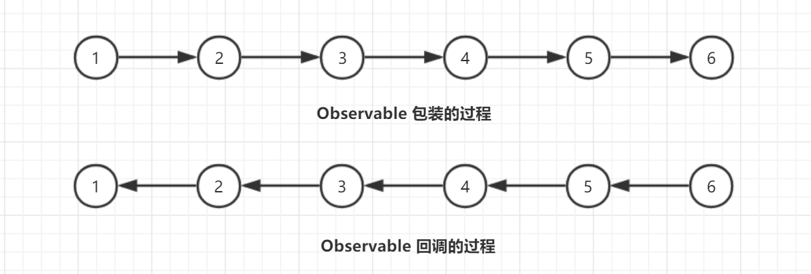
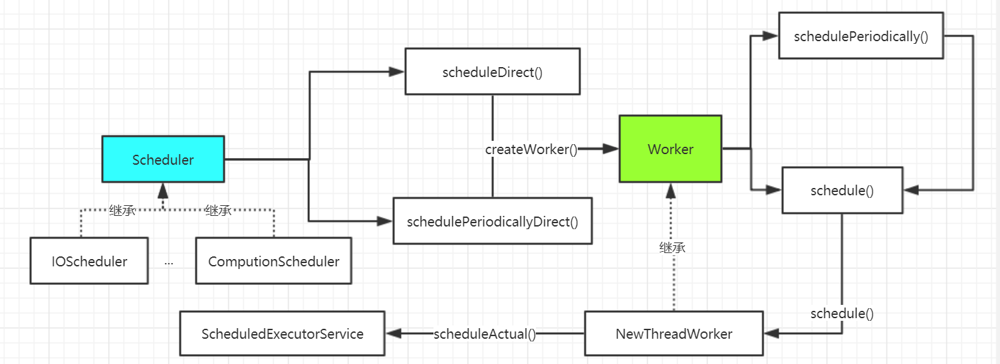

# RxJava 系列-4：RxJava 源码分析

在之前的文章中我们介绍了 RxJava 2 的常用的 API 的方法总结、背压的概念以及 RxJava 2 在项目中的实际应用。在本节中，我们将要对 RxJava 2 的源码进行分析。下面是之前文章的一些链接，如果对 RxJava 2 的使用比较感兴趣，你可以通过下面的文章进行学习：

- [RxJava2 系列-1：一篇的比较全面的 RxJava2 方法总结](https://juejin.im/post/5b72f76551882561354462dd)
- [RxJava2 系列-2：背压和 Flowable](https://juejin.im/post/5b759b9cf265da283719d187)
- [RxJava2 系列-3：使用 Subject](https://juejin.im/post/5b801dfa51882542cb409905)

下面我们就从 RxJava 2 的一个简单的示例来分析下 RxJava 2 是的主流程、设计模式以及 RxJava 2 是如何实现线程切换的。

## 1、RxJava 的主流程源码分析

下面是 RxJava 的一个非常典型的使用示例，在该示例中，我们在 IO 线程中执行业务逻辑，在主线程中对执行的结果进行后续的处理。

```java
    Disposable disposable = Observable.create(new ObservableOnSubscribe<Object>() {
        @Override
        public void subscribe(ObservableEmitter<Object> emitter) throws Exception {
            // 在这里执行业务逻辑
            emitter.onNext(new Object());
        }
    }).subscribeOn(Schedulers.io()).observeOn(AndroidSchedulers.mainThread()).subscribe(new Consumer<Object>() {
        @Override
        public void accept(Object o) throws Exception {
            // 在主线程中进行后续的处理
        }
    });
    disposable.dispose();
```

我们将这段程序分成四个阶段来进行分析：1). 调用 `create()` 方法的执行过程；2). 调用 `subscribeOn(Schedulers.io())` 和 `observeOn(AndroidSchedulers.mainThread())` 实现线程切换的过程；3). 使用 `subscribe()` 进行订阅的工程；4). 调用 `dispose()` 方法取消订阅的过程。

下面先来看第一个阶段的执行过程。

### 1.1 create() 和 subscribe() 方法的执行过程

下面是调用了 `create()` 方法之后的执行过程，在下面的代码中，我们省略了 null 的检测相关的逻辑。在当前的小节中，我们假设没有指定线程切换相关的逻辑。也就是调用了 `create()` 之后，紧接着调用了 `subscribe()` 方法。

对于 RxJavaPlugins 的静态方法，比如 `onAssembly()` 等，暂时我们先不考虑它的用途。你可以将其看作直接将传入的参数的值返回。比如下面的 `create()` 方法将返回 `ObservableCreate` 的实例。

```java
    public static <T> Observable<T> create(ObservableOnSubscribe<T> source) {
        // 看作直接返回了 new ObservableCreate<T>(source) 即可
        return RxJavaPlugins.onAssembly(new ObservableCreate<T>(source));
    }

    public final class ObservableCreate<T> extends Observable<T> {
        final ObservableOnSubscribe<T> source;

        public ObservableCreate(ObservableOnSubscribe<T> source) {
            this.source = source;
        }

        @Override
        protected void subscribeActual(Observer<? super T> observer) {
            // 对传入的观察者进行包装
            CreateEmitter<T> parent = new CreateEmitter<T>(observer);
            // 调用观察者的订阅回调方法
            observer.onSubscribe(parent);
            try {
                // 真正执行订阅的地方
                source.subscribe(parent);
            } catch (Throwable ex) {
                Exceptions.throwIfFatal(ex);
                parent.onError(ex);
            }
        }

        static final class CreateEmitter<T> extends AtomicReference<Disposable> 
            implements ObservableEmitter<T>, Disposable {
            final Observer<? super T> observer;

            CreateEmitter(Observer<? super T> observer) {
                this.observer = observer;
            }

            @Override
            public void onNext(T t) {
                if (t == null) {
                    onError(new NullPointerException("onNext ..."));
                    return;
                }
                if (!isDisposed()) {
                    // 调用传入的观察者的 onNext() 方法
                    observer.onNext(t);
                }
            }
        
            @Override
            public void dispose() {
                // 取消订阅
                DisposableHelper.dispose(this);
            }
            // ...
        }
        // ...
    }
```

上面是第一个阶段的执行过程。这里我们省去了一些代码，只保留了比较具有代表性的一些方法。也许你现在还对这部分代码看得云里雾里，没关系，看了下面的内容你会慢慢理解。

接下来我们看下当调用了 `subscribe()` 方法之后的处理。

```java
    public final Disposable subscribe(Consumer<? super T> onNext, Consumer<? super Throwable> onError,
            Action onComplete, Consumer<? super Disposable> onSubscribe) {
        // 将三种类型的观察者回调统一包装到 LambdaObserver 方法中
        LambdaObserver<T> ls = new LambdaObserver<T>(onNext, onError, onComplete, onSubscribe);
        subscribe(ls);
        return ls;
    }

    public final void subscribe(Observer<? super T> observer) {
        try {
            // 看作直接返回 observer 即可
            observer = RxJavaPlugins.onSubscribe(this, observer);
            // 调用了 subscribeActual() 方法
            subscribeActual(observer);
        } catch (NullPointerException e) {
            throw e;
        } catch (Throwable e) {
            Exceptions.throwIfFatal(e);
            RxJavaPlugins.onError(e);
            throw new NullPointerException("Actually not, but can't throw other exceptions due to RS");
        }
    }
```
上面的这些方法都定义在 Observable 中，区别只在于调用的对象。所以，为了更清晰地分析这个过程，我们使用大写字母来进行分析：

首先，整体的执行过程是，

```java
D = Observalbe.create(S).subscribe(X,Y,Z);
```

它可以被拆解成下面的两个步骤来分析（下面是一份伪代码，只是按照时间的调用顺序来排序的）：

```java
A = Observable.create(S);
D = A.subscribe(X,Y,Z);
```

然后，调用 A 的 `subscribe()` 方法的时候，实际上会调用到 Observable 的 `subscribe()` 方法（就是上面的代码）。所以，按照调用的过程，上面的伪代码将变成下面这个样子，

```java
A = Observable.create(S)
O = LambdaObserver(X,Y,Z)
D = A.subscribe(O)
A.subscribeActual(O)
```

于是我们可以得知，当调用了 `subscribe()` 方法的时候，实际上调用了 A 的 `subscribeActual()` 方法，并将 B 作为参数传入。B 是 LambdaObserver，由我们调用 `subscribe()` 的时候传入的三个参数组成。那么 A 呢？回到之前的 `create()` 代码中，我们得知它就是 `ObservableCreate` 的实例。这里会调用到它的 `subscribeActual()` 方法。按照字母表示的方式，该方法将会成为下面这个样子，

```java
    @Override
    protected void subscribeActual(O) {
        P = new CreateEmitter<T>(O);
        O.onSubscribe(P);
        S.subscribe(P);
    }
```

这里的 S 是由 ObservableCreate 的构造方法传入的，也就是我们在 `create()` 方法中传入的对象。首先，这里会将 O 作为构造方法的参数传入到 `CreateEmitter` 实例中。然后，回调 O 的 `onSubscribe()` 方法并将 P 传出。这是我们常用的 RxJava 的回调方法之一。第三步中，我们调用了 S 的 `subscribe()` 方法并将 P 传出。所以，当我们按照示例代码的方式调用下面这行代码的时候，

```java
    emitter.onNext(new Object());
```

实际上是调用了这里的 P 的方法。那么，我们来看 P 的 `onNext()` 方法，

```java
    @Override
    public void onNext(T t) {
        O.onNext(t);
    }
```

它通过调用 O 的 `onNext()` 方法实现。所以，到头来，其实还是回调了我们的在 `subscribe()` 方法中传入的 Consumer 的方法。这样就通过回调的方式把我们发送的值，传递给了我们的观察方法。

### 1.2 `dispose()` 方法的执行过程

上面分析了 `create()` 和 `subscribe()` 方法的主流程。那么 `dispose()` 方法呢？

按照上面给出的代码，它的定义如下。也就是通过 `DisposableHelper` 的 `dispose()` 方法来最终完成取消订阅。

```java
    @Override
    public void dispose() {
        DisposableHelper.dispose(this);
    }
```

`DisposableHelper` 的 `dispose()` 方法的定义如下。按照上面的分析，`dispose()` 的时候传入的 this 就是 CreateEmitter. 并且它是继承了 `AtomicReference<Disposable>` 的。

```java
    public static boolean dispose(AtomicReference<Disposable> field) {
        Disposable current = field.get();
        Disposable d = DISPOSED;
        if (current != d) {
            current = field.getAndSet(d);
            if (current != d) {
                if (current != null) {
                    current.dispose();
                }
                return true;
            }
        }
        return false;
    }
```

对 AtomicReference，相比大家都不陌生，它是一个原子类型的引用。这里正式通过对该原子类型引用的赋值来完成取消订阅的——通过一个原子操作将其设置为 DISPOSED. 
            
### 1.3 RxJava 执行过程的总结

上面我们总结了 RxJava 的 Observable 从 `create()` 到 `subscribe()` 到 `dispose()` 方法的执行过程。虽然，我们依靠自己的逻辑能够把整个流程梳理下来，但是这太笨拙了。除了掌握了整个流程，我想我们更应该分析下它使用的设计思想。

一开始，当我们分析到上面的流程的时候，我也是云里雾里，但是当我继续分析了 `subscribeOn()` 的时候才恍然大悟——它整体的设计使用的设计模式和 Java 中的流是一致的。在真正分析 `subscribeOn()` 之前，我们先来看下它的代码，

```java
    public final Observable<T> subscribeOn(Scheduler scheduler) {
        return RxJavaPlugins.onAssembly(new ObservableSubscribeOn<T>(this, scheduler));
    }

    public final class ObservableSubscribeOn<T> extends AbstractObservableWithUpstream<T, T> {
        final Scheduler scheduler;

        public ObservableSubscribeOn(ObservableSource<T> source, Scheduler scheduler) {
            super(source);
            this.scheduler = scheduler;
        }

        @Override
        public void subscribeActual(final Observer<? super T> s) {
            final SubscribeOnObserver<T> parent = new SubscribeOnObserver<T>(s);

            s.onSubscribe(parent);

            parent.setDisposable(scheduler.scheduleDirect(new SubscribeTask(parent)));
        }
        // ...
    }
```

对比一下 `subscribeOn()` 方法和 `create()` 方法，我们可以很容易地发现，它们的逻辑几乎是一致的。都是传入了一个 ObservableSource 之后对其进行包装，然后在 `subscribeActual()` 方法中，得到一个 parent，然后调用 `onSubscribe()` 继而进行后续处理……也就是它和 Java 的 IO 体系一样，都使用了**装饰者设计模式**。

在 Java 的 IO 体系中，我们经常可见下面的代码。

```java
    InputStream is = new FileInputStream(fileToCopy);
    BufferedInputStream bis = new BufferedInputStream(is, 15 * 1024);
    DataInputStream dis = new DataInputStream(bis);
```

这里的 FileInputStream 是节点流，用来打开磁盘上面的输入流。后续的 BufferedInputStream 和 DataInputStream 都用来对节点流进行修饰。它们各自只需要完成自己的功能，前者主要负责缓存以提升读取速率，后者用来将得到的流转换成我们需要的数据类型。如果我们由其他的需求只需要在这个链的基础上实现一个自定义的装饰器即可。

回想一下我们在实际的开发过程中是不是经常使用链式来调用一大串，中间的各个环节分别来实现自己的功能，比如转换、过滤、统计等等。使用了装饰者模式之后，链的每个环节只需要实现自己的功能，使用者可以根据自己的需求在链上面增加环节。所以，类似于转换、过滤、统计等等，每个类的责任变得单一了，从整个调用链上面解耦出来。真是不得不佩服 RxJava 的这种设计！

知道了 RxJava 的整体使用的是装饰者设计模式，我们理解其它的一些特性来就容易得多。按照装饰者设计模式的思路，RxJava 的包装过程和调用 `subscribe()` 方法之后的回调过程将如下所示：



所以，为什么 RxJava 为人诟病其调用栈太长，就是因为当我们使用一个个的装饰器套起来的时候，导致整个调用的栈变得很长。

另外，捎带说一下所谓的线程切换的问题。假如我们在上述调用过程中的 4 处使用了 `subscribeOn()` 方法，并指定处理的线程为 A；在 5 处同样调用该方法，但是指定的线程为 B，那么之前的 1~3 的过程会被包装成一个对象，放在 4 指定的线程中执行；然后 4 又被包装成一个对象放在 5 所在的线程。因此，如果我们在 2 中获取当前线程，那么肯定得到的是 4 所在的线程。也就是当使用两个 `subscribeOn()` 的时候，通常会被认为只有第一个有效的原因。其实两个都有效，只是 A 是在 B 中执行的，而 1~3 又是在 A 中执行的。所以，所谓的线程切换到奥秘啊，就是依靠这层包裹的关系实现的。一个线程里面把任务执行完了，自然就切换到另一个线程里了。（`subscribeOn()` 和 `observeOn()` 实现线程的时候稍有区别，详情看下文。）

### 1.4 RxJava 的线程切换的执行过程

上面我们也提到过 `subscribeOn()` 和 `observeOn()` 实现线程切换的方式有所不同。所以，在下面的文章中，我们分成两种情况来分别对其进行分析。

当调用 `subscribeOn()` 方法的时候，上流传入的 Observable 将会被进一步装饰成 ObservableSubscribeOn 对象。按照我们上面的分析，当最终调用 `subscribe()` 方法的时候，将会沿着装饰器构成的链，直到 ObservableSubscribeOn 的 `subscribeActual()` 方法中。下面就是该方法的定义，

```java
    @Override
    public void subscribeActual(final Observer<? super T> s) {
        final SubscribeOnObserver<T> parent = new SubscribeOnObserver<T>(s);
        s.onSubscribe(parent);
        parent.setDisposable(scheduler.scheduleDirect(new SubscribeTask(parent)));
    }
```

除了上面分析的内容，这里多了一个 scheduler，它就是我们调用  `subscribeOn()` 方法时指定的线程。这里会直接调用它的 `scheduleDirect()` 方法将任务添加到线程池当中执行。这里传入的是 SubscribeTask 对象，它实现了 `Runnable` 接口，并且会在覆写的 `run()` 方法中调用传入的 parent 的 `subscribe()` 方法。因此，它可以被放入任何线程池当中执行，并且当被执行的时候会调用传入的 Observable 的 `subscribe()` 方法来让上流的任务在该线程池当中执行。

下面是 RxJava 中异步任务执行的流程图，



这里的传入的 Schduler 是一个顶层的类，当我们调用 `Schedulers.io()` 等方法的时候，会获取其实现类的实例，比如 IOScheduler. 上面调用 `scheduleDirect()` 方法之后会先使用 Scheduler 的模板方法 `createWorker()` 中获取到一个 Worker. 这个类用来对 RxJava 的任务进行管理。它会进一步调用自己的 `schedule()` 方法来进一步安排任务的执行。图中的 Worker 也是一个抽象类，上面用到的 NewThreadWorker 是它的一个实现。NewThreadWorker 中维护了一个线程池，当调用了它的 `scheduler()` 方法的时候，它就会进一步把该任务放进线程池当中执行。因此，我们的异步任务就在该线程池当中被执行了。

然后，我们再来看下 `observeOn()` 方法是如何进行任务调度的。

当我们调用 `observeOn()` 方法的时候，该任务会被包装成 ObservableObserveOn 的实例。同样，我们来看它的 `subscribeActual()` 方法，

```java
    @Override
    protected void subscribeActual(Observer<? super T> observer) {
        if (scheduler instanceof TrampolineScheduler) {
            source.subscribe(observer);
        } else {
            Scheduler.Worker w = scheduler.createWorker();
            source.subscribe(new ObserveOnObserver<T>(observer, w, delayError, bufferSize));
        }
    }
```

它会直接调用 Scheduler 的模板方法得到 Worker，然后将 Worker 和传入的 Observer 一起包装到 ObserveOnObserver 中。它会被继续向上传递到 ObservableCreate 中，然后它的 `onNext()` 等方法将会被顶层的类触发。接下来，我们就看下 ObserveOnObserver 的定义，这里我们仍然只以 `onNext()` 为例，其方法源码如下，

```java
    @Override
    public void onNext(T t) {
        if (done) {
            return;
        }
        if (sourceMode != QueueDisposable.ASYNC) {
            queue.offer(t);
        }
        schedule();
    }

    void schedule() {
        if (getAndIncrement() == 0) {
            worker.schedule(this);
        }
    }
```

因此，可以看出，在 `observeOn()` 方法中也是通过将任务放进某个 Worker 中执行来实现的，只是具体的线程将取决于 Scheduler 和 Worker 的具体实现。而 Android 中的将任务放进主线程当中去执行就是通过向主线程的 Handler 发送消息来实现的。

## 2、总结

在本篇文章中，我们总结了 RxJava 2 的源码。虽然 RxJava 的功能非常强大，但是其核心的实现却仅仅依赖两个设计模式，一个是观察者模式，另一个是装饰器模式。它采用了类似于 Java 的流的设计，每个装饰器负责自己一种任务，这复合单一责任原则；各个装饰器之间相互协作，来完成复杂的功能。从上面的源码分析过程中我们也可以看出，RxJava 的缺点也是非常明显的，大量的自定义类，在完成一个功能的时候各装饰器之间不断包装，导致调用的栈非常长。至于线程的切换，它依赖于自己的装饰器模式，因为一个装饰器可以决定其上游的 Observable 在哪些线程当中执行；两个装饰器处于不同的线程的时候，从一个线程中执行完毕自然进入到另一个线程中执行就完成了线程切换的过程。

以上就是 RxJava 的源码分析，如有疑问，欢迎评论区交流:)

