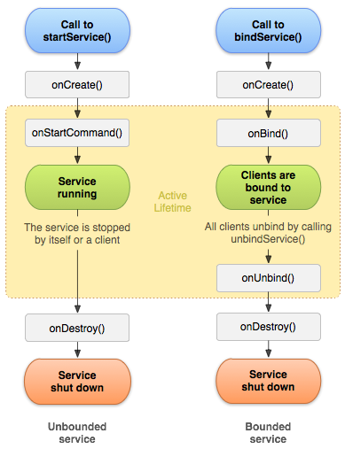

# Android 基础回顾：Service 基础

Service 主要用于在后台处理一些耗时的逻辑，或者去执行某些需要长期运行的任务。必要的时候我们甚至可以在程序退出的情况下，让 Service 在后台继续保持运行状态。相对于使用线程来实现异步任务的方式，它的安全性更高。（但是 Service 是运行在主线程中的，如果需要实现异步任务，可以单开线程。）

## 1、基础使用示例

### 1.1 使用示例

首先，通过继承 Service 来定义 Service：

```java
    public class MyService extends Service {

        public static final String TAG = "MyService";

        @Override
        public void onCreate() {
            super.onCreate();
            Log.d(TAG, "onCreate() executed");
        }

        @Override
        public int onStartCommand(Intent intent, int flags, int startId) {
            Log.d(TAG, "onStartCommand() executed");
            return super.onStartCommand(intent, flags, startId);
        }

        @Override
        public void onDestroy() {
            super.onDestroy();
            Log.d(TAG, "onDestroy() executed");
        }

        @Override
        public IBinder onBind(Intent intent) {
            return new MyBinder();
        }

        class MyBinder extends Binder {  
            public void startDownload() {  
                Log.d("TAG", "startDownload() executed");  
            }   
        }  
    }
```

定义了 Service 之后还要在 `AndroidManifest.xml` 中注册才能正常使用：

```xml
    <service android:name="com.example.servicetest.MyService"/>  
```

然后，就可以使用该 Service 了：

```java
    // 启动 Service
    Intent startIntent = new Intent(this, MyService.class);
    startService(startIntent);  

    // 停止 Service
    Intent stopIntent = new Intent(this, MyService.class);
    stopService(stopIntent);

    // 关联 Service 和 Activity
    Intent bindIntent = new Intent(this, MyService.class);  
    bindService(bindIntent, connection, BIND_AUTO_CREATE);

    // 解除 Service 和 Activity 关联
    unbindService(connection);

    private ServiceConnection connection = new ServiceConnection() {  
  
        @Override  
        public void onServiceDisconnected(ComponentName name) { /* Do nothing. */ }  
  
        @Override  
        public void onServiceConnected(ComponentName name, IBinder service) {  
            myBinder = (MyService.MyBinder) service;  
            myBinder.startDownload();  
        }  
    };
```

以上就是 Service 的基础使用示例。

### 1.2 Service 的使用小结

首先是 Service 的生命周期图



其他，

1. Service 有绑定模式和非绑定模式，以及这两种模式的混合使用方式。不同的使用方法生命周期方法也不同。 
    1. **非绑定模式**：当第一次调用 `startService()` 的时候执行的方法依次为 `onCreate()->onStartCommand()`；当 Service 关闭的时候调用 `onDestory()`。
    2. **绑定模式**：第一次 `bindService()` 的时候，执行的方法为 `onCreate()->onBind()`；解除绑定的时候会执行 `onUnbind()->onDestory()`。
2. 我们在开发的过程中还必须注意 Service 实例只会有一个，也就是说如果当前要启动的 Service 已经存在了那么就不会再次创建该 Service 当然也不会调用 onCreate() 方法。所以，
    1. 当第一次执行 `startService(intent)` 的时候，会调用该 Service 中的 `onCreate()` 和`onStartCommand()` 方法。
    2. 当第二次执行 `startService(intent)` 的时候，只会调用该 Service 中的 `onStartCommand()` 方法。（因此已经创建了服务，所以不需要再次调用 `onCreate()` 方法了）。
3. `bindService()` 方法的第三个参数是一个标志位，这里传入 `BIND_AUTO_CREATE` 表示在Activity 和 Service 建立关联后自动创建 Service，这会使得 MyService 中的 `onCreate()` 方法得到执行，但 `onStartCommand()` 方法不会执行。所以，在上面的程序中当调用了`bindService()` 方法的时候，会执行的方法有，Service 的 `onCreate()` 方法，以及 ServiceConnection 的 `onServiceConnected()` 方法。
4. 在 3 中，如果想要停止 Service，需要调用 `unbindService()` 才行。 
5. 如果我们既调用了 `startService()`，又调用 `bindService()` 会怎么样呢？这时不管你是单独调用 `stopService()` 还是 `unbindService()`，Service 都不会被销毁，必须要将两个方法都调用 Service 才会被销毁。也就是说，`stopService()` 只会让 Service 停止，`unbindService()` 只会让 Service 和 Activity 解除关联，一个 Service 必须要在既没有和任何 Activity 关联又处理停止状态的时候才会被销毁。

## 2、Service 与线程

Service 运行在主线程里的，也就是说如果你在 Service 里编写了非常耗时的代码，程序可能会出现ANR。 

Service 只意味着不需要前台 UI 的支持，即使 Activity 被销毁，或者程序被关闭，只要进程还在，Service 就可以继续运行。但是我们可以在 Service 中再创建一个子线程，然后在这里去处理耗时逻辑。

虽然也可以在 Activity 中创建线程来执行耗时任务，但是它的缺点在于该线程只能与该 Activity 关联，其他 Activity 无法对其进行控制。

所以，标准的使用是：

```java
    @Override
    public int onStartCommand(Intent intent, int flags, int startId) {
        new Thread(new Runnable() {
            @Override
            public void run() {
                // 开始执行后台任务  
            }
        }).start();
        return super.onStartCommand(intent, flags, startId);
    }

    class MyBinder extends Binder {

        public void startDownload() {
            new Thread(new Runnable() {
                @Override
                public void run() {
                    // 执行具体的下载任务  
                }
            }).start();
        }
    }
```

当然，你也可以使用 RxJava 等封装的线程池来实现异步任务。

## 3、前台 Service

因为 Service 的系统优先级较低，所以当系统出现内存不足情况时，就有可能会回收掉正在后台运行的 Service。我们可以通过使用前台 Service 来解决 Service 可能被回收的问题。它的效果是在系统中显示一个驻留的通知。

前台服务的

```java
    public class MyService extends Service {

        public static final String TAG = "MyService";

        @Override
        public void onCreate() {
            super.onCreate();
            Notification notification = new Notification(R.drawable.ic_launcher, 
                "Msg", System.currentTimeMillis());
            Intent intent = new Intent(this, MainActivity.class);
            PendingIntent pi = PendingIntent.getActivity(this, 0, intent, 0);
            notification.setLatestEventInfo(this, "Title", "Content", pi);
            startForeground(1, notification);
        }  
    }
```

## 4、远程 Service

远程 Service 是一种运行在其他进程中的服务。我们可以在 Manifest 中进行注册的时候通过指定进程来讲服务设置成远程的。远程的服务因为运行在另一个进程中，所以涉及跨进程调用的问题。

可以通过在 `AndroidManifest.xml` 中进行如下设置来将一个 Service 设置在非主线程中：

```xml
    <service  
        android:name="com.example.servicetest.MyService"  
        android:process=":remote" >  
    </service>  
```

也就说当前的 Service 运行在其他的进程了，不会阻碍主进行，从而也不会存在 ANR 了。但是这种方式中的 Service 是无法与 Activity 进行关联的，也就是说调用 `bindService()` 的时候会出现错误。如果我们想要将该 Service 与 Activity 进行关联，就需要使用 AIDL 进行跨进程通信了（IPC）。

要实现跨进程调用，我们可以按照如下步骤来实现：

首先，新建 `MyAIDLService.aidl` 文件：

```java
    package com.example.servicetest;  

    interface MyAIDLService {  
        int plus(int a, int b);  
        String toUpperCase(String str);  
    }  
```

然后，我们要修改之前 Service 中的 `bind()` 方法：

```java
    @Override  
    public IBinder onBind(Intent intent) {  
        return mBinder;  
    }

    MyAIDLService.Stub mBinder = new Stub() {  
  
        @Override  
        public String toUpperCase(String str) throws RemoteException {  
            if (str != null) {  
                return str.toUpperCase();  
            }  
            return null;  
        }  
  
        @Override  
        public int plus(int a, int b) throws RemoteException {  
            return a + b;  
        }  
    }; 
```

然后，我们在 ServiceConnection 中进行如下实现：

```java
    private ServiceConnection connection = new ServiceConnection() {  
  
        @Override  
        public void onServiceDisconnected(ComponentName name) { /* Do nothing. */ }  
  
        @Override  
        public void onServiceConnected(ComponentName name, IBinder service) {  
            myAIDLService = MyAIDLService.Stub.asInterface(service);  
            try {  
                int result = myAIDLService.plus(3, 5);  
                String upperStr = myAIDLService.toUpperCase("hello world");  
            } catch (RemoteException e) {  
                e.printStackTrace();  
            }  
        }  
    };  
```

也就是使用 `MyAIDLService.Stub.asInterface()` 方法获取 MyAIDLService，并调用 MyAIDLService 的方法。这时候再调用 `bindService()` 就不会出现错误了。

如果我们想要在其他进程（APP）中调用该 Service，我们可以进行如下操作：

首先在 Service 添加 `Intent-Filter`：

```xml
    <service android:name="com.example.servicetest.MyService"  
        android:process=":remote" >  
        <intent-filter>  
            <action android:name="com.example.servicetest.MyAIDLService"/>  
        </intent-filter>  
    </service>  
```

这样，我们就将该 Service 设置成其他程序可访问的了。

然后，在要访问该 Service 的程序中进行如下操作：

1. 将上述定义的 MyAIDLService 连同其包拷贝到当前程序中，即 src 目录下面。
2. 然后在绑定 Service 的时候按照下面的方式绑定：

```java
    Intent intent = new Intent("com.example.servicetest.MyAIDLService");
    bindService(intent, connection, BIND_AUTO_CREATE);

    private ServiceConnection connection = new ServiceConnection() {

        @Override
        public void onServiceDisconnected(ComponentName name) {}

        @Override
        public void onServiceConnected(ComponentName name, IBinder service) {
            myAIDLService = MyAIDLService.Stub.asInterface(service);
            try {
                int result = myAIDLService.plus(50, 50);
                String upperStr = myAIDLService.toUpperCase("comes from ClientTest");
            } catch (RemoteException e) {
                e.printStackTrace();
            }
        }
    };
```

这样我们就将该 Service 设置成了其他进程可访问的。

## 5、IntentService

相比于一般的 Service，IntentService 具有的特征：

1. 会创建独立的线程来处理所有的 `Intent` 请求;。
2. 会创建独立的线程来处理 `onHandleIntent()` 方法实现的代码，无需处理多线程问题。
3. 所有请求处理完成后，`IntentService` 会自动停止，无需调用 `stopSelf()` 方法停止 Service;。
4. 为 Service 的 `onBind()` 提供默认实现，返回 null. 
5. 为 Service 的 `onStartCommand()` 提供默认实现，将请求 Intent 添加到队列中。 
6. IntentService 内置的是 HandlerThread 作为异步线程，每一个交给 IntentService 的任务都将以队列的方式逐个被执行到，一旦队列中有某个任务执行时间过长，那么就会导致后续的任务都会被延迟处理。正在运行的 IntentService 的程序相比起纯粹的后台程序更不容易被系统杀死，该程序的优先级是介于前台程序与纯后台程序之间的

关于 IntentService 的源码分析，可以参考下面这篇文章：

[Android 多线程编程：IntentService & HandlerThread](https://blog.csdn.net/github_35186068/article/details/83758049)

## 5、Service 保活的问题

我们可以用通过 `setForeground(true)` 来提升 Service 的优先级。当然这并不能保证你得Service 永远不被杀掉，只是提高了他的优先级。这种方式的缺点是会设置一个长期停留的通知，用户体验比较差。

那么如何避免后台进程被杀死？

首先，服务被杀死的情况包含下面三种：

1. 系统根据资源分配情况杀死服务
2. 用户通过 `settings->Apps->Running->Stop` 方式杀死服务
3. 用户通过 `settings->Apps->Downloaded->Force Stop` 方式杀死服务

以及对应的解决办法：

1. 调用 `startForegound()`，让你的 Service 所在的线程成为前台进程；
2. Service 的 `onStartCommond()` 返回 START_STICKY 或 START_REDELIVER_INTENT；
3. Service 的 `onDestroy()` 里面重新启动自己。

关于 `onStartCommond()` 的返回值的总结：

|No|可选值|含义|
|:-:|:-:|:-|
|1|START_STICKY|当 Service 因内存不足而被系统 kill 后，一段时间后内存再次空闲时，系统将会尝试重新创建此 Service，一旦创建成功后将回调 `onStartCommand()` 方法，但其中的 Intent 将是 null，除非有挂起的 Intent，如 pendingintent，这个状态下比较适用于不执行命令、但无限期运行并等待作业的媒体播放器或类似服务|
|2|START_NOT_STICKY|当 Service 因内存不足而被系统 kill 后，即使系统内存再次空闲时，系统也不会尝试重新创建此 Service。除非程序中再次调用 `startService()` 启动此 Service，这是最安全的选项，可以避免在不必要时以及应用能够轻松重启所有未完成的作业时运行服务|
|3|START_REDELIVER_INTENT|当 Service 因内存不足而被系统 kill 后，则会重建服务，并通过传递给服务的最后一个 Intent 调用 `onStartCommand()`，任何挂起 Intent 均依次传递。与START_STICKY 不同的是，其中的传递的 Intent 将是非空，是最后一次调用 `startService()` 中的 intent。这个值适用于主动执行应该立即恢复的作业（例如下载文件）的服务|

在 `onDestroy()` 中自启的示例：

```java
	public void onCreate() {  
	    super.onCreate();  
	    mBroadcast = new BroadcastReceiver() {  
		    @Override  
		    public void onReceive(Context context, Intent intent) {  
		        Intent a = new Intent(ServiceA.this, ServiceA.class);  
		        startService(a);  
		    }  
	    };  
	    mIF = new IntentFilter();  
	    mIF.addAction("listener");  
	    registerReceiver(mBroadcast, mIF);  
	}
	
	@Override  
	public void onDestroy() {  
	  super.onDestroy();  
	  Intent intent = new Intent();  
	  intent.setAction("listener");  
	  sendBroadcast(intent);  
	  unregisterReceiver(mBroadcast);  
	}  
```

上面的这种启动的实例会因为系统处于后台线程而抛出异常。

参考：

1. [Android Service完全解析，关于服务你所需知道的一切(上)](http://blog.csdn.net/guolin_blog/article/details/11952435)
2. [Android Service完全解析，关于服务你所需知道的一切(下)](http://blog.csdn.net/guolin_blog/article/details/9797169)
3. [关于Android Service真正的完全详解，你需要知道的一切](https://blog.csdn.net/javazejian/article/details/52709857)