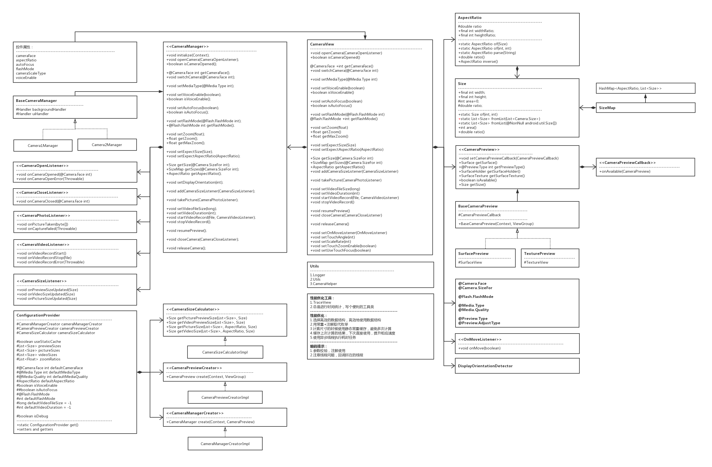

# CameraX：Android 相机库开发实践

## 前言

前段时间因为工作的需要对项目中的相机模块进行了优化，我们项目中的相机模块是基于开源库 CameraView 进行开发的。那次优化主要包括两个方面，一个是相机的启动速度，另一个是相机的拍摄的清晰度的问题。因为时间仓促，那次只是在原来的代码的基础之上进行的优化，然而那份代码本身存在一些问题，导致相机的启动速度无法进一步提升。所以，我准备自己开发一款功能完善，并且可拓展的相机库，于是 [CameraX](https://github.com/Shouheng88/CameraX) 就诞生了。

## Android 相加开源库的现状

要使用 Android 相机实现图片拍照功能本身并不复杂，Camera1 + SurfaceView 就可以搞定。但是如果让相机能够自由拓展，就需要花费很多的功夫。我所接触的开源库包括 Google 非官方的 CameraView，以及 CameraFragment. 两个库的设计有各自的优点和缺点。

|开源库|优点|缺点|
|:-|:-|:-|
|CameraView|1.支持基本的拍照、缩放等功能；2.支持自定义图片的宽高比；3.支持多种预览布局方式；|1.每次获取相机支持的尺寸的时候，会先将其组装到一个有序的 Set 中，这个过程会占用一定的启动时间；2.不支持拍摄视频；3.代码堆砌，结构混乱|
|CameraFragment|1.支持拍摄照片和视频；2.代码结构清晰|1.不支持缩放；2.默认宽高比4:3，无法运行时修改；3.必须基于 Fragment|

以上是两个开源库的优点和缺点，而我们可以结合它们的优缺点实现一个更加完善的相机库，同时对性能的优化和用户自定义配置，我们也提供了更多的可用的接口。

## CameraX 整体结构设计

虽然文章的题目是相机开发实践，但是我们并不打算介绍太多关于如何使用 Camera API 的内容，因为本项目是开源的，读者可以自行 Fork 代码进行阅读。在这里，我们只对项目中的一些关键部分的设计思路进行说明。



连接：https://www.processon.com/view/link/5c976af8e4b0d1a5b10a4049

以上是我们相机库的整体架构的设计图，这里笔者使用了 UML 建模进行基础的架构设计（当然，并非严格遵循 UML 建模的语言规则）。下面，我们介绍下项目的关键部分的设计思路。

### Camera1 还是 Camera2？

了解 Android 相机 API 的同学可能知道，在 LoliPop 上面提出了 Camera2 API. 就笔者个人的实践开发的效果来看，Camera2 相机的性能确实比 Camera1 要好得多，这体现在相机对焦的速率和相机启动的速率上。当然，这和硬件也有一定的关系。Camera2 比 Camera1 使用起来确实复杂得多，但提供的可以调用的 API 也更丰富。Camera2 的另一个问题是国内的很多手机设备对 Camera2 的支持并不好。

对于这个问题，首先，我们可以根据系统的参数来判断该设备是否支持 Camera2：

```java
    @TargetApi(Build.VERSION_CODES.LOLLIPOP)
    public static boolean hasCamera2(Context context) {
        if (context == null) return false;
        if (Build.VERSION.SDK_INT < Build.VERSION_CODES.LOLLIPOP) return false;
        try {
            CameraManager manager = (CameraManager) context.getSystemService(Context.CAMERA_SERVICE);
            assert manager != null;
            String[] idList = manager.getCameraIdList();
            boolean notNull = true;
            if (idList.length == 0) {
                notNull = false;
            } else {
                for (final String str : idList) {
                    if (str == null || str.trim().isEmpty()) {
                        notNull = false;
                        break;
                    }
                    final CameraCharacteristics characteristics = manager.getCameraCharacteristics(str);

                    Integer iSupportLevel = characteristics.get(CameraCharacteristics.INFO_SUPPORTED_HARDWARE_LEVEL);
                    if (iSupportLevel != null && iSupportLevel == CameraCharacteristics.INFO_SUPPORTED_HARDWARE_LEVEL_LEGACY) {
                        notNull = false;
                        break;
                    }
                }
            }
            return notNull;
        } catch (Throwable ignore) {
            return false;
        }
    }
```

不过，即便上面方法返回的结果标明支持 Camera2，但相机仍然可能在启动中出现异常。所以 CameraView 的解决方案是，相机启动的方法返回一个 boolean 类型标明 Camera2 是否启动成功，如果失败了，就降级并使用 Camera1。但是降级的过程会浪费一定的启动时间，因此，有人提出了使用 SharedPreferences 存储降级的记录，下次直接使用 Camera1 的解决方案。

上面两种方案各自有优缺点，使用第二种方案意味着你要修改相机库的源代码，而我们希望以一种更加灵活的方式提供给用户选择相机的权力。没错，就是**策略设计模式**。

因为虽然 Camera1 和 Camera2 的 API 设计和使用不同，但是我们并不需要知道内部如何实现，我们只需要给用户提供切换相机、打开闪光灯、拍照、缩放等的接口即可。在这种情况下，当然使用**门面设计模式**是最好的选择。

另外，对于 TextureView 还是 SurfaceView 的选择，我们也使用了**策略模式+门面模式**的思路。

即。对于相机的选择，我们提供门面 CameraManager 接口，Camera1 的实现类 Camera1Manager 以及 Camera2 的实现类 Camera2Manager. Camera1Manager 和 Camera2Manager 又统一继承自 BaseCameraManager. 这里的 BaseCameraManager 是一个抽象类，用来封装一些通用的相机方法。

所以问题到了是 Camera1Manager 还是 Camera2Manager 的问题。这里我们提供了策略接口 CameraManagerCreator，它返回 CameraManager：

```java
public interface CameraManagerCreator {

    CameraManager create(Context context, CameraPreview cameraPreview);
}
```

以及一个默认的实现：

```java
public class CameraManagerCreatorImpl implements CameraManagerCreator {

    @Override
    public CameraManager create(Context context, CameraPreview cameraPreview) {
        if (Build.VERSION.SDK_INT >= Build.VERSION_CODES.LOLLIPOP && CameraHelper.hasCamera2(context)) {
            return new Camera2Manager(cameraPreview);
        }
        return new Camera1Manager(cameraPreview);
    }
}
```

因此，我们只需要在相机的全局配置中指定自己的 CameraManager 创建策略就可以使用指定的相机了。

### 全局配置

之前考虑指定 CameraManager 创建策略的时候，思路是直接对静态的变量赋值的方式，不过后来考虑到对相机的支持的尺寸进行缓存的问题，所以将其设计了静态单实例的类：

```java
public class ConfigurationProvider {

    private static volatile ConfigurationProvider configurationProvider;

    private ConfigurationProvider() {
        if (configurationProvider != null) {
            throw new UnsupportedOperationException("U can't initialize me!");
        }
        initWithDefaultValues();
    }

    public static ConfigurationProvider get() {
        if (configurationProvider == null) {
            synchronized (ConfigurationProvider.class) {
                if (configurationProvider == null) {
                    configurationProvider = new ConfigurationProvider();
                }
            }
        }
        return configurationProvider;
    }

    // ... ...
}
```

除了指定一些全局的配置之外，我们还可以在 ConfigurationProvider 中缓存一些相机的信息，比如相机支持的尺寸的问题。因为相机所支持的尺寸属于相机属性的一部分，是不变的，我们没有必要获取多次，可以将其缓存起来，下次直接使用。当然，我们还提供了不使用缓存的接口：

```java
public class ConfigurationProvider {

    // ...
    private boolean useCacheValues;
    private List<Size> pictureSizes;

    public List<Size> getPictureSizes(android.hardware.Camera camera) {
        if (useCacheValues && pictureSizes != null) {
            return pictureSizes;
        }
        List<Size> sizes = Size.fromList(camera.getParameters().getSupportedPictureSizes());
        if (useCacheValues) {
            pictureSizes = sizes;
        }
        return sizes;
    }

}
```

这样，我们在获取相机支持的图片尺寸信息的时候只需要传入 Camera 即可使用缓存的信息。当然，缓存信息在某些极端的情况下可能会带来问题，比如从 Camera1 切换到 Camera2 的时候，需要清除缓存。

*注：这里缓存的时候应该使用 SoftReference，但是考虑到数据量不大，没有这么设计，以后会考虑修改。*

### 输出媒体文件的尺寸的问题

使用 Android 相机一个让人头疼的地方是计算尺寸的问题：因为相机支持的尺寸有三种，包括相片的支持尺寸、预览的支持尺寸和视频的支持尺寸。预览的尺寸决定了用户看到的画面的清晰程度，但是真正拍摄出图片的清晰度取决于相片的尺寸，同理输出的视频的尺寸取决于视频的尺寸。

在 CameraView 中，它允许你指定一个图片的尺寸，当没有满足的要求的尺寸的时候会 Crash…这样的处理方式是将其不好的，因为用户根本无法确定相机最大的支持尺寸，而 CameraView 甚至没有提供获取相机支持尺寸的接口……

为了解决这个问题，我们首先提供了一系列用户获取相机支持尺寸的接口：

```java
    Size getSize(@Camera.SizeFor int sizeFor);

    SizeMap getSizes(@Camera.SizeFor int sizeFor);
```

这里的 SizeFor 是基于注解的枚举，我们通过它来判断用户是希望获取相片、预览还是视频的尺寸信息。这里的 SizeMap 是一个哈希表，从相机的宽高比映射到对应的尺寸列表。跟 CameraView 处理方式不同的是，我们只有在调用上述方法的时候才计算图片的宽高比信息，虽然调用下面的方法的时候会花费一丁点儿时间，但是相机的启动速度大大提升了：

```java
    @Override
    public SizeMap getSizes(@Camera.SizeFor int sizeFor) {
        switch (sizeFor) {
            case Camera.SIZE_FOR_PREVIEW:
                if (previewSizeMap == null) {
                    previewSizeMap = CameraHelper.getSizeMapFromSizes(previewSizes);
                }
                return previewSizeMap;
            case Camera.SIZE_FOR_PICTURE:
                if (pictureSizeMap == null) {
                    pictureSizeMap = CameraHelper.getSizeMapFromSizes(pictureSizes);
                }
                return pictureSizeMap;
            case Camera.SIZE_FOR_VIDEO:
                if (videoSizeMap == null) {
                    videoSizeMap = CameraHelper.getSizeMapFromSizes(videoSizes);
                }
                return videoSizeMap;
        }
        return null;
    }
```

获取了相机的尺寸信息的目的当然是将其设置到相机上面，所以我们提供了两个用来设置相机尺寸的接口：

```java
    void setExpectSize(Size expectSize);

    void setExpectAspectRatio(AspectRatio expectAspectRatio);
```

它们一个用来指定期望的输出文件的尺寸，一个用来指定期望的图片的宽高比。

OK，既然用户可以指定计算参数，那么怎么计算呢？这当然还是用户说了算的，因为我们一样在全局配置中为用户提供了计算的策略接口：

```java
public interface CameraSizeCalculator {

    Size getPicturePreviewSize(@NonNull List<Size> previewSizes, @NonNull Size pictureSize);

    Size getVideoPreviewSize(@NonNull List<Size> previewSizes, @NonNull Size videoSize);

    Size getPictureSize(@NonNull List<Size> pictureSizes, @NonNull AspectRatio expectAspectRatio, @Nullable Size expectSize);

    Size getVideoSize(@NonNull List<Size> videoSizes, @NonNull AspectRatio expectAspectRatio, @Nullable Size expectSize);
}
```

当然，我们也会提供一个默认的计算策略。在 CameraManager 内部，我们会在需要的地方调用上述接口的方法以获取最终的相机尺寸信息：

```java
    private void adjustCameraParameters(boolean forceCalculateSizes, boolean changeFocusMode, boolean changeFlashMode) {
        Size oldPreview = previewSize;
        long start = System.currentTimeMillis();
        CameraSizeCalculator cameraSizeCalculator = ConfigurationProvider.get().getCameraSizeCalculator();
        android.hardware.Camera.Parameters parameters = camera.getParameters();
        if (mediaType == Media.TYPE_PICTURE && (pictureSize == null || forceCalculateSizes)) {
            pictureSize = cameraSizeCalculator.getPictureSize(pictureSizes, expectAspectRatio, expectSize);
            previewSize = cameraSizeCalculator.getPicturePreviewSize(previewSizes, pictureSize);
            parameters.setPictureSize(pictureSize.width, pictureSize.height);
            notifyPictureSizeUpdated(pictureSize);
        }

        // ... ...
    }
```

### 性能优化

为了对相机的性能进行优化，笔者可是花了大量的精力。因为在之前进行优化的时候积累了一些经验，所以这次开发的时候就容易得多。下面是 TraceView 进行分析的图：


可以看出从相机当中获取支持尺寸的本身会占用一定时间的，而这种属于相机固有的信息，一般是不会发生变化的，所以我们可以通过将其缓存起来来提升下一次打开相机的速率。

整体上，该项目的优化主要体现在几个地方：

1. 使用注解+常量取代枚举：因为枚举占用的内存空间比较大，而单纯使用注解无法约束输入参数的范围。这在 enums 包下面可以看到，这也是 Android 性能优化最常见的手段之一。

2. 延迟初始化：我们为了达到只在使用到某些数据的时候才初始化的目的采用了延迟初始化的解决方案，比如 Size 的宽高比的问题：

```
public class Size {

    // ...

    private double ratio;

    public double ratio() {
        if (ratio == 0 && width != 0) {
            ratio = (double) height / width;
        }
        return ratio;
    }

}
```

3. 数据结构的应用和选择：选择合适的数据结构和自定义数据结构往往能起到化腐朽为神奇的作用。比如 SizeMap 

```java
public class SizeMap extends HashMap<AspectRatio, List<Size>> {
}
```

比如在列表数据结构的应用上面，使用 ArrayList 但是提前指定数组大小，减小数组扩容的次数：

```java
    public static List<Size> fromList(@NonNull List<Camera.Size> cameraSizes) {
        List<Size> sizes = new ArrayList<>(cameraSizes.size());
        for (Camera.Size size : cameraSizes) {
            sizes.add(of(size.width, size.height));
        }
        return sizes;
    }
```

4. 缓存，这个我们之前已经提到过，除了尺寸信息我们还缓存了一些其他的信息，具体可以参考源码。

5. 异步线程：这个当然是最能提升应用相应速度的方式。它能够让我们不阻塞主线程，从而提升界面相应的速度。但是在相机开发的时候存在一个问题，即通常打开的相机的时候比较耗时，所以放在异步线程中；而开启预览处于主线程，这很容易因为线程执行的顺序的问题导致一些难以预测的异常。在之前，笔者的解决方案是使用一个私有锁来实现线程的控制。

## 总结

本次相机库开发占用的时间其实不多，更多的时间花费在了 UML 建模图的设计和在真正开发之前收集资料信息。不得不说，如果你开发一个小的项目，不需要做什么设计，直接就可以上了，但是如果你设计一个比较复杂的库，花费更多时间在 UML 建模上面是值得的，因为它能让你的开发思路更加清晰。另外，为了开发 Camera2，笔者不仅找遍了开源库，还翻译了相关的官方文档，这在开源项目中会一并奉上。

### 相机目前支持的功能

|编号|功能|
|:-|:-|
|1|拍摄照片|
|2|拍摄视频|
|3|指定使用 Camera1 还是 Camera2|
|4|指定使用 TextureView 还是 SurfaceView|
|5|闪光灯打开和关闭|
|6|自动对焦的选择|
|7|前置和后置相机|
|8|快门声|
|9|指定缩放的大小|
|10|指定期望的图片大小|
|11|指定期望的图片宽高比|
|12|获取支持的图片、预览和视频的尺寸信息|
|13|相机尺寸发生变化监听|
|14|输出视频的文件位置|
|15|输出视频的时间长度|
|16|手指界面滑动的监听|
|17|触摸进行缩放|
|18|预览自适应和裁剪等|
|19|缓存相机信息，清除和不适用缓存信息|

### 最后是关于项目的一些小问题

该项目目前所有功能已经开发完毕，不过仍有一些小的问题需要完善：

1. Camera2 预览放大之后拍摄出的图片没有放大效果的问题；
2. Camera1 拍摄出的图片需要旋转 90 度；
3. Camera2 在屏幕旋转成横屏之后相机预览需要同时选择 90 度的问题；
4. Camera1 和 Camera2 切换存在一些问题。

另外，由于时间限制，该相机库目前没有进行严格的测试，所以建议使用的时候进行充分测试之后再使用。

### 是否会继续完善该项目？

是的，包括对相机的功能进行充分测试。只是目前的时间结点，笔者有其他的事务需要处理，所以先把它介绍给读者。当然也希望能够有更多感兴趣的朋友对该项目贡献代码。

## 项目地址：

CameraX：https://github.com/Shouheng88/CameraX
