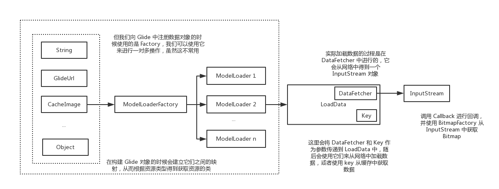

# Glide 系列-1：预热、Glide 的常用配置方式及其原理

在接下来的几篇文章中，我们会对 Android 中常用的图片加载框架 Glide 进行分析。在本篇文章中，我们先通过介绍 Glide 的几种常用的配置方式来了解 Glide 的部分源码。后续的文中，我们会对 Glide 的源码进行更详尽的分析。

对于 Glide，相信多数 Android 开发者并不陌生，在本文中，我们不打算对其具体使用做介绍，你可以通过查看官方文档进行学习。Glide 的 API 设计非常人性化，上手也很容易。

在这篇文中中我们主要介绍两种常用的 Glide 的配置方式，并以此为基础来分析 Glide 的工作原理。在本文中我们将会介绍的内容有：

1. 通过自定义 GlideModule 指定 Glide 的缓存路径和缓存空间的大小；
2. 带有时间戳的图片的缓存命中问题的解决；
3. 在 Glide 中使用 OkHttp 作为网络中的图片资源加载方式的实现。

## 1、自定义图片加载方式

有时候，我们需要对 Glide 进行配置来使其能够对特殊类型的图片进行加载和缓存。考虑这么一个场景：图片路径中带有时间戳。这种情形比较场景，即有时候我们通过为图片设置时间戳来让图片链接在指定的时间过后失效，从而达到数据保护的目的。

在这种情况下，我们需要解决几个问题：1).需要配置缓存的 key，不然缓存无法命中，每次都需要从网络中进行获取；2).根据正确的链接，从网络中获取图片并展示。

我们可以使用自定义配置 Glide 的方式来解决这个问题。

### 1.1 带时间戳图片加载的实现

#### 1.1.1 MyAppGlideModule

首先，按照下面的方式自定义 `GlideModule`，

```java
    @GlideModule
    public class MyAppGlideModule extends AppGlideModule {

        /**
        * 配置图片缓存的路径和缓存空间的大小
        */
        @Override
        public void applyOptions(Context context, GlideBuilder builder) {
            builder.setDiskCache(new InternalCacheDiskCacheFactory(context, Constants.DISK_CACHE_DIR, 100 << 20));
        }

        /**
        * 注册指定类型的源数据，并指定它的图片加载所使用的 ModelLoader
        */
        @Override
        public void registerComponents(Context context, Glide glide, Registry registry) {
            glide.getRegistry().append(CachedImage.class, InputStream.class, new ImageLoader.Factory());
        }

        /**
        * 是否启用基于 Manifest 的 GlideModule，如果没有在 Manifest 中声明 GlideModule，可以通过返回 false 禁用
        */
        @Override
        public boolean isManifestParsingEnabled() {
            return false;
        }
    }
```

在上面的代码中，我们通过覆写 `registerComponents()` 方法，并调用 Glide 的 `Registry` 的 `append()` 方法来向 Glide **增加**我们的自定义图片类型的加载方式。（如果替换某种资源加载方式则需要使用 `replace()` 方法，此外 `Registry` 还有其他的方法，可以通过查看源码进行了解。）

在上面的方法中，我们新定义了两个类，分别是 `CachedImage` 和 `ImageLoader`。`CachedImage` 就是我们的自定义资源类型，`ImageLoader` 是该资源类型的加载方式。当进行图片加载的时候，会根据资源的类型找到该图片加载方式，然后使用它来进行图片加载。

#### 1.1.2 CachedImage

我们通过该类的构造方法将原始的图片的链接传入，并通过该类的 `getImageId()` 方法来返回图片缓存的键，在该方法中我们从图片链接中过滤掉时间戳：

```java
    public class CachedImage {

        private final String imageUrl;

        public CachedImage(String imageUrl) {
            this.imageUrl = imageUrl;
        }

        /**
        * 原始的图片的 url，用来从网络中加载图片
        */
        public String getImageUrl() {
            return imageUrl;
        }

        /**
        * 提取时间戳之前的部分作为图片的 key，这个 key 将会被用作缓存的 key，并用来从缓存中找缓存数据
        */
        public String getImageId() {
            if (imageUrl.contains("?")) {
                return imageUrl.substring(0, imageUrl.lastIndexOf("?"));
            } else {
                return imageUrl;
            }
        }
    }
```

#### 1.1.3 ImageLoader

`CachedImage` 的加载通过 `ImageLoader` 实现。正如上面所说的，我们将 `CachedImage` 的 `getImageId()` 方法得到的字符串作为缓存的键，然后使用默认的 `HttpUrlFetcher` 作为图片的加载方式。

```java
    public class ImageLoader implements ModelLoader<CachedImage, InputStream> {

        /**
        * 在这个方法中，我们使用 ObjectKey 来设置图片的缓存的键
        */
        @Override
        public LoadData<InputStream> buildLoadData(CachedImage cachedImage, int width, int height, Options options) {
            return new LoadData<>(new ObjectKey(cachedImage.getImageId()),
                    new HttpUrlFetcher(new GlideUrl(cachedImage.getImageUrl()), 15000));
        }

        @Override
        public boolean handles(CachedImage cachedImage) {
            return true;
        }

        public static class Factory implements ModelLoaderFactory<CachedImage, InputStream> {

            @Override
            public ModelLoader<CachedImage, InputStream> build(MultiModelLoaderFactory multiFactory) {
                return new ImageLoader();
            }

            @Override
            public void teardown() { /* no op */ }
        }
    }
```

#### 1.1.4 使用

当我们按照上面的方式配置完毕之后就可以在项目中使用 `CachedImage` 来加载图片了：

```java
    GlideApp.with(getContext())
        .load(new CachedImage(user.getAvatarUrl()))
        .into(getBinding().ivAccount);
```

这里，当有加载图片需求的时候，都会把原始的图片链接使用 `CachedImage` 包装一层之后再进行加载，其他的步骤与 Glide 的基本使用方式一致。

### 1.2 原理分析

当我们启用了 `@GlideModule` 注解之后会在编译期间生成 `GeneratedAppGlideModuleImpl`。从下面的代码中可以看出，它实际上就是对我们自定义的 `MyAppGlideModule` 做了一层包装。这么去做的目的就是它可以通过反射来寻找 `GeneratedAppGlideModuleImpl`，并通过调用 `GeneratedAppGlideModuleImpl` 的方法来间接调用我们的 `MyAppGlideModule`。本质上是一种代理模式的应用：

```java
    final class GeneratedAppGlideModuleImpl extends GeneratedAppGlideModule {
        private final MyAppGlideModule appGlideModule;

        GeneratedAppGlideModuleImpl() {
            appGlideModule = new MyAppGlideModule();
        }

        @Override
        public void applyOptions(Context context, GlideBuilder builder) {
            appGlideModule.applyOptions(context, builder);
        }

        @Override
        public void registerComponents(Context context, Glide glide, Registry registry) {
            appGlideModule.registerComponents(context, glide, registry);
        }

        @Override
        public boolean isManifestParsingEnabled() {
            return appGlideModule.isManifestParsingEnabled();
        }

        @Override
        public Set<Class<?>> getExcludedModuleClasses() {
            return Collections.emptySet();
        }

        @Override
        GeneratedRequestManagerFactory getRequestManagerFactory() {
            return new GeneratedRequestManagerFactory();
        }
    }
```

下面就是 `GeneratedAppGlideModuleImpl` 被用到的地方：

当我们实例化单例的 Glide 的时候，会调用下面的方法来通过反射获取该实现类（所以对生成类的混淆就是必不可少的）：

```java
    Class<GeneratedAppGlideModule> clazz = (Class<GeneratedAppGlideModule>)
            Class.forName("com.bumptech.glide.GeneratedAppGlideModuleImpl");
```

当得到了之后会调用 `GeneratedAppGlideModule` 的各个方法。这样我们的自定义 `GlideModule` 的方法就被触发了。（下面的方法比较重要，我们自定义 Glide 的时候许多的配置都能够从下面的源码中寻找到答案，后文中我们仍然会提到这个方法）

```java
  private static void initializeGlide(@NonNull Context context, @NonNull GlideBuilder builder) {
    Context applicationContext = context.getApplicationContext();
    // 利用反射获取 GeneratedAppGlideModuleImpl
    GeneratedAppGlideModule annotationGeneratedModule = getAnnotationGeneratedGlideModules();
    // 从 Manifest 中获取 GlideModule
    List<com.bumptech.glide.module.GlideModule> manifestModules = Collections.emptyList();
    if (annotationGeneratedModule == null || annotationGeneratedModule.isManifestParsingEnabled()) {
      manifestModules = new ManifestParser(applicationContext).parse();
    }

    // 获取被排除掉的 GlideModule
    if (annotationGeneratedModule != null
        && !annotationGeneratedModule.getExcludedModuleClasses().isEmpty()) {
      Set<Class<?>> excludedModuleClasses = annotationGeneratedModule.getExcludedModuleClasses();
      Iterator<com.bumptech.glide.module.GlideModule> iterator = manifestModules.iterator();
      while (iterator.hasNext()) {
        com.bumptech.glide.module.GlideModule current = iterator.next();
        if (!excludedModuleClasses.contains(current.getClass())) {
          continue;
        }
        iterator.remove();
      }
    }

    // 应用 GlideModule，我们自定义 GlideModuel 的方法会在这里被调用
    RequestManagerRetriever.RequestManagerFactory factory = annotationGeneratedModule != null
        ? annotationGeneratedModule.getRequestManagerFactory() : null;
    builder.setRequestManagerFactory(factory);
    for (com.bumptech.glide.module.GlideModule module : manifestModules) {
      module.applyOptions(applicationContext, builder);
    }
    if (annotationGeneratedModule != null) {
      annotationGeneratedModule.applyOptions(applicationContext, builder);
    }
    // 构建 Glide 对象
    Glide glide = builder.build(applicationContext);
    for (com.bumptech.glide.module.GlideModule module : manifestModules) {
      module.registerComponents(applicationContext, glide, glide.registry);
    }
    if (annotationGeneratedModule != null) {
      annotationGeneratedModule.registerComponents(applicationContext, glide, glide.registry);
    }
    applicationContext.registerComponentCallbacks(glide);
    Glide.glide = glide;
  }
```

再回到之前的自定义 GlideModule 部分代码中：

```java
public void applyOptions(Context context, GlideBuilder builder) {
    builder.setDiskCache(new InternalCacheDiskCacheFactory(context, Constants.DISK_CACHE_DIR, 100 << 20));
}
```

这里的 `applyOptions()` 方法允许我们对 Glide 进行自定义。从 `initializeGlide()` 方法中，我们也看出，这里的 `GlideBuilder` 也就是 `initializeGlide()` 方法中传入的 `GlideBuilder`。这里使用了构建者模式，`GlideBuilder` 是构建者的实例。所以，我们可以通过调用 `GlideBuilder` 的方法来对 Glide 进行自定义。

在上面的自定义 GlideModule 中，我们通过构建者来指定了 Glide 的缓存大小和缓存路径。 `GlideBuilder` 还提供了一些其他的方法，我们可以通过查看源码了解，并调用这些方法来自定义 Glide.

## 2、在 Glide 中使用 OkHttp

Glide 默认使用 `HttpURLConnection` 实现网络当中的图片的加载。我们可以通过对 Glide 进行配置来使用 OkHttp 进行网络图片加载。

首先，我们需要引用如下依赖：

```groovy
    api ('com.github.bumptech.glide:okhttp3-integration:4.8.0') {
        transitive = false
    }
```

该类库中提供了基于 OkHttp 的 `ModelLoader` 和 `DataFetcher` 实现。它们是 Glide 图片加载环节中的重要组成部分，我们会在后面介绍源码和 Glide 的架构的时候介绍它们被设计的意图及其作用。

然后，我们需要在自定义的 `GlideModule` 中注册网络图片加载需要的组件，即在 `registerComponents()` 方法中替换 `GlideUrl` 的加载的默认实现：

```java
    @GlideModule
    @Excludes(value = {com.bumptech.glide.integration.okhttp3.OkHttpLibraryGlideModule.class})
    public class MyAppGlideModule extends AppGlideModule {

        private static final String DISK_CACHE_DIR = "Glide_cache";

        private static final long DISK_CACHE_SIZE = 100 << 20; // 100M

        @Override
        public void applyOptions(@NonNull Context context, @NonNull GlideBuilder builder) {
            builder.setDiskCache(new InternalCacheDiskCacheFactory(context, DISK_CACHE_DIR, DISK_CACHE_SIZE));
        }

        @Override
        public void registerComponents(@NonNull Context context, @NonNull Glide glide, @NonNull Registry registry) {
            OkHttpClient okHttpClient = new OkHttpClient.Builder()
                    .connectTimeout(10, TimeUnit.SECONDS)
                    .writeTimeout(10, TimeUnit.SECONDS)
                    .readTimeout(15, TimeUnit.SECONDS)
                    .eventListener(new EventListener() {
                        @Override
                        public void callStart(Call call) {
                            // 输出日志，用于确认使用了我们配置的 OkHttp 进行网络请求
                            LogUtils.d(call.request().url().toString());
                        }
                    })
                    .build();
            registry.replace(GlideUrl.class, InputStream.class, new Factory(okHttpClient));
        }

        @Override
        public boolean isManifestParsingEnabled() {
            // 不使用 Manifest 中的 GlideModule
            return false;
        }
    }
```

这样我们通过自己的配置指定网络中图片加载需要使用 OkHttp. 并且自定义了 OkHttp 的超时时间等参数。按照上面的方式我们可以在 Glide 中使用 OkHttp 来加载网络中的图片了。

不过，当我们在项目中引用了 `okhttp3-integration` 的依赖之后，不进行上述配置一样可以使用 OkHttp 来进行网络图片加载的。这是因为上述依赖的包中已经提供了一个自定义的 GlideModule，即 `OkHttpLibraryGlideModule`。该类使用了 `@GlideModule` 注解，并且已经指定了网络图片加载使用 OkHttp。所以，当我们不自定义 GlideModule 的时候，只使用它一样可以在 Glide 中使用 OkHttp. 

如果我们使用了自定义的 GlideModule，当我们编译的时候会看到 `GeneratedAppGlideModuleImpl` 中的 `registerComponents()` 方法定义如下：

```java
  @Override
  public void registerComponents(@NonNull Context context, @NonNull Glide glide, @NonNull Registry registry) {
    new OkHttpLibraryGlideModule().registerComponents(context, glide, registry);
    appGlideModule.registerComponents(context, glide, registry);
  }
```

这里先调用了 `OkHttpLibraryGlideModule` 的 `registerComponents()` 方法，然后调用了我们自定义的 GlideModule 的 `registerComponents()` 方法，只是，我们的 GlideModule 的 `registerComponents()` 方法会覆盖掉 `OkHttpLibraryGlideModule` 中的实现。（因为我们的 GlideModule 的 `registerComponents()` 方法中调用的是 `Registry` 的 `replace()` 方法，会替换之前的效果。） 

如果不希望多此一举，我们可以直接在自定义的 GlideModule 中使用 `@Excludes` 注解，并指定 `OkHttpLibraryGlideModule` 来直接排除该类。这样 `GeneratedAppGlideModuleImpl` 中的 `registerComponents()` 方法将只使用我们自定义的 GlideModule. 以下是排除之后生成的类中 `registerComponents()` 方法的实现：

```java
  @Override
  public void registerComponents(@NonNull Context context, @NonNull Glide glide, @NonNull Registry registry) {
    appGlideModule.registerComponents(context, glide, registry);
  }
```

## 3、总结

在本文中，我们通过介绍 Glide 的两种常见的配置方式来分析了 Glide 的部分源码实现。在这部分中，我们重点介绍了初始化 Glide 的并获取 `GlideModule` 的过程，以及与图片资源的时候相关的 `ModelLoader` 等的源码。了解这部分内容是比较重要的，因为它们是暴露给用户的 API 接口，比较常用；并且对这些类简单了解之后能够不至于在随后分析 Glide 整个加载流程的时候迷路。

这里我们对上面两种配置方式中涉及到的类进行一个分析。如下图所示



当我们初始化 Glide 的时候会使用 `Registry` 的 `append()` 等一系列的方法构建`资源类型-加载方式-输出类型` 的一个映射，然后当我们使用 Glide 进行记载的时候，会先根据资源类型找到对应的加载方式，然后使用该加载方式从指定的数据源中加载数据，并将其转换成指定的输出类型。

以上面我们自定义图片加载方式的过程为例，这里我们自定义了一个资源类型 `CacheImage`，并通过自定义 GlideModule 指定了它的加载实现是我们自定义的 `ImageLoader` 类。然后，在我们自定义的 ImageLoader 中，我们指定了获取该资源的缓存的键的方式和从数据源中记载数据的具体实现 `HttpUrlFetcher`。这样，当 Glide 要加载某个 CacheImage 的时候，会先使用该缓存的键尝试从缓存中获取，拿不到结果之后使用 `HttpUrlFetcher` 从网络当中获取数据。从网络中获取数据的时候会得到 InputStream，最后，再调用一个回调类，使用 BitmapFactory 从 InputStream 中获取 Bitmap 并将其显示到 ImageView 上面，这样就完成了整个图片加载的流程。

从上文的分析中，我们可以总结出 Glide 的几个设计人性的地方：

1. 使用代理类包装自定义 GlideModule，然后可以使用发射获取该代理类，并通过调用代理类的方法来间接调用我们的 GlideModuel；
2. 构建`资源类型-加载方式-输出类型`映射的时候使用工厂方法而不是通过某个类建立一对一映射。

上面我们通过 Glide 的几种配置方式简单介绍了 Glide 的图片加载流程。其实际的执行过程远比我们上述过程更加复杂。在下文中我们会对 Glide 的图片加载的主流程进行分析。欢迎继续关注和阅读！
