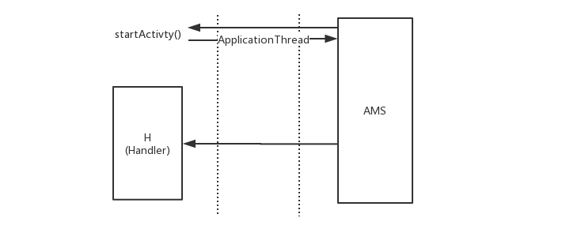
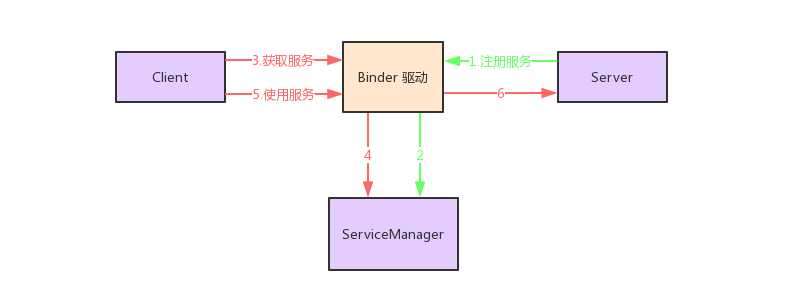
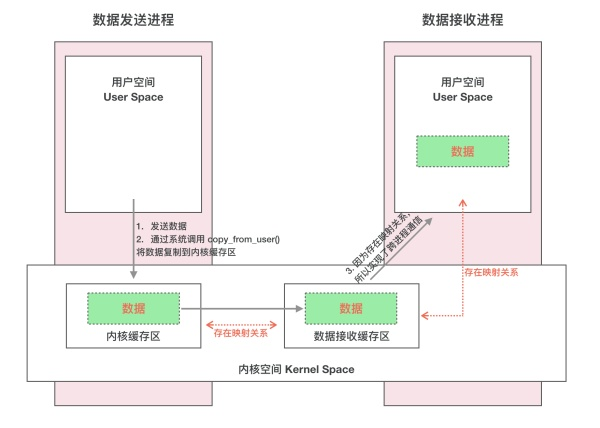
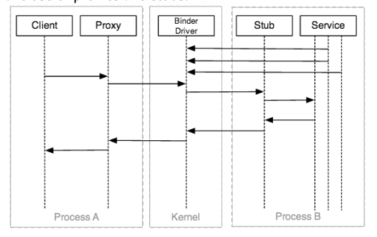

# Android 系统源码-2：Binder 通信机制

Binder 是 Android 系统中非常重要的组成部分。Android 系统中的许多功能建立在 Binder 机制之上。在这篇文章中，我们会对 Android 中的 Binder 在系统架构中的作用进行分析；然后，我们会从底层的实现角度简要说明为什么 Android 要开发出一套独立的跨进程通信机制；最后，我们会给出一个 AIDL 的使用示例来说明如何使用 Binder 来进行通信。

## 1、什么是 Binder？ 为什么说它对 Android 系统至关重要？

“什么是 Binder？ 为什么说它对 Android 系统至关重要？” 在回答这个问题之前，我们先来说下其他的东西。

不知道你有没有思考过这么一个问题：为什么当我们在 Android 中启动一个页面的时候需要调用 `startActivity()` 方法，然后还要传入一个 Intent？ 如果我们不使用这种传递值的方式，直接写成静态的变量有没有问题？这也是之前有人问过我的一个问题。

对上面的两个问题，我们先回答第二个。使用静态的变量传递值在大部分情况下是可以的，当然要注意在使用完了值之后要及时释放资源，不然会占用太多内存，甚至 OOM. 但是，在特殊的情况下它是无法适用的，即跨进程的情况下。这是因为，静态的变量的作用范围只是其所在的进程，在其他进程访问的时候属于跨进程访问，当然访问不到了。对于第一个问题，Android 中的一个 Activity 的启动过程远比我们想象的复杂，其中就涉及跨进程的通信过程。当我们调用 `startActivity()` 方法之后，我们的所有的 “意图” 会经过层层过滤，直到一个称之为 AMS 的地方被处理。处理完之后，再跨进程调用你启动页面时的进程进行后续处理，即回调 `onCreate()` 等生命周期方法。

*一个 Activity 的启动过程涉及 Android 中两种重要的通信机制，Binder 和 Handler，我们会在以后的文章中对此进行分析。*

下面我们通过一个简单的图来说明一下 Activity 的启动过程：



当我们调用 `startActivity()` 方法的时候，首先会从 ServiceManager 中获取到 ActivityManagerService （就是 AMS），然后将 ApplicationThread 作为参数传递给 AMS，然后执行 AMS 的方法来启动 Activity. （在我们的应用进程中执行另一个进程的方法。）

AMS 是全局的，在系统启动的时候被启动。当我们使用它的时候从 ServiceManager 中获取这个全局的变量即可。当我们调用它的方法的时候，方法具体的执行逻辑将在系统的进程中执行。我们传入的  ApplicationThread 就像一个信使一样。当 AMS 处理完毕，决定回调 Activity 的生命周期方法的时候，就直接调用 ApplicationThread 的方法（这是在另一个进程中调用我们的应用进程）。这样就实现了我们的 Activity 的生命周期的回调。

看了上面的过程，也许有的同学会觉得。Binder 对 Android 系统至关重要，但是我们并没有用到 Binder 啊。实际上，我们只是没有直接使用 Binder. 以下图为例，我们说下我们实际开发过程中是如何使用 Binder 的。


在大多数情况下，我们都在与各个 Manager 进行交互，而实际上这些 Manager 内部是使用 Binder 来进行跨进程通信的。如上所示，当我们调用 Manager 的时候，Manager 会通过代理类来从 Binder 驱动中得到另一个进程的 Stub 对象，然后我们使用该 Stub 对象，远程调用另一个进程的方法。只是这个过程被封装了，我们没有感知到而已，而这个跨进程通信 (IPC) 的机制就是 Binder 机制。

至于什么是 Stub 呢？Stub 是 AIDL 规范中的一部分。AIDL 为我们使用 Binder 提供了一套模板。在 Android 系统中大量使用了这种定义来完成跨进程通信。稍后我们介绍 AIDL 的时候，你将看到它是如何作用的。

## 2、为什么是 Binder 而不是其他通信机制？

Android 是基于 Linux 的，Linux 本身已经具有了许多的 IPC 机制，比如：管道（Pipe）、信号（Signal）和跟踪（Trace）、插口（Socket）、消息队列（Message）、共享内存（Share Memory）和信号量（Semaphore）。那么，为什么 Android 要特立独行地搞出一套 IPC 机制呢？这当然是有原因的：

1. **效率上** ：Socket 作为一款通用接口，其传输效率低，开销大，主要用在跨网络的进程间通信和本机上进程间的低速通信。消息队列和管道采用存储-转发方式，即数据先从发送方缓存区拷贝到内核开辟的缓存区中，然后再从内核缓存区拷贝到接收方缓存区，至少有两次拷贝过程。共享内存虽然无需拷贝，但控制复杂，难以使用。**Binder 只需要一次数据拷贝，性能上仅次于共享内存**。

2. **稳定性：Binder 基于 C|S 架构，客户端（Client）有什么需求就丢给服务端（Server）去完成，架构清晰、职责明确又相互独立，自然稳定性更好。** 共享内存虽然无需拷贝，但是控制负责，难以使用。从稳定性的角度讲，Binder 机制是优于内存共享的。

3. **安全性：Binder 通过在内核层为客户端添加身份标志 `UID|PID`，来作为身份校验的标志，保障了通信的安全性。** 传统 IPC 访问接入点是开放的，无法建立私有通道。比如，命名管道的名称，SystemV 的键值，Socket 的 ip 地址或文件名都是开放的，只要知道这些接入点的程序都可以和对端建立连接，不管怎样都无法阻止恶意程序通过猜测接收方地址获得连接。

除了上面的原因之外，Binder 还拥有许多其他的特性，比如：1).采用引用计数，当某个 Binder 不再被任何客户端引用的时候，会通知它的持有者可以将其释放，这适用于 Android 这种常常因为资源不足而回收资源的应用场景。2).它内部维护了一个线程池；3).可以像触发本地方法一样触发远程的方法。4).支持同步和异步 (oneway) 的触发模型；5).可以使用 AIDL 模板进行描述和开发。

## 3、Binder 模型，Binder 中的 4 个主要角色

在 Binder 模型中共有 4 个主要角色，它们分别是：Client、Server、Binder 驱动和 ServiceManager. Binder 的整体结构是基于 C|S 结构的，以我们启动 Activity 的过程为例，每个应用都会与 AMS 进行交互，当它们拿到了 AMS 的 Binder 之后就像是拿到了网络接口一样可以进行访问。如果我们将 Binder 和网络的访问过程进行类比，**那么 Server 就是服务器，Client 是客户终端，ServiceManager 是域名服务器（DNS），驱动是路由器。其中 Server、Client 和 ServiceManager 运行于用户空间，驱动运行于内核空间**。

当我们的系统启动的时候，会在启动 SystemServer 进程的时候启动各个服务，也包括上面的 AMS. 它们会被放进一个哈希表中，并且哈希表的键是字符串。这样我们就可以通过服务的字符串名称来找到对应的服务。这些服务就是一个个的 Binder 实体，对于 AMS 而言，也就是 `IActivityManager.Stub` 实例。这些服务被启动的之后就像网络中的服务器一样一直等待用户的访问。

对于这里的 ServiceManager，它也是一种服务，但是它比较特殊，它会在所有其他的服务之前被注册，并且只被注册一次。它的作用是用来根据字符串的名称从哈希表中查找服务，以及在系统启动的时候向哈希表中注册服务。



所以，我们可以使用上面的这张图来描述整个 Binder 模型：首先，在系统会将应用程序所需的各种服务通过 Binder 驱动注册到系统中（ServiceManager 先被注册，之后其他服务再通过 ServiceManager 进行注册），然后当某个客户端需要使用某个服务的时候，也需要与 Binder 驱动进行交互，Binder 会通过服务的名称到 ServiceManager 中查找指定的服务，并将其返回给客户端程序进行使用。

## 4、Binder 的原理

上面我们梳理了 Binder 的模型，以及为什么系统设计一套通信机制的原因。那么你是否也好奇神乎其神的 Binder 究竟是怎么实现的呢？这里我们来梳理下 Binder 内部实现的原理。

首先，Binder 的实现过程是非常复杂的，在《Android 系统源码情景分析》一书中有 200 页的篇幅都在讲 Binder. 在这里我们不算详细地讲解它的具体的实现原理，我们只对其中部分内容做简单的分析，并且不希望涉及大量的代码。

### 4.1 inder 相关的系统源码的结构

然后，我们需要介绍下 Binder 相关的核心类在源码中的位置，

```java
-framework
    |--base
        |--core
            |--java--android--os  
                              |--IInterface.java
                              |--IBinder.java
                              |--Parcel.java
                              |-- IServiceManager.java
                              |--ServiceManager.java
                              |--ServiceManagerNative.java
                              |--Binder.java  
            |--jni
                |--android_os_Parcel.cpp
                |--AndroidRuntime.cpp
                |--android_util_Binder.cpp
    |--native
        |--libs--binder         
                  |--IServiceManager.cpp
                  |--BpBinder.cpp
                  |--Binder.cpp             // Binder 的具体实现
                  |--IPCThreadState.cpp
                  |--ProcessState.cpp
        |--include--binder                  // 主要是一些头文件
                      |--IServiceManager.h
                      |--IInterface.h
        |--cmds--servicemanager
                    |--service_manager.c    // 用来注册服务的 ServiceManager
                    |--binder.c
-kernel-drivers-staging-android
                         |--binder.c        
                         |--uapi-binder.h
```

### 4.2 Binder 实现过程中至关重要的几个函数

当我们查看 binder.c 的源码的时候，或者查看与 Binder 相关的操作的时候，经常看到几个操作 ioctl, mmap 和 open. 那么这几个操作符是什么含义呢？

首先，`open` 函数用来打开文件的操作符，在使用的时候需要引入头文件，`#include <sys/types.h>`、`#include <sys/stat.h>` 和 `#include <fcntl.h>`，其函数定义如下，

```c
int open(const char * pathname, int flags);
int open(const char * pathname, int flags, mode_t mode);
```

这里的 `pathname` 表示文件路径；`flag` 表示打开方式；`mode` 表示打开的模式和权限等；若所有欲核查的权限都通过了检查则返回 0, 表示成功, 只要有一个权限被禁止则返回-1.

然后是 `ioctl` 指令，使用的时候需要引入 `#include <sys/ioctl.h>` 头文件，ioctl 是设备驱动程序中对设备的 I/O 通道进行管理的函数，用于向设备发控制和配置命令。其函数定义如下： 

```c
int ioctl(int fd, ind cmd, …)； 
```

其中 fd 是用户程序打开设备时使用 open 函数返回的文件标示符，cmd 是用户程序对设备的控制命令，至于后面的省略号，那是一些补充参数，一般最多一个，这个参数的有无和 cmd 的意义相关。 

最后是 `mmap` 函数，它用来实现内存映射。使用的时候需要引入头文件 `#include <sys/mman.h>`. 与之对应的还有 `munmap` 函数。它们的函数定义如下，

```c
void* mmap(void* start,size_t length,int prot,int flags,int fd,off_t offset);
int munmap(void* start,size_t length);
```

这里的参数的含义是：

1. start：映射区的开始地址，设置为0时表示由系统决定映射区的起始地址；
2. length：映射区的长度。长度单位是以字节为单位，不足一内存页按一内存页处理；
3. prot：期望的内存保护标志，不能与文件的打开模式冲突。是以下的某个值，可以通过 o r运算合理地组合在一起；
4. flags：指定映射对象的类型，映射选项和映射页是否可以共享。它的值可以是一个或者多个以下位的组合体；
5. fd：有效的文件描述词。一般是由 `open()` 函数返回，其值也可以设置为-1，此时需要指定 flags 参数中的 MAP_ANON,表明进行的是匿名映射；
6. off_toffset：被映射对象内容的起点。

成功执行时，`mmap()` 返回被映射区的指针，`munmap()` 返回0。失败时，`mmap()` 返回 MAP_FAILED[其值为(void *)-1]，`munmap()` 返回 -1.

### 4.3 ServiceManger 启动

Binder 中的 ServiceManager 并非 Java 层的 ServiceManager，而是 Native 层的。启动 ServiceManager 由 init 进程通过解析 init.rc 文件而创建。启动的时候会找到上述源码目录中的 service_manager.c 文件中，并调用它的 main() 方法，

```c
// platform/framework/native/cmds/servicemanager.c
int main(int argc, char** argv)
{
    struct binder_state *bs;
    char *driver;

    if (argc > 1) {
        driver = argv[1];
    } else {
        driver = "/dev/binder";
    }
    // 1. 打开 binder 驱动
    bs = binder_open(driver, 128*1024);
    // ...
    // 2. 将当前的 ServiceManger 设置成上下文
    if (binder_become_context_manager(bs)) {
        return -1;
    }
    // ...
    // 3. 启动 binder 循环，进入不断监听状态
    binder_loop(bs, svcmgr_handler);
    return 0;
}
```

ServcieManager 启动的过程就是上面三个步骤，无需过多说明。下面我们给出这三个方法具体实现的。在下面的代码中你将看到我们之前介绍的三个函数的实际应用。相应有了前面的铺垫之后你理解起来不成问题 :)

```c
// platform/framework/native/cmds/servicemanager.c
struct binder_state *binder_open(const char* driver, size_t mapsize)
{
    struct binder_state *bs;
    struct binder_version vers;
    bs = malloc(sizeof(*bs));
    if (!bs) {
        errno = ENOMEM;
        return NULL;
    }
    // 打开设备驱动
    bs->fd = open(driver, O_RDWR | O_CLOEXEC);
    if (bs->fd < 0) {
        goto fail_open;
    }
    // 向驱动发送指令，获取binder版本信息
    if ((ioctl(bs->fd, BINDER_VERSION, &vers) == -1) ||
        (vers.protocol_version != BINDER_CURRENT_PROTOCOL_VERSION)) {
        goto fail_open;
    }
    bs->mapsize = mapsize;
    // 通过系统调用，mmap 内存映射，mmap 必须是 page 的整数倍
    bs->mapped = mmap(NULL, mapsize, PROT_READ, MAP_PRIVATE, bs->fd, 0);
    if (bs->mapped == MAP_FAILED) {
        goto fail_map;
    }
    return bs;
fail_map:
    close(bs->fd);
fail_open:
    free(bs);
    return NULL;
}
```

在上面的代码中，先使用 `open()` 函数打开设备驱动（就是一个打开文件的操作），然后使用 `ioctl()` 函数向上面的设备驱动发送指令以获取设备信息。最后，通过 `mmap()` 函数实现内存映射，并将上述的文件描述符传入。这里的 binder_state 是一个结构体，定义如下。其实就是用来描述 binder 的状态。从上面我们也能看到它的三个变量的赋值过程。

```c
// platform/framework/native/cmds/servicemanager.c
struct binder_state
{
    int fd;
    void *mapped;
    size_t mapsize;
};
```

当然，在上面的代码中，我们又见到了久违的 goto 指令。它们主要用来处理发生一些异常的情况。

打开了驱动之后，注册为上下文的方法更加简单，

```c
// platform/framework/native/cmds/servicemanager.c
int binder_become_context_manager(struct binder_state *bs)
{
    return ioctl(bs->fd, BINDER_SET_CONTEXT_MGR, 0);
}
```

就是一个 `ioctl` 函数，使用指令 `BINDER_SET_CONTEXT_MGR` 将当前的 ServiceManager 注册为上下文。

最后就是启动 Binder 循环了。它的逻辑也没有想象中得复杂，就是启动了 for 循环，

```c
// platform/framework/native/cmds/servicemanager.c
void binder_loop(struct binder_state *bs, binder_handler func)
{
    int res;
    struct binder_write_read bwr;
    uint32_t readbuf[32];

    bwr.write_size = 0;
    bwr.write_consumed = 0;
    bwr.write_buffer = 0;

    readbuf[0] = BC_ENTER_LOOPER;
    // 将 BC_ENTER_LOOPER 命令发送给 binder 驱动，内部调用 ioctl 函数
    binder_write(bs, readbuf, sizeof(uint32_t));

    for (;;) {
        bwr.read_size = sizeof(readbuf);
        bwr.read_consumed = 0;
        bwr.read_buffer = (uintptr_t) readbuf;
        // 使用 iotcl 函数读取
        res = ioctl(bs->fd, BINDER_WRITE_READ, &bwr);
        if (res < 0) {
            break;
        }
        // 解析
        res = binder_parse(bs, 0, (uintptr_t) readbuf, bwr.read_consumed, func);
        if (res == 0) {
            break;
        }
        if (res < 0) {
            break;
        }
    }
}
```

从上面看出，函数将会在 binder_write() 中将命令发送给 Binder 驱动，以启动循环。其实内部也是调用 ioctl 函数实现的。然后程序会启动一个循环来不断读取、解析。这是服务器很典型的操作了。

当然，我们上面分析的是 ServiceManager 中向 Binder 写命令的过程，而驱动如何解析呢？当然是在驱动中实现了，详细的过程可以查看 Binder 驱动部分的源码。

### 4.4 Binder 的跨进程通信过程

下面我们以 AMS 作为例子来讲解下 Binder 跨进程通信的实现过程。首先，当我们调用 `startActivity()` 方法的时候，最终将会进入 ActivityManager 以获取 AMS，

```java
    // platform/framework/base/core/java/android/app/ActivityManager.java
    final IBinder b = ServiceManager.getService(Context.ACTIVITY_SERVICE);
    final IActivityManager am = IActivityManager.Stub.asInterface(b);
    return am;
```

这里会使用 ServiceManger 来按名称查找 AMS，查找到 Binder 对象之后将其转换成 AMS 就可以使用了。之前，我们也说过用来查找 AMS 的 SeerviceManager 本身也是一种服务。所以，它这里的方法也是通过 Binder 来实现的。那么，我们就从这里的 `getService()` 方法入手。

```java
    // platform/framework/base/core/java/android/os/ServiceManager.java
    public static IBinder getService(String name) {
        try {
            IBinder service = sCache.get(name);
            if (service != null) {
                return service;
            } else {
                return Binder.allowBlocking(rawGetService(name));
            }
        } catch (RemoteException e) { /* ... */ }
        return null;
    }
```

这里会先尝试从缓存当中取 Binder，取不到的话就从远程进行获取。这里使用 `rawGetService()` 方法来从远程获取 Binder，代码如下，

```java
    // platform/framework/base/core/java/android/os/ServiceManager.java
    private static IBinder rawGetService(String name) throws RemoteException {
        final IBinder binder = getIServiceManager().getService(name);
        // ...		
        return binder;
    }

    // platform/framework/base/core/java/android/os/ServiceManager.java
    private static IServiceManager getIServiceManager() {
        if (sServiceManager != null) {
            return sServiceManager;
        }
        sServiceManager = ServiceManagerNative
                .asInterface(Binder.allowBlocking(BinderInternal.getContextObject()));
        return sServiceManager;
    }
```

在 `rawGetService()` 方法中会使用 `ServiceManagerNative` 的 `getService()` 方法从远程获取 Binder. 这里的 ServiceManagerNative 本质上只是一个代理类，它实际的逻辑是由 `BinderInternal.getContextObject()` 返回的 Binder 实现的。

也许你已经晕了，怎么那么多 Binder……我来说明下。当要查找 AMS 的时候实际上是一个跨进程的调用过程，也就是实际的查找的逻辑是在另一个进程实现，因此需要 Binder 来通信。而查找 AMS 的远程对象实际上就是我们上面所说的 ServiceManager (Native 层的而不是 Java 层的，Java 层的 ServiceManager 是一个代理类，是用来从远程获取服务的）。

因此，按照上面的描述，`BinderInternal.getContextObject()` 返回的就应该是远程的 Binder 对象。于是方法进入 Native 层，

```c++
// platform/framework/base/core/jni/android_util_Binder.cpp
static jobject android_os_BinderInternal_getContextObject(JNIEnv* env, jobject clazz)
{
    sp<IBinder> b = ProcessState::self()->getContextObject(NULL);
    return javaObjectForIBinder(env, b);
}
```

这里的 `ProcessState::self()` 是否熟悉呢？你是否还记得在上一篇文章中，我们介绍 Android 系统启动过程的时候介绍过它。我们曾经使用它来开启 Binder 的线程池。这里的 `self()` 方法其实是用来获取一个单例对象的。我们可以直接由 `getContextObject()` 进入 `getStrongProxyForHandle()` 方法。从下面的方法中我们可以看出，这里调用了 `BpBinder` 的 `create()` 方法创建了一个 BpBinder 实例并返回，也就是我们的 ServiceManager.

```c++
// plaftorm/framework/native/libs/binder/ProcessState.cpp
sp<IBinder> ProcessState::getStrongProxyForHandle(int32_t handle)
{
    sp<IBinder> result;
    AutoMutex _l(mLock);
    handle_entry* e = lookupHandleLocked(handle);
    if (e != nullptr) {
        IBinder* b = e->binder;
        if (b == nullptr || !e->refs->attemptIncWeak(this)) {
            // ...
			// 调用 BpBinder
            b = BpBinder::create(handle);
            e->binder = b;
            if (b) e->refs = b->getWeakRefs();
            result = b;
        } else {
            result.force_set(b);
            e->refs->decWeak(this);
        }
    }
```

当我们拿到了 ServiceManager 的 Binder 之后就可以调用它的 `getService()` 方法来获取服务了，

```java
    // platform/framework/base/core/java/android/os/ServiceManagerNative.java
    public IBinder getService(String name) throws RemoteException {
        Parcel data = Parcel.obtain();
        Parcel reply = Parcel.obtain();
        data.writeInterfaceToken(IServiceManager.descriptor);
        data.writeString(name);
        mRemote.transact(GET_SERVICE_TRANSACTION, data, reply, 0);
        IBinder binder = reply.readStrongBinder();
        reply.recycle();
        data.recycle();
        return binder;
    }
```

这里的 mRemote 就是之前返回的 BpBinder，这里调用它的 `transact()` 方法，并传入了一个方法标记 GET_SERVICE_TRANSACTION. 

```c++
// platform/framework/native/libs/binder/BpBinder.cpp
status_t BpBinder::transact(uint32_t code, const Parcel& data, Parcel* reply, uint32_t flags)
{
    if (mAlive) {
        status_t status = IPCThreadState::self()->transact(mHandle, code, data, reply, flags);
        if (status == DEAD_OBJECT) mAlive = 0;
        return status;
    }
    return DEAD_OBJECT;
}
```

显然这里会调用 IPCThreadState 的 `self()` 方法先获取一个单例的对象，然后调用它的 `transact()` 方法继续方法的执行。

```c++
// platform/framework/native/libs/binder/IPCThreadState.cpp
status_t IPCThreadState::transact(int32_t handle, uint32_t code, 
    const Parcel& data, Parcel* reply, uint32_t flags)
{
    status_t err;
    // ...
    err = writeTransactionData(BC_TRANSACTION, flags, handle, code, data, nullptr);
    // ...
    if ((flags & TF_ONE_WAY) == 0) { // OneWay 类型的调用，同步的
        // ...
		if (reply) {
            // 等待相应
            err = waitForResponse(reply);
        } else {
            Parcel fakeReply;
            err = waitForResponse(&fakeReply);
        }
        IF_LOG_TRANSACTIONS() {
            TextOutput::Bundle _b(alog);
            if (reply) alog << indent << *reply << dedent << endl;
            else alog << "(none requested)" << endl;
        }
    } else { // 异步的
        err = waitForResponse(nullptr, nullptr);
    }
    return err;
}
```

上面会调用 `writeTransactionData()` 方法用来将数据写入到 Parcel 中。然后将会进入 `waitForResponse()` 方法处理与 ServiceManager 交互的结果。而真实的交互发生的地方位于 `talkWithDriver()` 方法，

```c++
// platform/framework/native/libs/binder/IPCThreadState.cpp
status_t IPCThreadState::talkWithDriver(bool doReceive)
{
    if (mProcess->mDriverFD <= 0) {
        return -EBADF;
    }

    binder_write_read bwr;
    const bool needRead = mIn.dataPosition() >= mIn.dataSize();
    const size_t outAvail = (!doReceive || needRead) ? mOut.dataSize() : 0;

    bwr.write_size = outAvail;
    bwr.write_buffer = (uintptr_t)mOut.data();

    if (doReceive && needRead) {
        bwr.read_size = mIn.dataCapacity();
        bwr.read_buffer = (uintptr_t)mIn.data();
    } else {
        bwr.read_size = 0;
        bwr.read_buffer = 0;
    }

    if ((bwr.write_size == 0) && (bwr.read_size == 0)) return NO_ERROR;

    bwr.write_consumed = 0;
    bwr.read_consumed = 0;
    status_t err;
    do {
        // 通过 ioctl 读写操作，与 Binder Driver 进行交互
        if (ioctl(mProcess->mDriverFD, BINDER_WRITE_READ, &bwr) >= 0)
            err = NO_ERROR;
        else
            err = -errno;
        if (mProcess->mDriverFD <= 0) {
            err = -EBADF;
        }
    } while (err == -EINTR);
    // ...
    return err;
}
```

binder_write_read 结构体用来与 Binder 设备交换数据的结构, 通过 ioctl 与 mDriverFD 通信，是真正与 Binder 驱动进行数据读写交互的过程。先向service manager进程发送查询服务的请求(BR_TRANSACTION)。然后，service manager 会在之前开启的循环中监听到，并使用 `svcmgr_handler()` 方法进行处理。

```c++
// platform/framework/native/cmds/servicemanager.c
int svcmgr_handler(struct binder_state *bs,
                   struct binder_transaction_data *txn,
                   struct binder_io *msg,
                   struct binder_io *reply)
{
    // ...
    switch(txn->code) {
        case SVC_MGR_GET_SERVICE:
        case SVC_MGR_CHECK_SERVICE:
            s = bio_get_string16(msg, &len);
            if (s == NULL) {
                return -1;
            }
            handle = do_find_service(s, len, txn->sender_euid, txn->sender_pid);
            if (!handle)
                break;
            bio_put_ref(reply, handle);
            return 0;
        case SVC_MGR_ADD_SERVICE: // ...
        case SVC_MGR_LIST_SERVICES: // ...
    }
    return 0;
}
```

显然，这里会从 binder_transaction_data 中取出 code，即 SVC_MGR_GET_SERVICE，然后使用 `do_find_service()` 方法查找服务。然后再 binder_send_reply() 应答发起者将结果返回即可。

### 4.5 Binder 高效通信的原因

上面我们梳理了 Binder 通信的过程，从上面我们似乎并没有看到能证明 Binder 高效的证据。那么 Binder 究竟靠什么实现高效的呢？

实际上，Binder 之所以高效，从我们上面的代码还真看不出来。因为，我们上面的代码并没有涉及 Binder 驱动部分。正如我们之前描述的那样，ServiceManager、客户端和服务器实际是靠 Binder 驱动这个中间媒介进行交互的。而 Binder 高效的地方就发生在 Binder 驱动部分。



> 图片来自 [《写给 Android 应用工程师的Binder原理剖析》](https://zhuanlan.zhihu.com/p/35519585)

就像图片描述的那样，当两个进程之间需要通信的时候，Binder 驱动会在两个进程之间建立两个映射关系：内核缓存区和内核中数据接收缓存区之间的映射关系，以及内核中数据接收缓存区和接收进程用户空间地址的映射关系。这样，当把数据从 1 个用户空间拷贝到内核缓冲区的时候，就相当于拷贝到了另一个用户空间中。这样只需要做一次拷贝，省去了内核中暂存这个步骤，提升了一倍的性能。实现内存映射靠的就是上面的 `mmap()` 函数。

## 5、Binder 的使用

### 5.1 代理模式

`Binder` 本质上只是一种底层通信方式，和具体服务没有关系。为了提供具体服务，`Server` 必须提供一套接口函数以便 `Client` 通过远程访问使用各种服务。这时通常采用**代理设计模式**：将接口函数定义在一个抽象类中，`Server` 和 `Client` 都会以该抽象类为基类实现所有接口函数。所不同的是 `Server` 端是真正的功能实现，而 `Client` 端是对这些函数远程调用请求的包装。为了简化这种设计模式，Android 中提供了 AIDL 供我们使用。下文中我们会介绍 AIDL 相关的内容以及它的一些基本的使用方式。

### 5.2 AIDL

`AIDL (Android Interface Definition Language，Android 接口定义语言)` 是一种文件格式，用来简化 Binder 的使用。当使用 Binder 的时候，只需要创建一个后缀名为 `.aidl` 的文件，然后像定义接口一样定义方法。定义完毕之后，使用工具 `aidl.exe` 即可生成 Binder 所需要的各种文件。当然，我们的 AS 已经为我们集成了 `aidl.exe`，所以，只需要在定义了 AIDL 文件之后，**编译**即可生成使用 `Binder` 时所需的文件。当然，不使用 AIDL，直接编写 Binder 所需的 java 文件也是可以的。

AIDL 是一种接口定义语言，它与 Java 中定义接口的方式有所区别。下面我们通过一个例子来说明 AIDL 的使用方式。

这里我们模拟一个笔记管理的类，通过在 Activity 中与一个远程的 Service 进行交互来实现 IPC 的效果。这里，我们先要定义数据实体 Note，它只包含两个字段，并且实现了 Parcelable。这里 Note 所在的目录是 `me.shouheng.advanced.aidl`，然后，我们需要在 `src/main` 建立一个同样的包路径，然后定义所需的 AIDL 文件：

```java
    // INoteManager.aidl
    package me.shouheng.advanced.aidl;
    import me.shouheng.advanced.aidl.Note;
    interface INoteManager {
        Note getNote(long id);
        void addNote(long id, String name);
    }

    // Note.aidl
    package me.shouheng.advanced.aidl;
    parcelable Note;
```

注意，在 INoteManager 文件中，我们定义了远程服务所需的各种方法。这里只定义了两个方法，一个用来获取指定 `id` 的笔记，一个用来向远程服务中添加一条笔记记录。

这样定义完了之后，我们可以对项目进行编译，这样就可以 build 目录下面得到为我们生成好的 INoteManager 类文件。以后，我们就可以使用这个文件中生成类和方法来进行远程通信。但在使用该接口之前，我们还是先来看一下其中都生成了些什么东西：

```java
package me.shouheng.advanced.aidl;

public interface INoteManager extends android.os.IInterface {

    // 交给远程来实现具体的业务逻辑
    public static abstract class Stub extends android.os.Binder implements me.shouheng.advanced.aidl.INoteManager {

        private static final java.lang.String DESCRIPTOR = "me.shouheng.advanced.aidl.INoteManager";

        public Stub() {
            this.attachInterface(this, DESCRIPTOR);
        }

        // 使用代理包装远程对象
        public static me.shouheng.advanced.aidl.INoteManager asInterface(android.os.IBinder obj) {
            if ((obj==null)) {
                return null;
            }
            android.os.IInterface iin = obj.queryLocalInterface(DESCRIPTOR);
            if (((iin!=null)&&(iin instanceof me.shouheng.advanced.aidl.INoteManager))) {
                return ((me.shouheng.advanced.aidl.INoteManager)iin);
            }
            // 返回代理对象
            return new me.shouheng.advanced.aidl.INoteManager.Stub.Proxy(obj);
        }

        @Override
        public android.os.IBinder asBinder() {
            return this;
        }

        // 真实地发送数据交换的地方
        @Override
        public boolean onTransact(int code, android.os.Parcel data, android.os.Parcel reply, int flags) throws android.os.RemoteException {
            switch (code) {
                case INTERFACE_TRANSACTION: {
                    reply.writeString(DESCRIPTOR);
                    return true;
                }
                case TRANSACTION_getNote: {
                    data.enforceInterface(DESCRIPTOR);
                    long _arg0;
                    _arg0 = data.readLong();
                    // 使用模板方法来实现业务
                    me.shouheng.advanced.aidl.Note _result = this.getNote(_arg0);
                    reply.writeNoException();
                    if ((_result!=null)) {
                        reply.writeInt(1);
                        _result.writeToParcel(reply, android.os.Parcelable.PARCELABLE_WRITE_RETURN_VALUE);
                    } else {
                        reply.writeInt(0);
                    }
                    return true;
                }
                case TRANSACTION_addNote: {
                    data.enforceInterface(DESCRIPTOR);
                    long _arg0;
                    _arg0 = data.readLong();
                    java.lang.String _arg1;
                    _arg1 = data.readString();
                    // 使用模板方法来实现业务
                    this.addNote(_arg0, _arg1);
                    reply.writeNoException();
                    return true;
                }
            }
            return super.onTransact(code, data, reply, flags);
        }

        // 代理对象，包装了远程对象，内部调用远程对象获取远程的服务信息
        private static class Proxy implements me.shouheng.advanced.aidl.INoteManager {

            private android.os.IBinder mRemote;

            Proxy(android.os.IBinder remote) {
                mRemote = remote;
            }

            @Override
            public android.os.IBinder asBinder() {
                return mRemote;
            }

            public java.lang.String getInterfaceDescriptor() {
                return DESCRIPTOR;
            }

            @Override
            public me.shouheng.advanced.aidl.Note getNote(long id) throws android.os.RemoteException {
                android.os.Parcel _data = android.os.Parcel.obtain();
                android.os.Parcel _reply = android.os.Parcel.obtain();
                me.shouheng.advanced.aidl.Note _result;
                try {
                    _data.writeInterfaceToken(DESCRIPTOR);
                    _data.writeLong(id);
                    // 实际内部调用远程对象，在另一个进程实现业务逻辑
                    mRemote.transact(Stub.TRANSACTION_getNote, _data, _reply, 0);
                    _reply.readException();
                    if ((0!=_reply.readInt())) {
                        _result = me.shouheng.advanced.aidl.Note.CREATOR.createFromParcel(_reply);
                    } else {
                        _result = null;
                    }
                } finally {
                    _reply.recycle();
                    _data.recycle();
                }
                return _result;
            }

            @Override
            public void addNote(long id, java.lang.String name) throws android.os.RemoteException {
                android.os.Parcel _data = android.os.Parcel.obtain();
                android.os.Parcel _reply = android.os.Parcel.obtain();
                try {
                    _data.writeInterfaceToken(DESCRIPTOR);
                    _data.writeLong(id);
                    _data.writeString(name);
                    // 实际内部调用远程对象，在另一个进程实现业务逻辑
                    mRemote.transact(Stub.TRANSACTION_addNote, _data, _reply, 0);
                    _reply.readException();
                } finally {
                    _reply.recycle();
                    _data.recycle();
                }
            }
        }

        // 方法 id，用来标记当前调用的是哪个方法
        static final int TRANSACTION_getNote = (android.os.IBinder.FIRST_CALL_TRANSACTION + 0);
        static final int TRANSACTION_addNote = (android.os.IBinder.FIRST_CALL_TRANSACTION + 1);
    }

    public me.shouheng.advanced.aidl.Note getNote(long id) throws android.os.RemoteException;

    public void addNote(long id, java.lang.String name) throws android.os.RemoteException;
}
```

如果只是看这上面的生成的代码，也许你仍然无法了解这些生成的类究竟有什么作用。下面就让我们通过使用上面生成的类来说明 AIDL 的具体工作流程。

首先，我们要定义远程的服务，并在该服务中实现业务逻辑：

```java
public class NoteService extends Service {

    private CopyOnWriteArrayList<Note> notes = new CopyOnWriteArrayList<>();

    // 当前服务运行于另一个进程，这里实现业务逻辑
    private Binder binder = new INoteManager.Stub() {
        @Override
        public Note getNote(long id) {
            return Observable.fromIterable(notes).filter(note -> note.id == id).singleOrError().blockingGet();
        }

        @Override
        public void addNote(long id, String name) {
            notes.add(new Note(id, name));
        }
    };

    @Override
    public void onCreate() {
        super.onCreate();
        notes.add(new Note(100, "Note 100"));
        notes.add(new Note(101, "Note 101"));
    }

    // 将 binder 返回，客户端可以使用连接来获取并调用
    @Nullable
    @Override
    public IBinder onBind(Intent intent) {
        return binder;
    }
}
```

这里在 `onCreate()` 方法中创建了两条记录，并且创建了 `INoteManager.Stub` 的实例，并在 `onBind()` 方法中将其返回。然后，我们在一个 `Activity` 中启动该远程服务，并尝试从该服务中获取指定 `id` 的笔记记录。从期望的结果来看，它的功能有些类似于 `ContentProvider`，即用来向调用者提供数据。

下面是该 `Activity` 的实现。这里我们在 `onCreate()` 方法中启动上述服务。并将实例化的 `ServiceConnection` 作为参数启动该服务。在 `ServiceConnection` 的方法中，我们调用 `INoteManager.Stub` 的 `asInterface(IBinder)` 方法来讲 `service` 转换成 `INoteManager`，然后从其中获取指定 `id` 的笔记记录即可。

```java
    // 创建服务连接
    private ServiceConnection connection = new ServiceConnection() {
        @Override
        public void onServiceConnected(ComponentName name, IBinder service) {
            // 返回代理对象
            INoteManager noteManager = INoteManager.Stub.asInterface(service);
            try {
                // 使用代理对象
                Note note = noteManager.getNote(100);
                LogUtils.d(note);
            } catch (RemoteException e) {
                e.printStackTrace();
            }
        }

        @Override
        public void onServiceDisconnected(ComponentName name) { }
    };

    @Override
    protected void doCreateView(Bundle savedInstanceState) {
        Intent intent = new Intent(this, NoteService.class);
        // 绑定服务
        bindService(intent, connection, Context.BIND_AUTO_CREATE);
    }

    @Override
    protected void onDestroy() {
        super.onDestroy();
        // 解绑服务
        unbindService(connection);
    }
}
```

根据 `INoteManager.Stub` 的 `asInterface()` 方法的定义，该方法中会将传入的 `service` 包装成一个 `INoteManager.Stub.Proxy` 返回，所以，我们在 `onServiceConnected()` 方法中实际调用的是该代理类的 `getNote()` 方法。而该代理类的 `getNote()` 方法中又调用了传入的 `mRemote.transact()` 方法。而这里的 `service` 正是我们在 `NoteService` 中创建的 `binder`。也就是说，当我们在 `onServiceConnected()` 中调用 `getNote()` 方法的时候，实际上调用了 `INoteManager.Stub` 的 `transact()` 方法。

所以，从上面我们看出：

1. 这里就像是在当前进程中调用了另一个进程的方法一样。这个调用的过程是通过 `Binder` 来实现的。
2. 当调用 `INoteManager.Stub` 的 `transact()` 方法的时候，通过传入了一个整型的 `code` 来作为要触发的方法的标识，这就是我们上面提到的方法的编号。

于是，我们可以通过下面的这张图来总结在上面使用 AIDL 的过程中各部分扮演的角色：



也就是客户端通过 `Proxy` 访问 `Binder` 驱动，然后 `Binder` 驱动调用 `Stub`，而 `Stub` 中调用我们的业务逻辑。这里的 `Proxy` 和 `Stub` 用来统一接口函数，`Proxy` 用来告诉我们远程服务中有哪些可用的方法，而具体的业务逻辑则由 `Stub` 来实现。`Binder` 的进程通信就发生在 `Proxy` 和 `Stub` 之间。

## 总结

以上就是 Binder 的工作原理，如有疑问，欢迎评论区交流。

### 参考资料

[Android Bander设计与实现 - 设计篇](https://blog.csdn.net/universus/article/details/6211589)

**源代码**：[Android-references](https://github.com/Shouheng88/Android-references/tree/master/advanced)