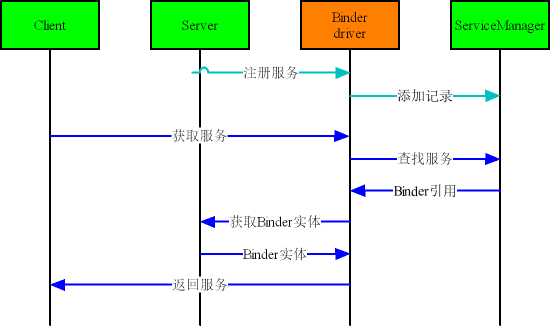
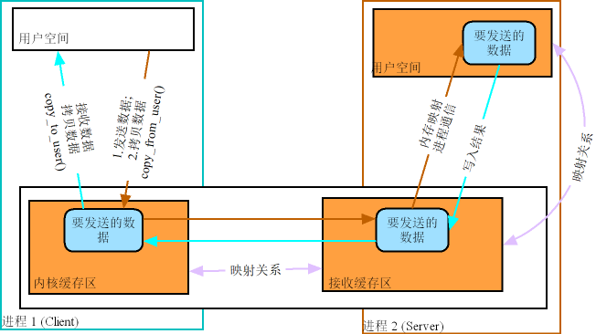
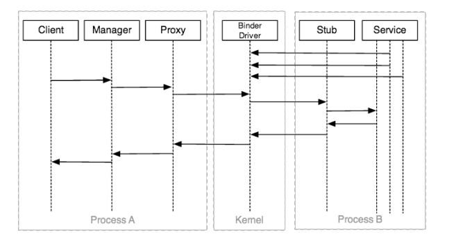
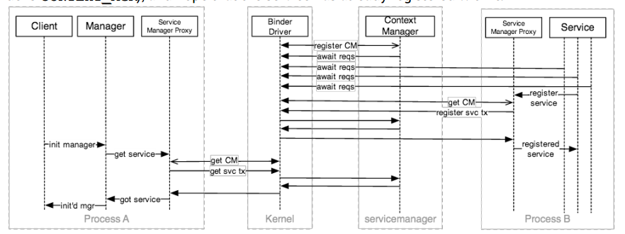
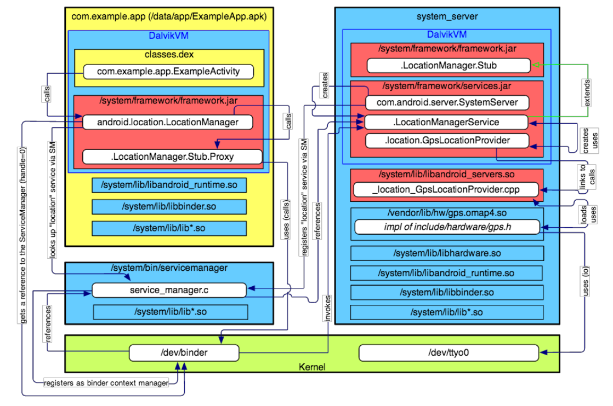

# Android 中的 Binder 通信机制

Binder 是 Android 系统中非常重要的组成部分。Android 系统中的许多功能建立在 Binder 机制之上。在这篇文章中，我们会对 Android 中的 Binder 在系统架构中的作用进行分析，然后，我们会从底层的实现角度简要说明下为什么 Android 要开发出一套独立的跨进程通信机制，最后，我们会给出一个 AIDL 的使用示例来说明如何使用 Binder 来进行通信。

## 1、什么是 Binder？ 为什么说它对 Android 系统至关重要？

“什么是 Binder？ 为什么说它对 Android 系统至关重要？” 在回答这个问题之前，我们先来说下其他的东西。

不知道你有没有思考过这么一个问题：为什么当我们在 Android 中启动一个页面的时候需要调用 `startActivity()` 方法，然后还要传入一个 Intent？ 如果我们不使用这种传递值的方式，直接写成静态的变量有没有问题？这也是之前有人问过我的一个问题。

对上面的两个问题，我们先回答第二个。使用静态的变量传递值在大部分情况下是可以的，当然要注意在使用完了值之后要及时释放资源，不然会占用太多内存，甚至 OOM. 但是，在特殊的情况下它是无法适用的，即跨进程的情况下。这是因为，静态的变量的作用范围只是其所在的进程，在其他进程访问的时候属于跨进程访问，当然访问不到了。对于第一个问题，Android 中的一个 Activity 的启动过程远比我们想象的复杂，其中就涉及跨进程的通信过程。当我们调用 `startActivity()` 方法之后，我们的所有的 “意图” 会经过层层过滤，一直到一个称之为 AMS 的地方被处理。处理完之后，再跨进程调用你启动页面所在位置的进程进行后续处理，即回调 `onCreate()` 等方法。

*一个 Activity 的启动过程涉及 Android 中两种重要的通信机制，Binder 和 Handler，我们会在以后的文章中对此进行分析。*


`Binder` 是 Android 系统中非常重要的组成部分。`Binder` 并非 Google 原创，而是来自于 `OpenBinder`，后来由于代码许可的问题，对代码进行了重写。

`Binder` 的中文意思是粘合剂，也就是把许多的功能或者模块组织到一起。按照 Android 的设计，在系统运行期间会同时运行许多的服务，当你需要某个功能的时候就需要与该服务进行交互。比如，Activity 的某个生命周期方法被触发，就是由 `ActivityManagerService` 通过 `Binder` 来完成的。只是，我们在开发的时候并没有直接使用 `Binder`，而是通过封装的类间接使用了它。但是，毫无疑问的是，`Binder` 对于 `Android` 是至关重要的。

你可以通过 `adb` 来查看系统中正在运行的各种服务。这些服务差不多在系统启动的时候就一起启动了，其后就一直等待着某个程序与其连接和通信，并对该请求做出响应。所以，从这个过程中我们可以看出，该程序与服务的交互过程非常类似于访问网络接口的过程。所以，我们称 `Binder` 的结构是 **C/S 结构** 的，称等待请求的服务为 `Server`，称尝试与其连接的程序为 `Client`。不同的是，在网络请求过程中我们使用 `Socket` 进行通信，而在 Android 中，我们使用 `Binder` 进行通信。

再说进程。我们知道一个应用就是一个进程，我们开发的程序与系统服务运行在不同的进程中。为了保证各自应用进程的安全性和系统的安全性，我们提出了**沙盒化**的概念：每个进程看作一个沙盒，每个进程只能运行自己的空间，就像一个小孩只能玩自己盒子里面的沙子。如果两个不同的盒子中的孩子想要交换沙子，那么就涉及到进程间通信了。

网络请求是一种 `RPC (Remote Procedure Call, 远程过程调用)` 调用，属于 `IPC (Inter-Process Communication, 进程间通信)` 的一种。而 `Binder` 没有远程过程调用的功能，仅是本地进程之间的通信 (`IPC`)。

Android 是基于 Linux 的，Linux 本身已经具有了许多的 `IPC` 机制，比如：管道（`Pipe`）、信号（`Signal`）和跟踪（`Trace`）、插口（`Socket`）、消息队列（`Message`）、共享内存（`Share Memory`）和信号量（`Semaphore`）。那么，为什么 Android 要特立独行地搞出一套 `IPC` 机制呢？这当然是有原因的：

1. 效率：`Socket` 作为一款通用接口，其传输效率低，开销大，主要用在跨网络的进程间通信和本机上进程间的低速通信。消息队列和管道采用存储-转发方式，即数据先从发送方缓存区拷贝到内核开辟的缓存区中，然后再从内核缓存区拷贝到接收方缓存区，至少有两次拷贝过程。共享内存虽然无需拷贝，但控制复杂，难以使用。`Binder` 只需要一次数据拷贝，性能上仅次于共享内存。

2. 稳定性：`Binder` 基于 `C/S 架构`，客户端（`Client`）有什么需求就丢给服务端（`Server`）去完成，架构清晰、职责明确又相互独立，自然稳定性更好。共享内存虽然无需拷贝，但是控制负责，难以使用。从稳定性的角度讲，`Binder` 机制是优于内存共享的。

3. 安全性：`Binder` 通过在内核层为客户端添加身份标志 `UID/PID`，来作为身份校验的标志，保障了通信的安全性。传统 `IPC` 访问接入点是开放的，无法建立私有通道。比如，命名管道的名称，`system V` 的键值，`socket` 的 `ip` 地址或文件名都是开放的，只要知道这些接入点的程序都可以和对端建立连接，不管怎样都无法阻止恶意程序通过猜测接收方地址获得连接。

基于以上原因，Android 需要建立一套新的 `IPC` 机制来满足系统对通信方式、传输性能和安全性的要求，这就是 `Binder`。

`Binder` 还拥有许多其他的特性，比如：1).采用引用计数，当某个 `Binder` 不再被任何客户端引用的时候，会通知它的持有者可以将其释放，这适用于 Android 这种常常因为资源不足而回收资源的应用场景。2).它内部维护了一个线程池；3).可以像触发本地方法一样触发远程的方法。4).支持同步和异步 (`oneway`) 的触发模型。5).可以使用 AIDL 模板进行描述和开发。

## 2、Binder 模型

在 `Binder` 模型中共有 4 个主要角色：`Client`、`Server`、`Binder 驱动`和 `ServiceManager`。上面我们提到过 Binder 是基于 `C/S结构` 设计的，如果将 `Binder` 和网络的访问过程进行类比，那么 `Server` 就是服务器，`Client` 是客户终端，`ServiceManager` 是域名服务器（`DNS`），驱动是路由器。其中 `Server`、`Client` 和 `ServiceManager` 运行于用户空间，驱动运行于内核空间。

当一个服务被创建的时候，会创建一个 `Binder` 实体，并为其取一个字符串形式的名称，然后将 `Binder` 与名称一起打包通过 `Binder` 驱动向 `ServiceManager` 中进行注册。驱动会为这个 `Binder` 创建位于内核中的实体节点以及 `ServiceManager` 对实体的引用，并将名字及新建的引用打包传递给 `ServiceManager`。`ServiceManager` 本身也是一个独立的进程，但是它比较特殊，它会在所有其他的服务之前被注册，并且只能被注册一次。

`Server` 注册了 `Binder` 之后，`Client` 就可以通过名字获得该Binder的引用了。`Client` 通过 `Binder` 的名称获取某个 `Binder` 的引用。当 `ServiceManager` 收到名称之后，会从查找表中找到该 `Binder` 的引用，并将该引用作为回复发送给发起请求的 `Client`。因为，`Server` 可能会从多个 `Client` 获取并发的请求，而每次返回的是同一 `Binder` 引用，所以我们需要保证 `Binder` 在多线程环境中的安全性。

当拿到了 `Binder` 之后，我们就可以像使用本地对象一样使用 `Binder` 的方法来获取我们需要的服务。

所以，我们可以使用下面的流程图来描述这个 IPC 通信的过程：



注：上图中使用绿色标记的部分运行在用户空间，红色标记的部分运行在内核空间。

## 3、Binder 的原理

### 3.1 内存映射

上面我们总结了 `Binder` 的模型。根据以上内容，`Binder` 之所以高效，是因为它可以像在当前进程中触发方法一样触发其他进程的方法。那么，它是如何做到这一点的呢？

当使用 `Binder` 进行通信的时候。`Binder` 驱动会先通过在 `mmap()` 在内核空间创建数据接收的缓存空间。接着在内核空间开辟一块内核缓存区，**建立内核缓存区和内核中数据接收缓存区之间的映射关系，以及内核中数据接收缓存区和接收进程用户空间地址的映射关系**（存在两个映射关系）。然后，发送方进程通过系统调用 `copy_from_user()` 将数据复制到内核中的内核缓存区，由于内核缓存区和接收进程的用户空间存在内存映射，因此也就相当于把数据发送到了接收进程的用户空间，这样便完成了一次进程间的通信。相对于传统的 `IPC`，`Binder` 只需要一次复制就完成了进程间的通信。这也是 `Binder` 相比于其他的 `IPC` 机制高效的原因。



当 `Client` 将数据和要执行的方法的编号 (`code`) 传递给 `Server` 之后，`Server` 会根据编号触发服务中的方法。当方法执行完毕之后，再通过将数据写入自身的用户空间。因为 `Server` 的用户空间和内核中的数据缓冲区存在映射关系，所以也就相当于把结果写进了内核缓存区中。然后，内核再通过调用系统的 `copy_to_user()` 方法将数据写入到 `Client` 的用户空间。这样 `Client` 就完成了对服务的一次调用。

上文中提到的编号需要注意一下，因为 `Client` 进程需要跨进程调用 `Server` 的进程，所以具体要调用哪个方法必须通过编号来告诉 `Server`。

## 4、Binder 的使用

### 4.1 代理模式

`Binder` 本质上只是一种底层通信方式，和具体服务没有关系。为了提供具体服务，`Server` 必须提供一套接口函数以便 `Client` 通过远程访问使用各种服务。这时通常采用**代理设计模式**：将接口函数定义在一个抽象类中，`Server` 和 `Client` 都会以该抽象类为基类实现所有接口函数，所不同的是 `Server` 端是真正的功能实现，而 `Client` 端是对这些函数远程调用请求的包装。下文中我们使用 `AIDL` 的时候你将会看到由 `AIDL` 生成的类中就是按照这种规范来生成的。

### 4.2 AIDL

`AIDL (Android Interface Definition Language，Android 接口定义语言)` 是一种文件格式，用来简化 `Binder`  的使用。当使用 `Binder` 的时候，只需要创建一个后缀名为 `.aidl` 的文件，然后像定义接口一样定义方法。定义完毕之后，使用工具 `aidl.exe` 即可生成 `Binder` 所需要的各种文件。当然，我们的 AS 已经为我们集成了 `aidl.exe`，所以，只需要在定义了 `AIDL` 文件之后，**编译**即可生成使用 `Binder` 时所需的文件。当然，不使用 AIDL，直接编写 `Binder` 所需的 `java` 文件也是可以的。

`AIDL` 是一种接口定义语言，它与 Java 中定义接口的方式有所区别。下面我们通过一个例子来说明 AIDL 的使用方式。

这里我们模拟一个笔记管理的类，通过在 `Activity` 中与一个远程的 `Service` 进行交互来实现 `IPC` 的效果。这里，我们先要定义数据实体 `Note`，它只包含两个字段，并且实现了 `Parcelable`。这里 `Note` 所在的目录是 `me.shouheng.advanced.aidl`，然后，我们需要在 `src/main` 建立一个同样的包路径，然后定义所需的 AIDL 文件：

    // INoteManager.aidl
    package me.shouheng.advanced.aidl;
    import me.shouheng.advanced.aidl.Note;
    interface INoteManager {
        Note getNote(long id);
        void addNote(long id, String name);
    }

    // Note.aidl
    package me.shouheng.advanced.aidl;
    parcelable Note;

注意，在 `INoteManager` 文件中，我们定义了远程服务所需的各种方法。这里只定义了两个方法，一个用来获取指定 `id` 的笔记，一个用来向远程服务中添加一条笔记记录。

这样定义完了之后，我们可以对项目进行编译，这样就可以 `build` 目录下面得到为我们生成好的 `INoteManager` 类文件。以后，我们就可以使用这个文件中生成类和方法来进行远程通信。但在使用该接口之前，我们还是先来看一下其中都生成了些什么东西：

```
package me.shouheng.advanced.aidl;
public interface INoteManager extends android.os.IInterface {

    public static abstract class Stub extends android.os.Binder implements me.shouheng.advanced.aidl.INoteManager {

        private static final java.lang.String DESCRIPTOR = "me.shouheng.advanced.aidl.INoteManager";

        public Stub() {
            this.attachInterface(this, DESCRIPTOR);
        }

        public static me.shouheng.advanced.aidl.INoteManager asInterface(android.os.IBinder obj) {
            if ((obj==null)) {
                return null;
            }
            android.os.IInterface iin = obj.queryLocalInterface(DESCRIPTOR);
            if (((iin!=null)&&(iin instanceof me.shouheng.advanced.aidl.INoteManager))) {
                return ((me.shouheng.advanced.aidl.INoteManager)iin);
            }
            return new me.shouheng.advanced.aidl.INoteManager.Stub.Proxy(obj);
        }

        @Override
        public android.os.IBinder asBinder() {
            return this;
        }

        @Override
        public boolean onTransact(int code, android.os.Parcel data, android.os.Parcel reply, int flags) throws android.os.RemoteException {
            switch (code) {
                case INTERFACE_TRANSACTION: {
                    reply.writeString(DESCRIPTOR);
                    return true;
                }
                case TRANSACTION_getNote: {
                    data.enforceInterface(DESCRIPTOR);
                    long _arg0;
                    _arg0 = data.readLong();
                    me.shouheng.advanced.aidl.Note _result = this.getNote(_arg0);
                    reply.writeNoException();
                    if ((_result!=null)) {
                        reply.writeInt(1);
                        _result.writeToParcel(reply, android.os.Parcelable.PARCELABLE_WRITE_RETURN_VALUE);
                    } else {
                        reply.writeInt(0);
                    }
                    return true;
                }
                case TRANSACTION_addNote: {
                    data.enforceInterface(DESCRIPTOR);
                    long _arg0;
                    _arg0 = data.readLong();
                    java.lang.String _arg1;
                    _arg1 = data.readString();
                    this.addNote(_arg0, _arg1);
                    reply.writeNoException();
                    return true;
                }
            }
            return super.onTransact(code, data, reply, flags);
        }

        private static class Proxy implements me.shouheng.advanced.aidl.INoteManager {

            private android.os.IBinder mRemote;

            Proxy(android.os.IBinder remote) {
                mRemote = remote;
            }

            @Override
            public android.os.IBinder asBinder() {
                return mRemote;
            }

            public java.lang.String getInterfaceDescriptor() {
                return DESCRIPTOR;
            }

            @Override
            public me.shouheng.advanced.aidl.Note getNote(long id) throws android.os.RemoteException {
                android.os.Parcel _data = android.os.Parcel.obtain();
                android.os.Parcel _reply = android.os.Parcel.obtain();
                me.shouheng.advanced.aidl.Note _result;
                try {
                    _data.writeInterfaceToken(DESCRIPTOR);
                    _data.writeLong(id);
                    mRemote.transact(Stub.TRANSACTION_getNote, _data, _reply, 0);
                    _reply.readException();
                    if ((0!=_reply.readInt())) {
                        _result = me.shouheng.advanced.aidl.Note.CREATOR.createFromParcel(_reply);
                    } else {
                        _result = null;
                    }
                } finally {
                    _reply.recycle();
                    _data.recycle();
                }
                return _result;
            }

            @Override
            public void addNote(long id, java.lang.String name) throws android.os.RemoteException {
                android.os.Parcel _data = android.os.Parcel.obtain();
                android.os.Parcel _reply = android.os.Parcel.obtain();
                try {
                    _data.writeInterfaceToken(DESCRIPTOR);
                    _data.writeLong(id);
                    _data.writeString(name);
                    mRemote.transact(Stub.TRANSACTION_addNote, _data, _reply, 0);
                    _reply.readException();
                } finally {
                    _reply.recycle();
                    _data.recycle();
                }
            }
        }

        static final int TRANSACTION_getNote = (android.os.IBinder.FIRST_CALL_TRANSACTION + 0);

        static final int TRANSACTION_addNote = (android.os.IBinder.FIRST_CALL_TRANSACTION + 1);
    }

    public me.shouheng.advanced.aidl.Note getNote(long id) throws android.os.RemoteException;

    public void addNote(long id, java.lang.String name) throws android.os.RemoteException;
}
```

如果只是看这上面的生成的代码，也许你仍然无法了解这些生成的类究竟有什么作用。下面就让我们通过使用上面生成的类来说明 AIDL 的具体工作流程。

首先，我们要定义远程的服务，并在该服务中实现业务逻辑：

```
public class NoteService extends Service {

    private CopyOnWriteArrayList<Note> notes = new CopyOnWriteArrayList<>();

    private Binder binder = new INoteManager.Stub() {
        @Override
        public Note getNote(long id) {
            return Observable.fromIterable(notes).filter(note -> note.id == id).singleOrError().blockingGet();
        }

        @Override
        public void addNote(long id, String name) {
            notes.add(new Note(id, name));
        }
    };

    @Override
    public void onCreate() {
        super.onCreate();
        notes.add(new Note(100, "Note 100"));
        notes.add(new Note(101, "Note 101"));
    }

    @Nullable
    @Override
    public IBinder onBind(Intent intent) {
        return binder;
    }
}
```

这里在 `onCreate()` 方法中创建了两条记录，并且创建了 `INoteManager.Stub` 的实例，并在 `onBind()` 方法中将其返回。然后，我们在一个 `Activity` 中启动该远程服务，并尝试从该服务中获取指定 `id` 的笔记记录。从期望的结果来看，它的功能有些类似于 `ContentProvider`，即用来向调用者提供数据。

下面是该 `Activity` 的实现。这里我们在 `onCreate()` 方法中启动上述服务。并将实例化的 `ServiceConnection` 作为参数启动该服务。在 `ServiceConnection` 的方法中，我们调用 `INoteManager.Stub` 的 `asInterface(IBinder)` 方法来讲 `service` 转换成 `INoteManager`，然后从其中获取指定 `id` 的笔记记录即可。

```
    private ServiceConnection connection = new ServiceConnection() {
        @Override
        public void onServiceConnected(ComponentName name, IBinder service) {
            INoteManager noteManager = INoteManager.Stub.asInterface(service);
            try {
                Note note = noteManager.getNote(100);
                LogUtils.d(note);
            } catch (RemoteException e) {
                e.printStackTrace();
            }
        }

        @Override
        public void onServiceDisconnected(ComponentName name) { }
    };

    @Override
    protected void doCreateView(Bundle savedInstanceState) {
        Intent intent = new Intent(this, NoteService.class);
        bindService(intent, connection, Context.BIND_AUTO_CREATE);
    }

    @Override
    protected void onDestroy() {
        super.onDestroy();
        unbindService(connection);
    }
}
```

根据 `INoteManager.Stub` 的 `asInterface()` 方法的定义，该方法中会将传入的 `service` 包装成一个 `INoteManager.Stub.Proxy` 返回，所以，我们在 `onServiceConnected()` 方法中实际调用的是该代理类的 `getNote()` 方法。而该代理类的 `getNote()` 方法中又调用了传入的 `mRemote.transact()` 方法。而这里的 `service` 正是我们在 `NoteService` 中创建的 `binder`。也就是说，当我们在 `onServiceConnected()` 中调用 `getNote()` 方法的时候，实际上调用了 `INoteManager.Stub` 的 `transact()` 方法。

所以，从上面我们看出：

1. 这里就像是在当前进程中调用了另一个进程的方法一样。这个调用的过程是通过 `Binder` 来实现的。
2. 当调用 `INoteManager.Stub` 的 `transact()` 方法的时候，通过传入了一个整型的 `code` 来作为要触发的方法的标识，这就是我们上面提到的方法的编号。

于是，我们可以通过下面的这张图来总结在上面使用 AIDL 的过程中各部分扮演的角色：


也就是客户端通过 `Proxy` 访问 `Binder` 驱动，然后 `Binder` 驱动调用 `Stub`，而 `Stub` 中调用我们的业务逻辑。这里的 `Proxy` 和 `Stub` 用来统一接口函数，`Proxy` 用来告诉我们远程服务中有哪些可用的方法，而具体的业务逻辑则由 `Stub` 来实现。`Binder` 的进程通信就发生在 `Proxy` 和 `Stub` 之间。

### 4.3 Binder 的执行过程

上面是标准的 AIDL 的使用方式，实际在我们开发的时候好像并没有用到许多 AIDL。这是因为很多 API 隐藏了 AIDL 的实现细节，而只提供了一个 Manager。就像下图所示，你只需要与 Manager 进行交互就可以了：



再加上 `ServiceManager`，一次完整的 IPC 过程中，各个模块的逻辑如下所示：



如果用一个更加详尽的方式展示这个过程，那么它将是下面这样：


最后，以获取定位服务的过程作为一个例子，那么在获取服务的过程中各个进程的状态如下所示。因为，这幅图中不仅包含了 `Binder` 相关的知识，同时涉及了许多 Android 系统层面的东西，对于自我提升会有许多帮助，因此将其 post 在这里。如果弄懂了上面的过程，看懂下面的整个过程也不会有太大的难度。



## 参考资料


**源代码**：[Android-references](https://github.com/Shouheng88/Android-references/tree/master/advanced)