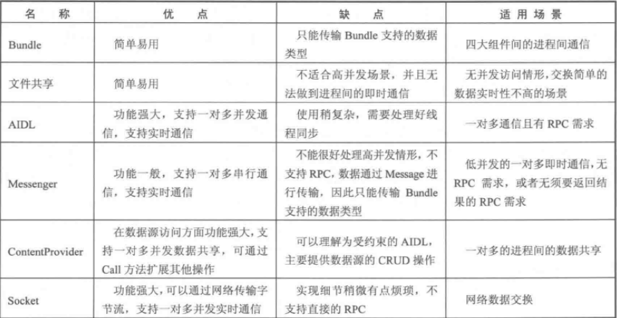

# Android 高级面试-2：IPC 相关

## 内容

IPC 就是指跨进程通信。IPC 相关的内容，涉及的主要有：

1. 常见的 IPC 通信方式；
2. Binder 相关；
3. 两种序列化方式及其对比；

## 问题

### IPC

- **Android 上的 IPC 跨进程通信时如何工作的**
- 简述 IPC？
- 进程间通信的机制
- AIDL 机制
- Bundle 机制

IPC 就是指进程之间的通信机制，在 Android 系统中启动 Activity/Service 等都涉及跨进程调用的过程。

Android 中有多种方式可以实现 IPC，

**Bundle**，用于在四大组件之间传递信息，优点是使用简单，缺点是只能使用它支持的数据类型。Bundle 继承自 BaseBundle，它通过内部维护的 `ArrayMap<String, Object>` 来存储数据。当我们使用 `put()` 和 `get()` 系列的方法的时候都会直接与其进行交互。`ArrayMap<String, Object>` 与 HashMap 类似，也是用作键值对的映射，但是它的实现方式与 SpareArray 类似，是基于两个数组来实现的映射。目的也是为了提升 Map 的效率。它在查找某个哈希值的时候使用的是二分查找。

**共享文件**，即两个进程通过读/写同一个文件来进行交换数据。由于 Android 系统是基于 Linux的，使得其并发读/写文件可以没有任何限制地进行，甚至两个线程同时对同一个文件进行写操作都是被充许的。如果并发读/写，我们读取出来的数据可能不是最新的。文件共享方式适合在对数据同步要求不高的情况的进程之间进行通信，并且要妥善处理并发读/写的问题。

另外，SharedPreferences 也是属于文件的一种，但是系统对于它的读/写有一定的缓存策略，即在内存中有一份 SP 文件的缓存，因此在多进程模式下，系统对它的读/写变得不可靠，面对高并发的读/写访问有很大几率会丢失数据。不建议在进程间通信中使用 SP.

**Messenger** 是一种轻量级的 IPC 方案，它的底层实现是 AIDL，可以在不同进程中传递 Message. 它一次只处理一个请求，在服务端不需要考虑线程同步的问题，服务端不存在并发执行的情形。在远程的服务中，声明一个 Messenger，使用一个 Handler 用来处理收到的消息，然后再 `onBind()` 方法中返回 Messenger 的 binder. 当客户端与 Service 绑定的时候就可以使用返回的 Binder 创建 Messenger 并向该 Service 发送服务。

```java
    // 远程服务的代码
    private Messenger messenger = new Messenger(new MessengerHandler(this));

    @Nullable
    @Override
    public IBinder onBind(Intent intent) {
        ToastUtils.makeToast("MessengerService bound!");
        return messenger.getBinder();
    }

    // 客户端 bind 服务的时候用到的 ServiceConnection
    private ServiceConnection msgConn = new ServiceConnection() {
        @Override
        public void onServiceConnected(ComponentName name, IBinder service) {
            // 这样就拿到了远程的 Messenger，向它发送消息即可
            boundServiceMessenger = new Messenger(service);
        }
        // ... ...
    }

    // 客户端发送消息的代码
    Message message = Message.obtain(null, /*what=*/ MessengerService.MSG_SAY_SOMETHING);
    message.replyTo = receiveMessenger; // 客户端用来接收服务端消息的 Messenger
    Bundle bundle = new Bundle(); // 构建消息
    bundle.putString(MessengerService.MSG_EXTRA_COMMAND, "11111");
    message.setData(bundle);
    boundServiceMessenger.send(message); // 发送消息给服务端
```

**AIDL**：Messenger 是以串行的方式处理客户端发来的消息，如果大量消息同时发送到服务端，服务端只能一个一个处理，所以大量并发请求就不适合用 Messenger ，而且 Messenger 只适合传递消息，不能跨进程调用服务端的方法。AIDL 可以解决并发和跨进程调用方法的问题。

AIDL 即 Android 接口定义语言。使用的时候只需要创建一个后缀名为 `.aidl` 的文件，然后在编译期间，编译器会使用 `aidl.exe` 自动生成 Java 类文件。

远程的服务只需要实现 Stub 类，客户端需要在 `bindService()` 的时候传入一个 ServiceConnection，并在连接的回调方法中将 Binder 转换成为本地的服务。然后就可以在本地调用远程服务中的方法了。

```java
    // 远程服务的代码
    private Binder binder = new INoteManager.Stub() {
        @Override
        public Note getNote(long id) {
            // ... ...
        }
    };
    // 绑定服务
    public IBinder onBind(Intent intent) {
        return binder;
    }

    // 客户端代码
    private INoteManager noteManager;
    private ServiceConnection connection = new ServiceConnection() {
        @Override
        public void onServiceConnected(ComponentName name, IBinder service) {
            // 获取远程的服务，转型，然后就可以在本地使用了
            noteManager = INoteManager.Stub.asInterface(service);
        }

        @Override
        public void onServiceDisconnected(ComponentName name) { }
    };

    // 服务端访问权限控制：使用 Permission 验证，在 manifest 中声明
    <permission android:name="com.jc.ipc.ACCESS_BOOK_SERVICE"
        android:protectionLevel="normal"/>
    <uses-permission android:name="com.jc.ipc.ACCESS_BOOK_SERVICE"/>
    // 服务端 onBinder 方法中
    public IBinder onBind(Intent intent) {
        //Permission 权限验证
        int check = checkCallingOrSelfPermission("com.jc.ipc.ACCESS_BOOK_SERVICE");
        if (check == PackageManager.PERMISSION_DENIED) return null;
        return mBinder;
    }
```

AIDL 支持的数据类型包括，1).基本数据类型；2).string 和 CharSequence；3).List 中只支持 ArrayList，并且其元素必须能够被 AIDL 支持；4).Map 中只支持 HashMap，并且其元素必须能够被 AIDL 支持；5).所有实现了 Parcelable 接口的对象；6).AIDL：所有 AIDL 接口本身也可以在AIDL文件中使用。

注意！这里使用了自定义的 Parcelable 对象：Note 类，但是 AIDL 不认识这个类，所以我们要创建一个与 Note 类同名的 AIDL 文件：Note.aidl. 并且类必须与 aidl 文件的包结构一致。

**ContentProvider**，主要用来对提供数据库方面的共享。缺点是主要提供数据源的 CURN 操作。

**Socket**，Socket 主要用在网络方面的数据交换。在 Android 系统中，启动的 Zygote 进程的时候会启动一个 ServerSocket. 当我们需要创建应用进程的时候会通过 Socket 与之进行通信，这也是 Socket 的应用。

**管道**，另外在使用 Looper 启动 MQ 的时候会在 Native 层启动一个 Looper. Native 层的与 Java 层的 Looper 进行通信的时候使用的是 epoll，也就是管道通信机制。



- **为何需要进行 IPC？多进程通信可能会出现什么问题？**

在 Android 系统中一个应用默认只有一个进程，每个进程都有自己独立的资源和内存空间，其它进程不能任意访问当前进程的内存和资源，系统给每个进程分配的内存会有限制。如果一个进程占用内存超过了这个内存限制，就会报 OOM 的问题，很多涉及到大图片的频繁操作或者需要读取一大段数据在内存中使用时，很容易报 OOM 的问题，为了解决应用内存的问题，Android 引入了多进程的概念，它允许在同一个应用内，为了分担主进程的压力，将占用内存的某些页面单独开一个进程，比如 Flash、视频播放页面，频繁绘制的页面等。

实现的方式很简单就是在 Manifest 中注册 Activity 等的时候，使用 `process` 属性指定一个进程即可。process 分私有进程和全局进程，以 `:` 号开头的属于私有进程，其他应用组件不可以和他跑在同一个进程中；不以 `:` 号开头的属于全局进程，其他应用可以通过 ShareUID 的方式和他跑在同一个进程中。此外，还有一种特殊方法，通过 JNI 在 native 层去 fork 一个新的进程。

但是多进程模式出现以下问题：

1. 静态成员和单例模式完全失效，因为没有存储在同一个空间上；
2. 线程同步机制完全失效，因为线程处于不同的进程；
3. SharedPreferences 的可靠性下降，因为系统对于它的读/写有一定的缓存策略，即在内存中有一份 SP 文件的缓存；
4. Application 多次创建。

解决这些问题可以依靠 Android 中的进程通信机制，即 IPC，接上面的问题。

- Binder 相关？

*为什么要设计 Binder，Binder 模型，高效的原因*

Binder 是 Android 设计的一套进程间的通信机制。Linux 本身具有很多种跨进程通信方式，比如管道（Pipe）、信号（Signal）和跟踪（Trace）、插口（Socket）、消息队列（Message）、共享内存（Share Memory）和信号量（Semaphore）。之所以设计出 Binder 是因为，这几种通信机制在效率、稳定性和安全性上面无法满足 Android 系统的要求。

效率上 ：Socket 作为一款通用接口，其传输效率低，开销大，主要用在跨网络的进程间通信和本机上进程间的低速通信。消息队列和管道采用存储-转发方式，即数据先从发送方缓存区拷贝到内核开辟的缓存区中，然后再从内核缓存区拷贝到接收方缓存区，至少有两次拷贝过程。共享内存虽然无需拷贝，但控制复杂，难以使用。Binder 只需要一次数据拷贝，性能上仅次于共享内存。

稳定性：Binder 基于 C|S 架构，客户端（Client）有什么需求就丢给服务端（Server）去完成，架构清晰、职责明确又相互独立，自然稳定性更好。共享内存虽然无需拷贝，但是控制负责，难以使用。从稳定性的角度讲，Binder 机制是优于内存共享的。

安全性：Binder 通过在内核层为客户端添加身份标志 UID|PID，来作为身份校验的标志，保障了通信的安全性。 传统 IPC 访问接入点是开放的，无法建立私有通道。比如，命名管道的名称，SystemV 的键值，Socket 的 ip 地址或文件名都是开放的，只要知道这些接入点的程序都可以和对端建立连接，不管怎样都无法阻止恶意程序通过猜测接收方地址获得连接。

在 Binder 模型中共有 4 个主要角色，它们分别是：Client、Server、Binder 驱动和 ServiceManager. Binder 的整体结构是基于 C|S 结构的，以我们启动 Activity 的过程为例，每个应用都会与 AMS 进行交互，当它们拿到了 AMS 的 Binder 之后就像是拿到了网络接口一样可以进行访问。如果我们将 Binder 和网络的访问过程进行类比，那么 Server 就是服务器，Client 是客户终端，ServiceManager 是域名服务器（DNS），驱动是路由器。

1. Client、Server 和 Service Manager 实现在用户空间中，Binder 驱动程序实现在内核空间中；
2. Binder 驱动程序和 ServiceManager 在 Android 平台中已经实现，开发者只需要在用户空间实现自己的 Client 和 Server；
3. Binder 驱动程序提供设备文件 `/dev/binder` 与用户空间交互，Client、Server 和 ServiceManager 通过 open 和 ioctl 文件操作函数与 Binder 驱动程序进行通信；
4. Client 和 Server 之间的进程间通信通过 Binder 驱动程序间接实现；
5. ServiceManager 是一个守护进程，用来管理 Server，并向 Client 提供查询 Server 接口的能力。

系统启动的 init 进程通过解析 init.rc 文件创建 ServiceManager. 此时会，先打开 Binder 驱动，注册 ServiceManager 成为上下文，最后启动 Binder 循环。当使用到某个服务的时候，比如 AMS 时，会先根据它的字符串名称到缓冲当中去取，拿不到的话就从远程获取。这里的 ServiceManager 也是一种服务。

1. 客户端首先获取服务器端的代理对象。所谓的代理对象实际上就是在客户端建立一个服务端的“引用”，该代理对象具有服务端的功能，使其在客户端访问服务端的方法就像访问本地方法一样。
2. 客户端通过调用服务器代理对象的方式向服务器端发送请求。
3. 代理对象将用户请求通过 Binder 驱动发送到服务器进程。
4. 服务器进程处理用户请求，并通过 Binder 驱动返回处理结果给客户端的服务器代理对象。

Binder 高效的原因，当两个进程之间需要通信的时候，Binder 驱动会在两个进程之间建立两个映射关系：内核缓存区和内核中数据接收缓存区之间的映射关系，以及内核中数据接收缓存区和接收进程用户空间地址的映射关系。这样，当把数据从 1 个用户空间拷贝到内核缓冲区的时候，就相当于拷贝到了另一个用户空间中。这样只需要做一次拷贝，省去了内核中暂存这个步骤，提升了一倍的性能。实现内存映射靠的就是上面的 `mmap()` 函数。

### 序列化

- **序列化的作用，以及 Android 两种序列化的区别**
- 序列化，Android 为什么引入 Parcelable
- 有没有尝试简化 Parcelable 的使用

Android 中主要有两种序列化的方式。

第一种是 Serializable. 它是 Java 提供的序列化方式，让类实现 Serializable 接口就可以序列化地使用了。这种序列化方式的缺点是，它**序列化的效率比较低，更加适用于网络和磁盘中信息的序列化，不太适用于 Android 这种内存有限的应用场景**。优点是使用方便，只需要实现一个接口就行了。

这种序列化的类可以使用 ObjectOutputStream/ObjectInputStream 进行读写。这种序列化的对象可以提供一个名为 **serialVersionUID** 的字段，用来标志类的版本号，比如当类的解构发生变化的时候将无法进行反序列化。

此外，

1. 静态成员变量不属于对象，不会参与序列化过程 
2. 用 transient 关键字标记的成员变量不会参与序列化过程。

第二种方式是 Parcelable. 它是 Android 提供的新的序列化方式，主要用来进行内存中的序列化，无法进行网络和磁盘的序列化。它的**缺点是使用起来比较繁琐，需要实现两个方法，和一个静态的内部类。**

Serializable 会使用反射，序列化和反序列化过程需要大量 I/O 操作，在序列化的时候会产生大量的临时变量，从而引起频繁的GC。Parcelable 自已实现封送和解封（marshalled & unmarshalled）操作不需要用反射，数据也存放在 Native 内存中，效率要快很多。

我自己尝试过一些简化 Parcelable 使用的方案，通常有两种解决方案：第一种方式是使用 IDE 的**插件**来辅助生成 Parcelable 相关的代码（[插件地址](https://github.com/mcharmas/android-parcelable-intellij-plugin)）；第二种方案是使用**反射**，根据字段的类型调用 `wirte()` 和 `read()` 方法（性能比较低）；第三种方案是基于**注解**处理，在编译期间生成代理类，然后在需要覆写的方法中调用生成的代理类的方法即可。

### 进程与线程

- **进程与线程之间有什么区别与联系？**

一个进程就是一个执行单元，在 PC 和移动设备上指一个程序或应用。在 Android 中，一个应用默认只有一个进程，每个进程都有自己独立的资源和内存空间，其它进程不能任意访问当前进程的内存和资源，系统给每个进程分配的内存会有限制。实现的方式很简单就是在 Manifest 中注册 Activity 等的时候，使用 `process` 属性指定一个进程即可。process 分私有进程和全局进程，以 `:` 号开头的属于私有进程，其他应用组件不可以和他跑在同一个进程中；不以 `:` 号开头的属于全局进程，其他应用可以通过 ShareUID 的方式和他跑在同一个进程中

Android 系统启动的时候会先启动 Zygote 进程，当我们需要创建应用程序进程的时候的会通过 Socket 与之通信，Zygote 通过 fork 自身来创建我们的应用程序的进程。

*不应只是简单地讲述两者之间的区别，同时涉及系统进程的创建，应用进程的创建，以及如何在程序中使用多进程等。*

线程是 CPU 调度的最小单元，一个进程可包含多个线程。Java 线程的实现是基于一对一的线程模型，即通过语言级别层面程序去间接调用系统的内核线程。内核线程由操作系统内核支持，由操作系统内核来完成线程切换，内核通过操作调度器进而对线程执行调度，并将线程的任务映射到各个处理器上。由于我们编写的多线程程序属于语言层面的，程序一般不会直接去调用内核线程，取而代之的是一种轻量级的进程(Light Weight Process)，也是通常意义上的线程。由于每个轻量级进程都会映射到一个内核线程，因此我们可以通过轻量级进程调用内核线程，进而由操作系统内核将任务映射到各个处理器。这种轻量级进程与内核线程间1对1的关系就称为一对一的线程模型。


