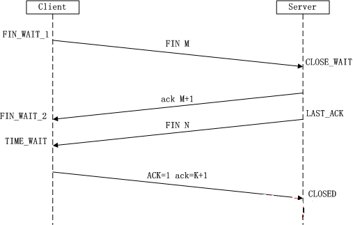

# Android 高级面试-5：网络基础

## 1、TCP/UDP

- **TCP 与 UDP 区别与应用**（三次握手和四次挥手）涉及到部分细节（如 client 如何确定自己发送的消息被 server 收到） 
- TCP 中 3 次握手和 4 次挥手的过程?
- TCP 与 UDP 的区别及应用?

**TCP**（Transmission Control Protocol 传输控制协议）是一种面向连接的、可靠的、基于字节流的传输层通信协议。**UDP** 是 User Datagram Protocol 的简称， 中文名是用户数据报协议。

**区别**：

1. TCP 协议是`有连接的`，有连接的意思是开始传输实际数据之前 TCP 的客户端和服务器端必须通过三次握手建立连接，会话结束之后也要结束连接。而 UDP 是无连接的。
2. TCP 协议保证数据`按序发送`，`按序到达`，提供`超时重传`来保证可靠性，但是 UDP `不保证按序到达`，甚至`不保证到达`，只是努力交付，即便是按序发送的序列，也不保证按序送到。
3. TCP 协议`所需资源多`，TCP 首部需 20 个字节（不算可选项），UDP 首部字段只需8个字节。
4. TCP 有`流量控制和拥塞控制`，UDP 没有，网络拥堵不会影响发送端的发送速率。
5. TCP 是`一对一`的连接，而 UDP 则可以支持`一对一、多对多、一对多`的通信。
6. TCP 面向的是`字节流`的服务，UDP 面向的是`报文`的服务。

**应用**：因此根据它们的特点，TCP 被用在对不能容忍数据丢失的场景中，比如用来发送 Http；UDP 用来可以容忍丢失的场景，比如网络视频流的传输。

**TCP 中 3 次握手和 4 次挥手的过程**：

1. 客户端通过 TCP 向服务器发送 **SYN 报文段**。它不包含应用层信息，其中的 **SYN标志位为1**，然后选择一个 **初始序号 (client_isn)**，并将其放置在报文段的序号字段中。
2. 当 SYN 报文段到达服务器之后，服务器为该 TCP 连接分配 TCP 缓存和变量，并向该客户端发送**SYNACK 报文段**。它不包含应用层信息，其中个的 **SYN 置为1**，**确认号字段**被置为client_isn+1，最后服务器选择自己的 **初始序号 (server_isn)** 放在序号字段中。
3. 客户端收到 SYNACK 报文段之后，为连接分配缓存和变量，然后向服务器发送另一个报文段，其中将 server_isn+1 放在**确认字段**中，并将**SYN 位置为 0**.

为什么要三次握手：三次握手的目的是建立可靠的通信信道，说到通讯，简单来说就是数据的发送与接收，而三次握手最主要的目的就是`双方确认自己与对方的发送与接收是正常的`。

1. 第一次握手：Client 什么都不能确认；Server 确认了对方发送正常。
2. 第二次握手：Client 确认了：自己发送、接收正常，对方发送、接收正常；Server 确认了：自己接收正常，对方发送正常。
3. 第三次握手：Client 确认了：自己发送、接收正常，对方发送、接收正常；Server 确认了：自己发送、接收正常，对方发送接收正常。

1. 客户端向服务器发送关闭连接报文段，其中 FIN 置为 1。
2. 服务器接收到该报文段之后向发送方会送一个确认字段。
3. 服务器向客户端发送自己的终止报文段。
4. 客户端对服务器终止报文段进行确认。

为什么要四次挥手：任何一方都可以在数据传送结束后发出连接释放的通知，待对方确认后进入半关闭状态。当另一方也没有数据再发送的时候，则发出连接释放通知，对方确认后就完全关闭了 TCP 连接。

举个例子：A 和 B 打电话，通话即将结束后，A 说“我要挂了”，B 回答 “我知道了”，但是 A 可能还会有要说的话，所以隔一段时间，B 再问 “真的要挂吗”，A 确认之后通话才算结束。

- 三次握手建立连接时，发送方再次发送确认的必要性？

主要是为了防止已失效的连接请求报文段突然又传到了 B，因而产生错误。假定出现一种异常情况，即 A 发出的第一个连接请求报文段并没有丢失，而是在某些网络结点长时间滞留了，一直延迟到连接释放以后的某个时间才到达 B，本来这是一个早已失效的报文段。但 B 收到此失效的连接请求报文段后，就误认为是 A 又发出一次新的连接请求，于是就向 A 发出确认报文段，同意建立连接。假定不采用三次握手，那么只要 B 发出确认，新的连接就建立了，这样一直等待 A 发来数据，B 的许多资源就这样白白浪费了。

## 2、Http

- HTTP 协议
- HTTP 报文结构
- HTTP 相关 

**Http 协议概念**：

1. 全称**超文本传输协议**。
2. HTTP使用 **TCP** 作为它的支撑协议，TCP 默认使用 80 端口。
3. 它是**无状态的**，就是说它不会记录你之前是否访问过某个对象，它不保存任何关于客户的信息。
4. 它有两种连接方式，**非持续连接和持续连接**。它们的区别在于，非持续连接发送一个请求获取内容之后，对内容里的链接会再分别发送 TCP 请求获取；持续连接当获取到内容之后，使用之前的 TCP 获取相关的内容。后者节省了建立连接的时间，效率更高。

**HTTP 请求报文的结构**

HTTP 请求包含以下三个部分：1). 请求方法-统一资源标识符(URI)-协议/版本；2). 请求头；3). 实体。

如下所示：

    GET /somedir/page.jsp HTTP/1.1      请求方法-统一资源标识符(URI)-协议/版本
    Accept: text/plain; text/html
    Accept-Language: en-gb
    Connection: keep-Alive
    Host: localhost
    User-Agent: Mozilla/4.0
    Content-Length: 33
    Content-Type: application/x-www-form-urlencoded
    Accept-Encoding: gzip, deflate      请求头
    
    lastName=Franks&firstName=Michael   实体

1. 请求方法共有**GET、POST、HEAD、PUT和DELETE**等，其中 GET 大约占 90%。HEAD 类似 GET，但不返回请求对象。PUT 表示上传对象到服务器。DELETE 表示删除服务器上的对象。
2. **URI** 是相应的 **URL** 的后缀，通常被解释为相对于服务器根目录的路径；
3. 请求头包含客户端和实体正文的相关信息，各个请求头之间使用 **“换行/回车”符(CRLF)** 隔开；
4. 请求头和实体之间有一个空行，该空行只有 CRLF 符，对 HTTP 格式非常重要。
5. **Host** 指明对象主机，它在 Web 代理高速缓存中有作用；
6. **Connection** 可取的值有 keep-Alive 和 close，分别对应持续连接和非持续连接；
7. **User-Agent** 指明向服务器发送请求的浏览器。

**HTTP 响应报文**

HTTP 响应报文包含以下三部分：1). 协议-状态码-描述；2). 响应头；3). 响应实体段。

如下所示：

    HTTP/1.1 200 OK                         协议-状态码-描述
    Server: Microft-IIS/4.0
    Date: Mon, 5 Jan 2004 12:11：22 GMT
    Content-Type: text/html
    Last-Modified: Mon, 5 Jan 2004 11:11:11 GMT
    Content-Length: 112                     响应头

    <html>.....</html>                      响应实体段

1. 响应头和响应实体之间使用一个 CRLF 符分隔;
2. Last-Modified 缓存服务器中有作用；
3. 状态码的五种可能取值：
	1. 1xx：指示信息--表示请求已接收，继续处理
	2. 2xx：成功--表示请求已被成功接收、理解、接受
	3. 3xx：重定向--要完成请求必须进行更进一步的操作
	4. 4xx：客户端错误--请求有语法错误或请求无法实现
	5. 5xx：服务器端错误--服务器未能实现合法的请求
3. 常见的状态码:
	1. 200 OK：请求成功；
	2. 301 Moved Permanelty: 请求对象被永久转移；
	3. 400 Bad Request: 请求不被服务器理解；
	4. 404 Not Found: 请求的文档不在服务器；
    5. 503 Service Unavailable：服务器出错的一种返回状态；
	6. 505 HTTP Version Not Supperted： 服务器不支持的HTTP协议。

- 301 和 302 有什么区别？

301 是永久重定向，而 302 是临时重定向。302 重定向只是暂时的重定向，搜索引擎会抓取新的内容而保留旧的地址，搜索搜索引擎认为新的网址是暂时的。而 301 重定向是永久的，搜索引擎在抓取新的内容的同时也将旧的网址替换为了重定向之后的网址。

----

- HTTP 1.0 与 2.0 的区别

1. HTTP/2 采用`二进制格式`而非文本格式；
2. HTTP/2 是完全`多路复用`的，而非有序并阻塞的——只需一个连接即可实现并行（多路复用允许单一的 HTTP/2 连接同时发起多重的请求-响应消息）；
3. 使用`报头压缩`，HTTP/2 降低了开销（不使用原来的头部的字符串，比如 UserAgent 等，而是从字典中获取，这需要在支持 HTTP/2 的浏览器和服务端之间运行）；
4. HTTP/2 让服务器可以将响应主动“`推送`”到客户端缓存中（说白了，就是 HTTP2.0 中，浏览器在请求 HTML 页面的时候，服务端会推送 css、js 等其他资源给浏览器，减少网络空闲浪费）。

-----

- Https 请求慢的解决办法，DNS，携带数据，直接访问 IP
- Http 与 Https 的区别以及如何实现安全性
- Https 原理
- Https 相关，如何验证证书的合法性，Https 中哪里用了对称加密，哪里用了非对称加密，对加密算法（如 RSA）等是否有了解

**HTTPS 与 HTTP 的一些区别**
1. HTTPS 协议需要到 CA 申请证书，一般免费证书很少，需要交费。
2. HTTP 协议运行在 TCP 之上，所有传输的内容都是明文，HTTPS 运行在 SSL/TLS 之上，所有传输的内容都经过加密的。
3. HTTP 和 HTTPS 使用的是完全不同的连接方式，用的端口也不一样，前者是 80，后者是 443。
4. HTTPS 可以有效的防止运营商劫持，解决了防劫持的一个大问题。

Https 连接的过程，

SSL 协议的握手过程共分成 5 各步骤，

1. 第一步，客户端给出协议版本号、一个客户端生成的随机数（Client random），以及客户端支持的加密方法。
2. 第二步，服务器确认双方使用的加密方法，并给出数字证书、以及一个服务器生成的随机数（Server random）。
3. 第三步，客户端确认数字证书有效，然后生成一个新的随机数（Premaster secret），并使用数字证书中的公钥，加密这个随机数，发给服务器。
4. 第四步，服务器使用自己的私钥，获取客户端发来的随机数（即 Premaster secret）。
5. 第五步，客户端和服务器根据约定的加密方法，使用前面的三个随机数，生成"对话密钥"（session key），用来加密接下来的整个对话过程。

握手阶段有三点需要注意。

1. 生成对话密钥一共需要`三个随机数`，然后使用这三个随机数来最终确定通话使用的算法；
2. 握手之后的对话使用"对话密钥"，服务器的公钥和私钥只用于加密和解密"对话密钥"，无其他作用；（握手之后开启的正式对话使用的是 `对称加密`，即双方都能通过密钥进行解密；握手的过程中，协商最终使用哪种加密算法通话的时候是 `非对称加密`，即私钥加密后的密文，只要是公钥，都可以解密，但是公钥加密后的密文，只有私钥可以解密。这样，服务端发送给客户端的消息不安全，但是客户端回复给服务端的消息是安全的。因为最后还要发送一个随机数用来确定最终的算法，所以这个过程安全就保证了最终的通话密钥是安全的。）
3. 服务器公钥放在服务器的数字证书之中。

然而直接使用非对称加密的过程本身也不安全，会有中间人篡改公钥的可能性，所以客户端与服务器不直接使用公钥，而是使用数字证书签发机构颁发的证书来保证非对称加密过程本身的安全。第三方使用自己的私钥对公钥进行加密，生成一个证书。然后客户端从该证书中读取出服务器的公钥。那么证书的合法性如何确认呢？我们可以使用浏览器或操作系统中维护的权威的第三方颁发机构的公钥，验证证书的编号是否正确。然后再使用第三方结构的公钥解密出我们服务器的公钥即可。

参考：[也许，这样理解HTTPS更容易](http://blog.jobbole.com/110354/)

----

- Http 长连接

在 `HTTP/1.0` 中默认使用短连接。也就是说，客户端和服务器每进行一次 HTTP 操作，就建立一次连接，任务结束就中断连接。当客户端浏览器访问的某个 HTML 或其他类型的 Web 页中包含有其他的 Web 资源（如 JavaScript 文件、图像文件、CSS 文件等），每遇到这样一个 Web 资源，浏览器就会重新建立一个 HTTP 会话。

而从 `HTTP/1.1` 起，默认使用长连接，用以保持连接特性。使用长连接的 HTTP 协议，会在响应头加入这行代码：

    Connection:keep-alive

在使用长连接的情况下，当一个网页打开完成后，客户端和服务器之间用于传输 HTTP 数据的 TCP 连接不会关闭，客户端再次访问这个服务器时，会继续使用这一条已经建立的连接。Keep-Alive 不会永久保持连接，它有一个保持时间，可以在不同的服务器软件（如 Apache）中设定这个时间。实现长连接需要客户端和服务端都支持长连接。

`HTTP 协议的长连接和短连接，实质上是 TCP 协议的长连接和短连接。`

长连接可以省去较多的 TCP 建立和关闭的操作，减少浪费，节约时间。对于频繁请求资源的客户来说，较适用长连接。不过这里存在一个问题，存活功能的探测周期太长，还有就是它只是探测 TCP 连接的存活，属于比较斯文的做法，遇到恶意的连接时，保活功能就不够使了。在长连接的应用场景下，client 端一般不会主动关闭它们之间的连接，Client 与 server 之间的连接如果一直不关闭的话，会存在一个问题，随着客户端连接越来越多，server 早晚有扛不住的时候，这时候 server 端需要采取一些策略，如关闭一些长时间没有读写事件发生的连接，这样可 以避免一些恶意连接导致 server 端服务受损；如果条件再允许就可以以客户端机器为颗粒度，限制每个客户端的最大长连接数，这样可以完全避免某个蛋疼的客户端连累后端服务。

短连接对于服务器来说管理较为简单，存在的连接都是有用的连接，不需要额外的控制手段。但如果客户请求频繁，将在 TCP 的建立和关闭操作上浪费时间和带宽。

----

- 描述一次网络请求的流程?

浏览器输入域名之后，首先通过 DNS 查找该域名对应的 IP 地址。查找的过程会使用多级的缓存，包括浏览器、路由器和 DNS 的缓存。查找的 IP 地址之后，客户端向 web 服务器发送一个 HTTP 连接请求。服务器收到客户端的请求之后处理请求，并返回处理结果。客户端收到服务端返回的结果后将视图呈现给用户。

-----

- 提到过 Websocket 问了 WebSocket 相关以及与 Socket 的区别
- 谈谈你对 WebSocket 的理解
- WebSocket 与 socket 的区别

WebSocket 是 HTML5 提供的一种在单个 TCP 连接上进行全双工通讯的协议，允许服务端主动向客户端推送数据。浏览器和服务器只需要完成一次握手，两者之间就直接可以创建持久性的连接，并进行双向数据传输。WebSocket 的请求和响应报文的结构与 Http 相似。相比于 ajax 这种通过不断轮询的方式来从服务端获取请求的方式，它通过类似于 “推送” 的方式通知客户端，可以节省更多的网络资源。

跟 socket 的区别：

Socket 其实并不是一个协议，是应用层与 TCP/IP 协议族通信的中间软件抽象层，它是一组接口。当两台主机通信时，让 Socket 去组织数据，以符合指定的协议。TCP 连接则更依靠于底层的 IP 协议，IP 协议的连接则依赖于链路层等更低层次。WebSocket 则是一个典型的应用层协议。

总的来说：Socket 是传输控制层协议，WebSocket 是应用层协议。（只是名字有点像…）

