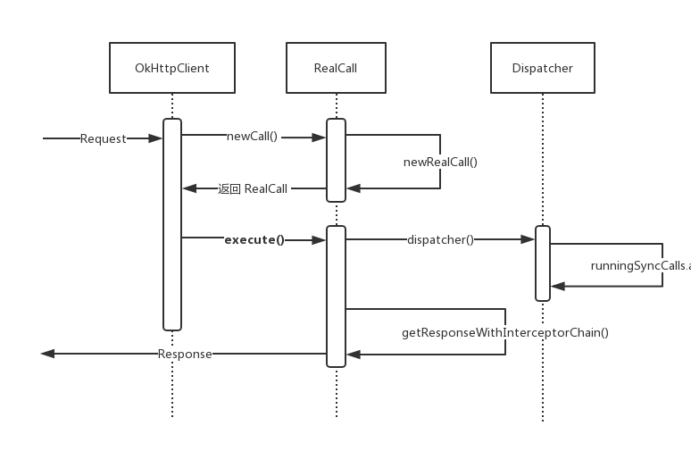
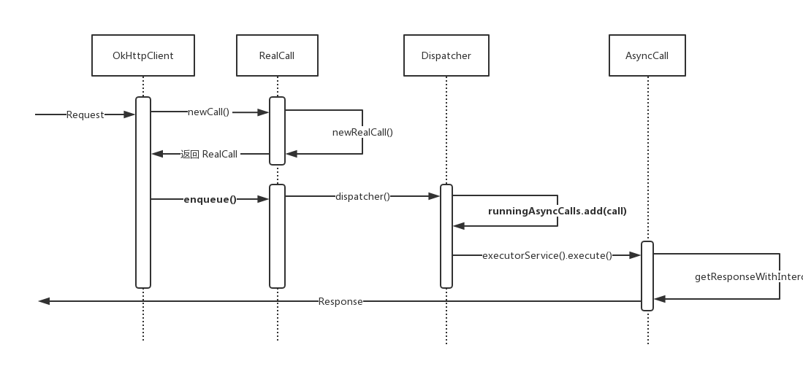
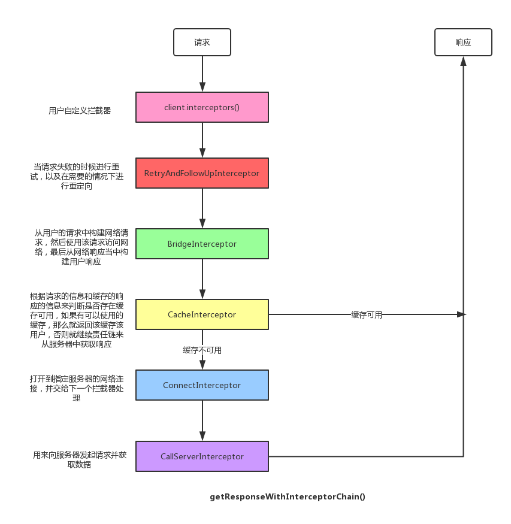

# Andriod 网络框架 OkHttp 源码解析

## 1、OkHttp 的基本使用

OkHttp 是 Square 的一款应用于 Android 和 Java 的 Http 和 Http/2 客户端。使用的时候只需要在 Gradle 里面加入下面一行依赖即可引入：

    implementation 'com.squareup.okhttp3:okhttp:3.11.0'

我们知道，Http 请求有多种类型，常用的分为 Get 和 Post，而 POST 又分为 Form 和 Multiple 等。下面我们以 Form 类型的请求为例来看下 OkHttp 的 API 设计逻辑：

    OkHttpClient internalHttpClient = new OkHttpClient();
    FormBody.Builder formBodyBuilder = new FormBody.Builder();
    RequestBody body = formBodyBuilder.build();
    Request.Builder builder = new Request.Builder().url("host:port/url").post(body);
    Request request = builder.build();
    Response response = internalHttpClient.newCall(request).execute();
    String retJson = response.body().string();

这里我们先用了 `FormBody` 的构建者模式创建 Form 类型请求的请求体，然后使用 `Request` 的构建者创建完整的 Form 请求。之后，我们用创建好的 OkHttp 客户端 `internalHttpClient` 来获取一个请求，并从请求的请求体中获取 Json 数据。

根据 OkHttp 的 API，如果我们希望发送一个 Multipart 类型的请求的时候就需要使用 `MultipartBody` 的构建者创建 Multipart 请求的请求体。然后同样使用 `Request` 的构建者创建完整的 Multipart 请求，剩下的逻辑相同。

除了使用上面的直接实例化一个 OkHttp 客户端的方式，我们也可以使用 `OkHttpClient` 的构建者 `OkHttpClient.Builder` 来创建 OkHttp 客户端。

所以，我们可以总结：

1. OkHttp 为不同的请求类型都提供了一个构建者方法用来创建请求体 `RequestBody`；
2. 因为请求体只是整个请求的一部分，所以，又要用 `Request.Builder` 构建一个请求对象 `Request`；
3. 这样我们得到了一个完整的 Http 请求，然后使用 `OkHttpClient` 对象进行网络访问得到响应对象 `Response`。

OkHttp 本身的设计比较友好，思路非常清晰，按照上面的思路搞懂了人家的 API 设计逻辑，自己再基于 OkHttp 封装一个库自然问题不大。

## 2、OkHttp 源码分析

上面我们提到的一些是基础的 API 类，是提供给用户使用的。这些类的设计只是基于构建者模式，非常容易理解。这里我们关注点也不在这些 API 类上面，而是 OkHttp 内部的请求执行相关的类。下面我们就开始对 OkHttp 的请求过程进行源码分析（源码版本：3.10.0）。

### 2.1 一个请求的大致流程

参考之前的示例程序，抛弃构建请求的过程不讲，单从请求的发送过程来看，我们的线索应该从 `OkHttpClient.newCall(Request)` 开始。下面是这个方法的定义，它会创建一个 `RealCall` 对象，并把 `OkHttpClient` 对象和 `Request` 对象作为参数传入进去：

    @Override public Call newCall(Request request) {
        return RealCall.newRealCall(this, request, false /* for web socket */);
    }
  
然后，RealCall 调用内部的静态方法 `newRealCall` 在其中创建一个 `RealCall` 实例并将其返回：

    static RealCall newRealCall(OkHttpClient client, Request originalRequest, boolean forWebSocket) {
        RealCall call = new RealCall(client, originalRequest, forWebSocket);
        call.eventListener = client.eventListenerFactory().create(call);
        return call;
    }

然后，当返回了 `RealCall` 之后，我们又会调用它的 `execute()` 方法来获取响应结果，下面是这个方法的定义：

    @Override public Response execute() throws IOException {
        synchronized (this) {
            if (executed) throw new IllegalStateException("Already Executed");
            executed = true;
        }
        captureCallStackTrace();
        eventListener.callStart(this);
        try {
            // 加入到一个双端队列中
            client.dispatcher().executed(this);
            // 从这里拿的响应Response
            Response result = getResponseWithInterceptorChain();
            if (result == null) throw new IOException("Canceled");
            return result;
        } catch (IOException e) {
            eventListener.callFailed(this, e);
            throw e;
        } finally {
            client.dispatcher().finished(this);
        }
    }

这里我们会用 `client` 对象（实际也就是上面创建 `RealCall` 的时候传入的 `OkHttpClient`）的 `dispatcher()` 方法来获取一个 `Dispatcher` 对象，并调用它的 `executed()` 方法来将当前的 `RealCall` 加入到一个双端队列中，下面是 `executed(RealCall)` 方法的定义，这里的 `runningSyncCalls` 的类型是 `Deque<RealCall>`：

    synchronized void executed(RealCall call) {
        runningSyncCalls.add(call);
    }

让我们回到上面的 `execute()`  方法，在把 `RealCall` 加入到双端队列之后，我们又调用了 `getResponseWithInterceptorChain()` 方法，下面就是该方法的定义。

    Response getResponseWithInterceptorChain() throws IOException {
        // 添加一系列拦截器，注意添加的顺序
        List<Interceptor> interceptors = new ArrayList<>();
        interceptors.addAll(client.interceptors());
        interceptors.add(retryAndFollowUpInterceptor);
        // 桥拦截器
        interceptors.add(new BridgeInterceptor(client.cookieJar()));
        // 缓存拦截器：从缓存中拿数据
        interceptors.add(new CacheInterceptor(client.internalCache()));
        // 网络连接拦截器：建立网络连接
        interceptors.add(new ConnectInterceptor(client));
        if (!forWebSocket) {
            interceptors.addAll(client.networkInterceptors());
        }
        // 服务器请求拦截器：向服务器发起请求获取数据
        interceptors.add(new CallServerInterceptor(forWebSocket));
        // 构建一条责任链
        Interceptor.Chain chain = new RealInterceptorChain(interceptors, null, null, null, 0,
            originalRequest, this, eventListener, client.connectTimeoutMillis(),
            client.readTimeoutMillis(), client.writeTimeoutMillis());
        // 处理责任链
        return chain.proceed(originalRequest);
    }

这里，我们创建了一个列表对象之后把 `client` 中的拦截器、重连拦截器、桥拦截器、缓存拦截器、网络连接拦截器和服务器请求拦截器等**依次**加入到列表中。然后，我们用这个列表创建了一个拦截器链。这里使用了责任链设计模式，每当一个拦截器执行完毕之后会调用下一个拦截器或者不调用并返回结果。显然，我们最终拿到的响应就是这个链条执行之后返回的结果。当我们自定义一个拦截器的时候，也会被加入到这个拦截器链条里。

这里我们遇到了很多的新类，比如 `RealCall`、`Dispatcher` 以及责任链等。下文中，我们会对这些类之间的关系以及责任链中的环节做一个分析，而这里我们先对整个请求的流程做一个大致的梳理。下面是这个过程大致的时序图：

### 2.2 分发器 Dispatcher

上面我们提到了 `Dispatcher` 这个类，它的作用是对请求进行分发。以最开始的示例代码为例，在使用 OkHttp 的时候，我们会创建一个 `RealCall` 并将其加入到双端队列中。但是请注意这里的双端队列的名称是 `runningSyncCalls`，也就是说这种请求是同步请求，会在当前的线程中立即被执行。所以，下面的 `getResponseWithInterceptorChain()` 就是这个同步的执行过程。而当我们执行完毕的时候，又会调用 `Dispatcher` 的 `finished(RealCall)` 方法把该请求从队列中移除。所以，这种同步的请求无法体现分发器的“分发”功能。

除了同步的请求，还有异步类型的请求：当我们拿到了 `RealCall` 的时候，调用它的 `enqueue(Callback responseCallback)` 方法并设置一个回调即可。该方法会执行下面这行代码：

    client.dispatcher().enqueue(new AsyncCall(responseCallback));

即使用上面的回调创建一个  `AsyncCall` 并调用  `enqueue(AsyncCall)`。这里的 `AsyncCall` 间接继承自 `Runnable`，是一个可执行的对象，并且会在 `Runnable` 的 `run()` 方法里面调用 `AsyncCall` 的 `execute()` 方法。`AsyncCall` 的 `execute()` 方法与 `RealCall` 的 `execute()` 方法类似，都使用责任链来完成一个网络请求。只是后者可以放在一个异步的线程中进行执行。

当我们调用了 `Dispatcher` 的 `enqueue(AsyncCall)` 方法的时候也会将 `AsyncCall` 加入到一个队列中，并会在请求执行完毕的时候从该队列中移除，只是这里的队列是 `runningAsyncCalls` 或者 `readyAsyncCalls`。它们都是一个双端队列，并用来存储异步类型的请求。它们的区别是，`runningAsyncCalls` 是正在执行的队列，当正在执行的队列达到了限制的时候，就会将其放置到就绪队列 `readyAsyncCalls` 中：

    synchronized void enqueue(AsyncCall call) {
        if (runningAsyncCalls.size() < maxRequests && runningCallsForHost(call) < maxRequestsPerHost) {
            runningAsyncCalls.add(call);
            executorService().execute(call);
        } else {
            readyAsyncCalls.add(call);
        }
    }

当把该请求加入到了正在执行的队列之后，我们会立即使用一个线程池来执行该 `AsyncCall`。这样这个请求的责任链就会在一个线程池当中被异步地执行了。这里的线程池由 `executorService()` 方法返回：

    public synchronized ExecutorService executorService() {
        if (executorService == null) {
            executorService = new ThreadPoolExecutor(0, Integer.MAX_VALUE, 60, TimeUnit.SECONDS,
            new SynchronousQueue<Runnable>(), Util.threadFactory("OkHttp Dispatcher", false));
        }
        return executorService;
    }

显然，当线程池不存在的时候会去创建一个线程池。除了上面的这种方式，我们还可以在构建 `OkHttpClient` 的时候，自定义一个 `Dispacher`，并在其构造方法中为其指定一个线程池。下面我们类比 OkHttp 的同步请求绘制了一个异步请求的时序图。你可以通过将两个图对比来了解两种实现方式的不同：

以上就是分发器 `Dispacher` 的逻辑，看上去并没有那么复杂。并且从上面的分析中，我们可以看出实际请求的执行过程并不是在这里完成的，这里只能决定在哪个线程当中执行请求并把请求用双端队列缓存下来，而实际的请求执行过程是在责任链中完成的。下面我们就来分析一下 OkHttp 里的责任链的执行过程。

### 2.3 责任链的执行过程

在典型的责任链设计模式里，很多对象由每一个对象对其下级的引用而连接起来形成一条链。请求在这个链上传递，直到链上的某一个对象决定处理此请求。发出这个请求的客户端并不知道链上的哪一个对象最终处理这个请求，这使得系统可以在不影响客户端的情况下动态地重新组织和分配责任。责任链在现实生活中的一种场景就是面试，当某轮面试官觉得你没有资格进入下一轮的时候可以否定你，不然会让下一轮的面试官继续面试。

在 OkHttp 里面，责任链的执行模式与之稍有不同。这里我们主要来分析一下在 OkHttp 里面，责任链是如何执行的，至于每个链条里面的具体逻辑，我们会在随后一一说明。

回到 2.1 的代码，有两个地方需要我们注意：

1. 是当创建一个责任链 `RealInterceptorChain` 的时候，我们传入的第 5 个参数是 0。该参数名为 `index`，会被赋值给 `RealInterceptorChain` 实例内部的同名全局变量。
2. 当启用责任链的时候，会调用它的 `proceed(Request)` 方法。

下面是 `proceed(Request)` 方法的定义：

    @Override public Response proceed(Request request) throws IOException {
        return proceed(request, streamAllocation, httpCodec, connection);
    }

这里又调用了内部的重载的 `proceed()` 方法。下面我们对该方法进行了简化：

    public Response proceed(Request request, StreamAllocation streamAllocation, HttpCodec httpCodec,
        RealConnection connection) throws IOException {
        if (index >= interceptors.size()) throw new AssertionError();
        // ...
        // 调用责任链的下一个拦截器
        RealInterceptorChain next = new RealInterceptorChain(interceptors, streamAllocation, httpCodec,
            connection, index + 1, request, call, eventListener, connectTimeout, readTimeout,
            writeTimeout);
        Interceptor interceptor = interceptors.get(index);
        Response response = interceptor.intercept(next);
        // ...
        return response;
    }

注意到这里使用责任链进行处理的时候，会新建下一个责任链并把 `index+!` 作为下一个责任链的 `index`。然后，我们使用 `index` 从拦截器列表中取出一个拦截器，调用它的 `intercept()` 方法，并把下一个执行链作为参数传递进去。

这样，当下一个拦截器希望自己的下一级继续处理这个请求的时候，可以调用传入的责任链的 `proceed()` 方法；如果自己处理完毕之后，下一级不需要继续处理，那么就直接返回一个 `Response` 实例即可。因为，每次都是在当前的 `index` 基础上面加 1，所以能在调用  `proceed()` 的时候准确地从拦截器列表中取出下一个拦截器进行处理。

我们还要注意的地方是之前提到过重试拦截器，这种拦截器会在内部启动一个 `while` 循环，并在循环体中调用执行链的 `proceed()` 方法来实现请求的不断重试。这是因为在它那里的拦截器链的 `index` 是固定的，所以能够每次调用 `proceed()` 的时候，都能够从自己的下一级执行一遍链条。下面就是这个责任链的执行过程：

清楚了 OkHttp 的拦截器链的执行过程之后，我们来看一下各个拦截器做了什么逻辑。

### 2.3 重试和重定向：RetryAndFollowUpInterceptor

`RetryAndFollowUpInterceptor` 主要用来当请求失败的时候进行重试，以及在需要的情况下进行重定向。我们上面说，责任链会在进行处理的时候调用第一个拦截器的 `intercept()` 方法。如果我们在创建 OkHttp 客户端的时候没有加入自定义拦截器，那么
`RetryAndFollowUpInterceptor` 就是我们的责任链中最先被调用的拦截器。

    @Override public Response intercept(Chain chain) throws IOException {
        // ...
        // 注意这里我们初始化了一个 StreamAllocation 并赋值给全局变量，它的作用我们后面会提到
        StreamAllocation streamAllocation = new StreamAllocation(client.connectionPool(),
                createAddress(request.url()), call, eventListener, callStackTrace);
        this.streamAllocation = streamAllocation;
        // 用来记录重定向的次数
        int followUpCount = 0;
        Response priorResponse = null;
        while (true) {
            if (canceled) {
                streamAllocation.release();
                throw new IOException("Canceled");
            }

            Response response;
            boolean releaseConnection = true;
            try {
                // 这里从当前的责任链开始执行一遍责任链，是一种重试的逻辑
                response = realChain.proceed(request, streamAllocation, null, null);
                releaseConnection = false;
            } catch (RouteException e) {
                // 调用 recover 方法从失败中进行恢复，如果可以恢复就返回true，否则返回false
                if (!recover(e.getLastConnectException(), streamAllocation, false, request)) {
                    throw e.getLastConnectException();
                }
                releaseConnection = false;
                continue;
            } catch (IOException e) {
                // 重试与服务器进行连接
                boolean requestSendStarted = !(e instanceof ConnectionShutdownException);
                if (!recover(e, streamAllocation, requestSendStarted, request)) throw e;
                releaseConnection = false;
                continue;
            } finally {
                // 如果 releaseConnection 为 true 则表明中间出现了异常，需要释放资源
                if (releaseConnection) {
                    streamAllocation.streamFailed(null);
                    streamAllocation.release();
                }
            }

            // 使用之前的响应 priorResponse 构建一个响应，这种响应的响应体 body 为空
            if (priorResponse != null) {
                response = response.newBuilder()
                        .priorResponse(priorResponse.newBuilder().body(null).build())
                        .build();
            }

            // 根据得到的响应进行处理，可能会增加一些认证信息、重定向或者处理超时请求
            // 如果该请求无法继续被处理或者出现的错误不需要继续处理，将会返回 null
            Request followUp = followUpRequest(response, streamAllocation.route());

            // 无法重定向，直接返回之前的响应
            if (followUp == null) {
                if (!forWebSocket) {
                    streamAllocation.release();
                }
                return response;
            }

            // 关闭资源
            closeQuietly(response.body());

            // 达到了重定向的最大次数，就抛出一个异常
            if (++followUpCount > MAX_FOLLOW_UPS) {
                streamAllocation.release();
                throw new ProtocolException("Too many follow-up requests: " + followUpCount);
            }

            if (followUp.body() instanceof UnrepeatableRequestBody) {
                streamAllocation.release();
                throw new HttpRetryException("Cannot retry streamed HTTP body", response.code());
            }

            // 这里判断新的请求是否能够复用之前的连接，如果无法复用，则创建一个新的连接
            if (!sameConnection(response, followUp.url())) {
                streamAllocation.release();
                streamAllocation = new StreamAllocation(client.connectionPool(),
                        createAddress(followUp.url()), call, eventListener, callStackTrace);
                this.streamAllocation = streamAllocation;
            } else if (streamAllocation.codec() != null) {
                throw new IllegalStateException("Closing the body of " + response
                        + " didn't close its backing stream. Bad interceptor?");
            }

            request = followUp;
            priorResponse = response;
        }
    }

以上的代码主要用来根据错误的信息做一些处理，会根据服务器返回的信息判断这个请求是否可以重定向，或者是否有必要进行重试。如果值得去重试就会新建或者复用之前的连接在下一次循环中进行请求重试，否则就将得到的请求包装之后返回给用户。这里，我们提到了 `StreamAllocation` 对象，它相当于一个管理类，维护了服务器连接、并发流和请求之间的关系，该类还会初始化一个 `Socket` 连接对象，获取输入/输出流对象。同时，还要注意这里我们通过 `client.connectionPool()` 传入了一个连接池对象 `ConnectionPool`。这里我们只是初始化了这些类，但实际在当前的方法中并没有真正用到这些类，而是把它们传递到下面的拦截器里来从服务器中获取请求的响应。稍后，我们会说明这些类的用途，以及之间的关系。

### 2.4 BridgeInterceptor

桥拦截器 `BridgeInterceptor` 用于从用户的请求中构建网络请求，然后使用该请求访问网络，最后从网络响应当中构建用户响应。相对来说这个拦截器的逻辑比较简单，只是用来对请求进行包装，并将服务器响应转换成用户友好的响应：

    public final class BridgeInterceptor implements Interceptor {
        @Override public Response intercept(Chain chain) throws IOException {
            Request userRequest = chain.request();
            // 从用户请求中获取网络请求构建者
            Request.Builder requestBuilder = userRequest.newBuilder();
            // ...
            // 执行网络请求
            Response networkResponse = chain.proceed(requestBuilder.build());
            // ...
            // 从网络响应中获取用户响应构建者
            Response.Builder responseBuilder = networkResponse.newBuilder().request(userRequest);
            // ...
            // 返回用户响应
            return responseBuilder.build();
        }
    }

### 2.5 使用缓存：CacheInterceptor

缓存拦截器会根据请求的信息和缓存的响应的信息来判断是否存在缓存可用，如果有可以使用的缓存，那么就返回该缓存该用户，否则就继续责任链来从服务器中获取响应。当获取到响应的时候，又会把响应缓存到磁盘上面。以下是这部分的逻辑：

    public final class CacheInterceptor implements Interceptor {
        @Override public Response intercept(Chain chain) throws IOException {
            Response cacheCandidate = cache != null ? cache.get(chain.request()) : null;
            long now = System.currentTimeMillis();
            // 根据请求和缓存的响应中的信息来判断是否存在缓存可用
            CacheStrategy strategy = new CacheStrategy.Factory(now, chain.request(), cacheCandidate).get();
            Request networkRequest = strategy.networkRequest; // 如果该请求没有使用网络就为空
            Response cacheResponse = strategy.cacheResponse; // 如果该请求没有使用缓存就为空
            if (cache != null) {
                cache.trackResponse(strategy);
            }
            if (cacheCandidate != null && cacheResponse == null) {
                closeQuietly(cacheCandidate.body());
            }
            // 请求不使用网络并且不使用缓存，相当于在这里就拦截了，没必要交给下一级（网络请求拦截器）来执行
            if (networkRequest == null && cacheResponse == null) {
                return new Response.Builder()
                        .request(chain.request())
                        .protocol(Protocol.HTTP_1_1)
                        .code(504)
                        .message("Unsatisfiable Request (only-if-cached)")
                        .body(Util.EMPTY_RESPONSE)
                        .sentRequestAtMillis(-1L)
                        .receivedResponseAtMillis(System.currentTimeMillis())
                        .build();
            }
            // 该请求使用缓存，但是不使用网络：从缓存中拿结果，没必要交给下一级（网络请求拦截器）执行
            if (networkRequest == null) {
                return cacheResponse.newBuilder().cacheResponse(stripBody(cacheResponse)).build();
            }
            Response networkResponse = null;
            try {
                // 这里调用了执行链的处理方法，实际就是交给自己的下一级来执行了
                networkResponse = chain.proceed(networkRequest);
            } finally {
                if (networkResponse == null && cacheCandidate != null) {
                    closeQuietly(cacheCandidate.body());
                }
            }
            // 这里当拿到了网络请求之后调用，下一级执行完毕会交给它继续执行，如果使用了缓存就把请求结果更新到缓存里
            if (cacheResponse != null) {
                // 服务器返回的结果是304，返回缓存中的结果
                if (networkResponse.code() == HTTP_NOT_MODIFIED) {
                    Response response = cacheResponse.newBuilder()
                            .headers(combine(cacheResponse.headers(), networkResponse.headers()))
                            .sentRequestAtMillis(networkResponse.sentRequestAtMillis())
                            .receivedResponseAtMillis(networkResponse.receivedResponseAtMillis())
                            .cacheResponse(stripBody(cacheResponse))
                            .networkResponse(stripBody(networkResponse))
                            .build();
                    networkResponse.body().close();
                    cache.trackConditionalCacheHit();
                    // 更新缓存
                    cache.update(cacheResponse, response);
                    return response;
                } else {
                    closeQuietly(cacheResponse.body());
                }
            }
            Response response = networkResponse.newBuilder()
                    .cacheResponse(stripBody(cacheResponse))
                    .networkResponse(stripBody(networkResponse))
                    .build();
            // 把请求的结果放进缓存里
            if (cache != null) {
                if (HttpHeaders.hasBody(response) && CacheStrategy.isCacheable(response, networkRequest)) {
                    CacheRequest cacheRequest = cache.put(response);
                    return cacheWritingResponse(cacheRequest, response);
                }
                if (HttpMethod.invalidatesCache(networkRequest.method())) {
                    try {
                        cache.remove(networkRequest);
                    } catch (IOException ignored) {
                        // The cache cannot be written.
                    }
                }
            }
            return response;
        }
    }

对缓存，这里我们使用的是全局变量 `cache`，它是 `InternalCache` 类型的变量。`InternalCache` 是一个接口，在 OkHttp 中只有一个实现类 `Cache`。在 `Cache` 内部，使用了 `DiskLruCache` 来将缓存的数据存到磁盘上。`DiskLruCache` 以及 `LruCache` 是 Android 上常用的两种缓存策略。前者是基于磁盘来进行缓存的，后者是基于内存来进行缓存的，它们的核心思想都是 Least Recently Used，即最近最少使用算法。我们会在以后的文章中详细介绍这两种缓存框架，也请继续关注我们的文章。

另外，上面我们根据请求和缓存的响应中的信息来判断是否存在缓存可用的时候用到了 `CacheStrategy` 的两个字段，得到这两个字段的时候使用了非常多的判断，其中涉及 Http 缓存相关的知识，感兴趣的话可以自己参考源代码。

### 2.6 连接复用：ConnectInterceptor

连接拦截器 `ConnectInterceptor` 用来打开到指定服务器的网络连接，并交给下一个拦截器处理。这里我们只打开了一个网络连接，但是并没有发送请求到服务器。从服务器获取数据的逻辑交给下一级的拦截器来执行。虽然，这里并没有真正地从网络中获取数据，而仅仅是打开一个连接，但这里有不少的内容值得我们去关注。因为在获取连接对象的时候，使用了连接池 `ConnectionPool` 来复用连接。

    public final class ConnectInterceptor implements Interceptor {

        @Override public Response intercept(Chain chain) throws IOException {
            RealInterceptorChain realChain = (RealInterceptorChain) chain;
            Request request = realChain.request();
            StreamAllocation streamAllocation = realChain.streamAllocation();

            boolean doExtensiveHealthChecks = !request.method().equals("GET");
            HttpCodec httpCodec = streamAllocation.newStream(client, chain, doExtensiveHealthChecks);
            RealConnection connection = streamAllocation.connection();

            return realChain.proceed(request, streamAllocation, httpCodec, connection);
        }
    }

这里的 `HttpCodec` 用来编码请求并解码响应，`RealConnection` 用来向服务器发起连接。它们会在下一个拦截器中被用来从服务器中获取响应信息。下一个拦截器的逻辑并不复杂，这里万事具备之后，只要它来从服务器中读取数据即可。可以说，OkHttp 中的核心部分大概就在这里，所以，我们就先好好分析一下，这里在创建连接的时候如何借助连接池来实现连接复用的。

根据上面的代码，当我们调用 `streamAllocation` 的 `newStream()` 方法的时候，最终会经过一系列的判断到达 `StreamAllocation` 中的 `findConnection()` 方法。

    private RealConnection findConnection(int connectTimeout, int readTimeout, int writeTimeout,
                                          int pingIntervalMillis, boolean connectionRetryEnabled) throws IOException {
        // ...
        synchronized (connectionPool) {
            // ...
            // 尝试使用已分配的连接，已经分配的连接可能已经被限制创建新的流
            releasedConnection = this.connection;
            // 释放当前连接的资源，如果该连接已经被限制创建新的流，就返回一个Socket以关闭连接
            toClose = releaseIfNoNewStreams();
            if (this.connection != null) {
                // 已分配连接，并且该连接可用
                result = this.connection;
                releasedConnection = null;
            }
            if (!reportedAcquired) {
                // 如果该连接从未被标记为获得，不要标记为发布状态，reportedAcquired 通过 acquire() 方法修改
                releasedConnection = null;
            }

            if (result == null) {
                // 尝试供连接池中获取一个连接
                Internal.instance.get(connectionPool, address, this, null);
                if (connection != null) {
                    foundPooledConnection = true;
                    result = connection;
                } else {
                    selectedRoute = route;
                }
            }
        }
        // 关闭连接
        closeQuietly(toClose);

        if (releasedConnection != null) {
            eventListener.connectionReleased(call, releasedConnection);
        }
        if (foundPooledConnection) {
            eventListener.connectionAcquired(call, result);
        }
        if (result != null) {
            // 如果已经从连接池中获取到了一个连接，就将其返回
            return result;
        }

        boolean newRouteSelection = false;
        if (selectedRoute == null && (routeSelection == null || !routeSelection.hasNext())) {
            newRouteSelection = true;
            routeSelection = routeSelector.next();
        }

        synchronized (connectionPool) {
            if (canceled) throw new IOException("Canceled");

            if (newRouteSelection) {
                // 根据一系列的 IP 地址从连接池中获取一个链接
                List<Route> routes = routeSelection.getAll();
                for (int i = 0, size = routes.size(); i < size; i++) {
                    Route route = routes.get(i);
                    // 从连接池中获取一个连接
                    Internal.instance.get(connectionPool, address, this, route);
                    if (connection != null) {
                        foundPooledConnection = true;
                        result = connection;
                        this.route = route;
                        break;
                    }
                }
            }

            if (!foundPooledConnection) {
                if (selectedRoute == null) {
                    selectedRoute = routeSelection.next();
                }

                // 创建一个新的连接，并将其分配，这样我们就可以在握手之前进行终端
                route = selectedRoute;
                refusedStreamCount = 0;
                result = new RealConnection(connectionPool, selectedRoute);
                acquire(result, false);
            }
        }

        // 如果我们在第二次的时候发现了一个池连接，那么我们就将其返回
        if (foundPooledConnection) {
            eventListener.connectionAcquired(call, result);
            return result;
        }

        // 进行 TCP 和 TLS 握手
        result.connect(connectTimeout, readTimeout, writeTimeout, pingIntervalMillis,
                connectionRetryEnabled, call, eventListener);
        routeDatabase().connected(result.route());

        Socket socket = null;
        synchronized (connectionPool) {
            reportedAcquired = true;

            // 将该连接放进连接池中
            Internal.instance.put(connectionPool, result);

            // 如果同时创建了另一个到同一地址的多路复用连接，释放这个连接并获取那个连接
            if (result.isMultiplexed()) {
                socket = Internal.instance.deduplicate(connectionPool, address, this);
                result = connection;
            }
        }
        closeQuietly(socket);

        eventListener.connectionAcquired(call, result);
        return result;
    }

该方法会被放置在一个循环当中被不停地调用以得到一个可用的连接。它优先使用当前已经存在的连接，不然就使用连接池中存在的连接，再不行的话，就创建一个新的连接。所以，上面的代码大致分成三个部分：

1. 判断当前的连接是否可以使用：流是否已经被关闭，并且已经被限制创建新的流；
2. 如果当前的连接无法使用，就从连接池中获取一个连接；
3. 连接池中也没有发现可用的连接，创建一个新的连接，并进行握手，然后将其放到连接池中。

在从连接池中获取一个连接的时候，使用了 `Internal` 的 `get()` 方法。`Internal` 有一个静态的实例，会在 OkHttpClient 的静态代码快中被初始化。我们会在 `Internal` 的 `get()` 中调用连接池的 `get()` 方法来得到一个连接。

从上面的代码中我们也可以看出，实际上，我们使用连接复用的一个好处就是省去了进行 TCP 和 TLS 握手的一个过程。因为建立连接本身也是需要消耗一些时间的，连接被复用之后可以提升我们网络访问的效率。那么这些连接被放置在连接池之后是如何进行管理的呢？我们会在下文中分析 OkHttp 的 `ConnectionPool` 中是如何管理这些连接的。

### 2.7 CallServerInterceptor

服务器请求拦截器 `CallServerInterceptor` 用来向服务器发起请求并获取数据。这是整个责任链的最后一个拦截器，这里没有再继续调用执行链的处理方法，而是把拿到的响应处理之后直接返回给了上一级的拦截器：

    public final class CallServerInterceptor implements Interceptor {

        @Override public Response intercept(Chain chain) throws IOException {
            RealInterceptorChain realChain = (RealInterceptorChain) chain;
            // 获取 ConnectInterceptor 中初始化的 HttpCodec
            HttpCodec httpCodec = realChain.httpStream();
            // 获取 RetryAndFollowUpInterceptor 中初始化的 StreamAllocation
            StreamAllocation streamAllocation = realChain.streamAllocation();
            // 获取 ConnectInterceptor 中初始化的 RealConnection
            RealConnection connection = (RealConnection) realChain.connection();
            Request request = realChain.request();

            long sentRequestMillis = System.currentTimeMillis();

            realChain.eventListener().requestHeadersStart(realChain.call());
            // 在这里写入请求头 
            httpCodec.writeRequestHeaders(request);
            realChain.eventListener().requestHeadersEnd(realChain.call(), request);

            Response.Builder responseBuilder = null;
            if (HttpMethod.permitsRequestBody(request.method()) && request.body() != null) {
                if ("100-continue".equalsIgnoreCase(request.header("Expect"))) {
                    httpCodec.flushRequest();
                    realChain.eventListener().responseHeadersStart(realChain.call());
                    responseBuilder = httpCodec.readResponseHeaders(true);
                }
                 // 在这里写入请求体
                if (responseBuilder == null) {
                    realChain.eventListener().requestBodyStart(realChain.call());
                    long contentLength = request.body().contentLength();
                    CountingSink requestBodyOut =
                            new CountingSink(httpCodec.createRequestBody(request, contentLength));
                    BufferedSink bufferedRequestBody = Okio.buffer(requestBodyOut);
                    // 写入请求体
                    request.body().writeTo(bufferedRequestBody);
                    bufferedRequestBody.close();
                    realChain.eventListener()
                            .requestBodyEnd(realChain.call(), requestBodyOut.successfulCount);
                } else if (!connection.isMultiplexed()) {
                    streamAllocation.noNewStreams();
                }
            }
            httpCodec.finishRequest();
            if (responseBuilder == null) {
                realChain.eventListener().responseHeadersStart(realChain.call());
                // 读取响应头
                responseBuilder = httpCodec.readResponseHeaders(false);
            }
            Response response = responseBuilder
                    .request(request)
                    .handshake(streamAllocation.connection().handshake())
                    .sentRequestAtMillis(sentRequestMillis)
                    .receivedResponseAtMillis(System.currentTimeMillis())
                    .build();
            // 读取响应体
            int code = response.code();
            if (code == 100) {
                responseBuilder = httpCodec.readResponseHeaders(false);
                response = responseBuilder
                        .request(request)
                        .handshake(streamAllocation.connection().handshake())
                        .sentRequestAtMillis(sentRequestMillis)
                        .receivedResponseAtMillis(System.currentTimeMillis())
                        .build();
                code = response.code();
            }
            realChain.eventListener().responseHeadersEnd(realChain.call(), response);
            if (forWebSocket && code == 101) {
                response = response.newBuilder()
                        .body(Util.EMPTY_RESPONSE)
                        .build();
            } else {
                response = response.newBuilder()
                        .body(httpCodec.openResponseBody(response))
                        .build();
            }
            // ...
            return response;
        }
    }

### 2.8 连接管理：ConnectionPool

与请求的缓存类似，OkHttp 的连接池也使用一个双端队列来缓存已经创建的连接：

    private final Deque<RealConnection> connections = new ArrayDeque<>();

OkHttp 的缓存管理分成两个步骤，一边当我们创建了一个新的连接的时候，我们要把它放进缓存里面；另一边，我们还要来对缓存进行清理。在 `ConnectionPool` 中，当我们向连接池中缓存一个连接的时候，只要调用双端队列的 `add()` 方法，将其加入到双端队列即可，而清理连接缓存的操作则交给线程池来定时执行。

在 `ConnectionPool` 中存在一个静态的线程池：

    private static final Executor executor = new ThreadPoolExecutor(0 /* corePoolSize */,
        Integer.MAX_VALUE /* maximumPoolSize */, 
        60L /* keepAliveTime */,
        TimeUnit.SECONDS,
        new SynchronousQueue<Runnable>(), 
        Util.threadFactory("OkHttp ConnectionPool", true));

每当我们向连接池中插入一个连接的时候就会调用下面的方法，将连接插入到双端队列的同时，会调用上面的线程池来执行清理缓存的任务：

    void put(RealConnection connection) {
        assert (Thread.holdsLock(this));
        if (!cleanupRunning) {
            cleanupRunning = true;
            // 使用线程池执行清理任务
            executor.execute(cleanupRunnable);
        }
        // 将新建的连接插入到双端队列中
        connections.add(connection);
    }

这里的清理任务是 `cleanupRunnable`，是一个 `Runnable` 类型的实例。它会在方法内部调用 `cleanup()` 方法来清理无效的连接：

    private final Runnable cleanupRunnable = new Runnable() {
        @Override public void run() {
            while (true) {
                long waitNanos = cleanup(System.nanoTime());
                if (waitNanos == -1) return;
                if (waitNanos > 0) {
                    long waitMillis = waitNanos / 1000000L;
                    waitNanos -= (waitMillis * 1000000L);
                    synchronized (ConnectionPool.this) {
                        try {
                            ConnectionPool.this.wait(waitMillis, (int) waitNanos);
                        } catch (InterruptedException ignored) {
                        }
                    }
                }
            }
        }
    };

下面是 `cleanup()` 方法：

    long cleanup(long now) {
        int inUseConnectionCount = 0;
        int idleConnectionCount = 0;
        RealConnection longestIdleConnection = null;
        long longestIdleDurationNs = Long.MIN_VALUE;

        synchronized (this) {
            // 遍历所有的连接
            for (Iterator<RealConnection> i = connections.iterator(); i.hasNext(); ) {
                RealConnection connection = i.next();
                // 当前的连接正在使用中
                if (pruneAndGetAllocationCount(connection, now) > 0) {
                    inUseConnectionCount++;
                    continue;
                }
                idleConnectionCount++;
                // 如果找到了一个可以被清理的连接，会尝试去寻找闲置时间最久的连接来释放
                long idleDurationNs = now - connection.idleAtNanos;
                if (idleDurationNs > longestIdleDurationNs) {
                    longestIdleDurationNs = idleDurationNs;
                    longestIdleConnection = connection;
                }
            }

            if (longestIdleDurationNs >= this.keepAliveDurationNs 
                    || idleConnectionCount > this.maxIdleConnections) {
                // 该连接的时长超出了最大的活跃时长或者闲置的连接数量超出了最大允许的范围，直接移除
                connections.remove(longestIdleConnection);
            } else if (idleConnectionCount > 0) {
                // 闲置的连接的数量大于0，停顿指定的时间（等会儿会将其清理掉，现在还不是时候）
                return keepAliveDurationNs - longestIdleDurationNs;
            } else if (inUseConnectionCount > 0) {
                // 所有的连接都在使用中，5分钟后再清理
                return keepAliveDurationNs;
            } else {
                // 没有连接
                cleanupRunning = false;
                return -1;
            }
        }

        closeQuietly(longestIdleConnection.socket());
        return 0;
    }

在从缓存的连接中取出连接来判断是否应该将其释放的时候使用到了两个变量 `maxIdleConnections` 和 `keepAliveDurationNs`，分别表示最大允许的闲置的连接的数量和连接允许存活的最长的时间。默认空闲连接最大数目为5个，`keepalive` 时间最长为5分钟。

上面的方法会对缓存中的连接进行遍历，以寻找一个闲置时间最长的连接，然后根据该连接的闲置时长和最大允许的连接数量等参数来决定是否应该清理该连接。同时注意上面的方法的返回值是一个时间，如果闲置时间最长的连接仍然需要一段时间才能被清理的时候，会返回这段时间的时间差，然后会在这段时间之后再次对连接池进行清理。

## 总结：

以上就是我们对 OkHttp 内部网络访问的源码的分析。当我们发起一个请求的时候会初始化一个 Call 的实例，然后根据同步和异步的不同，分别调用它的 `execute()` 和 `enqueue()` 方法。虽然，两个方法一个会在当前的线程中被立即执行，一个会在线程池当中执行，但是它们进行网络访问的逻辑都是一样的：通过拦截器组成的责任链，依次经过重试、桥接、缓存、连接和访问服务器等过程，来获取到一个响应并交给用户。其中，缓存和连接两部分内容是重点，因为前者涉及到了一些计算机网络方面的知识，后者则是 OkHttp 效率和框架的核心。

