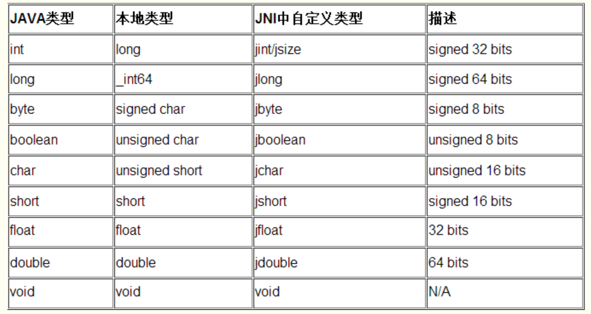
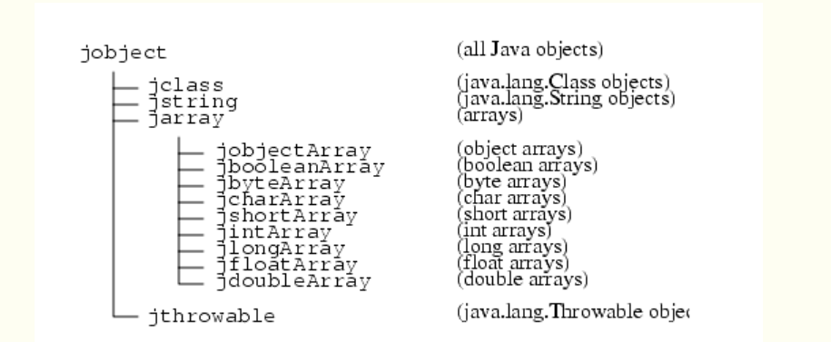
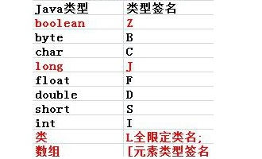
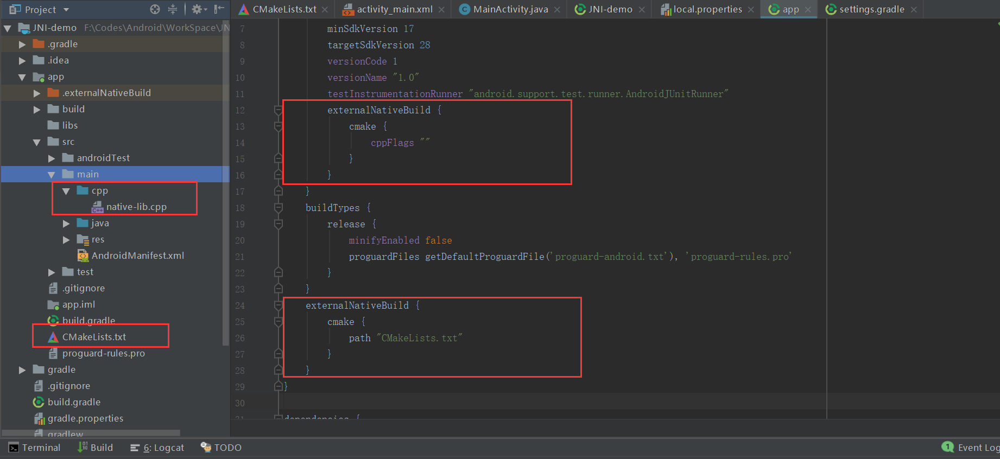

# 在 Android 中使用 JNI 的总结

最近在研究 Android 相机相关的东西，因为想要对相机做一个封装，于是想到要提供支持滤镜和图像动态识别相关的接口。在我找到一些资料中，它们的实现：一个是基于 OpenGL 的，一个是基于 OpenCV 的。两者都可以直接使用 Java 进行开发，受制于 Java 语言的限制，所以当对程序的性能要求很高的时候，Java 就有些心有余力不足了。所以，有些实现 OpenCV 的方式是在 Native 层进行处理的。这就需要涉及 JNI 的一些知识。

当然，JNI 并非 Android 中提出的概念，而是在 Java 中本来提供的。所以，在这篇文章中，我们先尝试在 IDEA 中使用 JNI 进行开发，以了解 JNI 运行的原理和一些基础知识。然后，再介绍下 AS 中使用更高效的开发方式。

## 1、声明 native 方法

### 1.1 静态注册

首先，声明 Java 类，

```java
package me.shouheng.jni;

public class JNIExample {

    static {
        // 函数System.loadLibrary()是加载dll（windows）或so（Linux）库，只需名称即可，
        // 无需加入文件名后缀（.dll或.so）
        System.loadLibrary("JNIExample");
        init_native();
    }

    private static native void init_native();

    public static native void hello_world();

    public static void main(String...args) {
        JNIExample.hello_world();
    }
}
```

native 的方法可以定义成 static 的和非 static 的，使用上和普通的方法没有区别。这里使用 `System.loadLibrary("JNIExample")` 加载 JNI 的库。在 Window 上面是 dll，在 Linux 上面是 so. 这里的 `JNIExample` 只是库的名称，甚至都没有包含文件类型的后缀，那么 IDEA 怎么知道到哪里加载库呢？这就需要我们在运行 JVM 的时候，通过虚拟机参数来指定。在 IDEA 中的方式是使用 `Edit Configuration...`，然后在 `VM options` 一栏中输入 `-Djava.library.path=F:\Codes\Java\Project\Java-advanced\java-advanced\lib`，这里的路径是我的库文件所在的位置。

使用 JNI 第一步是生成头文件，我们可以使用如下的指令，

```shell
javah -jni -classpath (搜寻类目录) -d (输出目录) (类名)
```

或者简单一些，先把 java 文件编译成 class，然后使用 class 生成 h 头文件，

```powershell
javac me/shouheng/jni/JNIExample.java
javah me.shouheng.jni.JNIExample
```

上面的两个命令是可行的，只是要注意下文件的路径的问题。(也许我们可以使用 Java 或者其他的语言写些程序调用这些可执行文件来简化它的使用！)

生成的头文件代码如下，

```c
/* DO NOT EDIT THIS FILE - it is machine generated */
#include <jni.h>
/* Header for class me_shouheng_jni_JNIExample */

#ifndef _Included_me_shouheng_jni_JNIExample
#define _Included_me_shouheng_jni_JNIExample
#ifdef __cplusplus
extern "C" {
#endif
/*
 * Class:     me_shouheng_jni_JNIExample
 * Method:    init_native
 * Signature: ()V
 */
JNIEXPORT void JNICALL Java_me_shouheng_jni_JNIExample_init_1native
  (JNIEnv *, jclass);

/*
 * Class:     me_shouheng_jni_JNIExample
 * Method:    hello_world
 * Signature: ()V
 */
JNIEXPORT void JNICALL Java_me_shouheng_jni_JNIExample_hello_1world
  (JNIEnv *, jclass);

#ifdef __cplusplus
}
#endif
#endif
```

可以看出，它跟普通的 c 头文件多了 JNIEXPORT 和 JNICALL 两个指令，剩下的东西完全符合一般 c 头文件的规则。这里的 `Java_me_shouheng_jni_JNIExample_init_1native` 对应 Java 层的代码，可见它的规则是 `Java_Java层的方法路径` 只是方法路径使用了下划线取代了逗号，并且 Java 层的下划线使用 `_1` 替代，这是因为 Native 层的下划线已经用来替代 Java 层的逗号了，所以 Java 层的下划线只能用 `_1` 表示了。

这里的 `JNIEnv` 是一个指针类型，我们可以用它访问 Java 层的代码，它不能跨进程被调用。你可以在 JDK 下面的 include 文件夹中的 `jni.h` 中找到它的定义。`jclass` 对应 Java 层的 Class 类。Java 层的类和 Native 层的类之间按照指定的规则进行映射，当然还有方法签名的映射关系。所谓方法签名，比如上面的 `()V`，当你使用 javap 反编译 class 的时候可以看到这种符号。它们实际上是 class 文件中的一种简化的描述方式，主要是为了节省 class 文件的内存。此外，方法签名还被用来进行动态注册 JNI 方法。



引用类型的对应关系如下，



上面注册 JNI 的方式属于静态注册，可以理解为在 Java 层注册 Native 的方法；此外，还有动态注册，就是在 Native 层注册 Java 层的方法。

### 1.2 动态注册

除了按照上面的方式静态注册 native 方法，我们还可以动态进行注册。动态注册的方式需要我们使用方法的签名，下面是 Java 类型与方法签名之间的映射关系：



注意这里的全限定类名以 `/` 分隔，而不是用 `.` 或 `_` 分隔。方法签名的规则是：`(参数1类型签名参数2类型签名……参数n类型签名)返回类型签名`。比如，`long fun(int n, String str, int[] arr)` 对应的方法签名为 `(ILjava/lang/String;[I)J`。

一般 JNI 方法动态注册的流程是：

1. 利用结构体 `JNINativeMethod` 数组记录 java 方法与 JNI 函数的对应关系；
2. 实现 `JNI_OnLoad` 方法，在加载动态库后，执行动态注册；
3. 调用 `FindClass` 方法，获取 java 对象；
4. 调用 `RegisterNatives` 方法，传入 java 对象，以及 JNINativeMethod 数组，以及注册数目完成注册。

比如上面的代码如果使用动态注册将会是如下形式：

```c++
void init_native(JNIEnv *env, jobject thiz) {
    printf("native_init\n");
    return;
}

void hello_world(JNIEnv *env, jobject thiz) {
    printf("Hello World!");
    return;
}

static const JNINativeMethod gMethods[] = {
        {"init_native", "()V", (void*)init_native},
        {"hello_world", "()V", (void*)hello_world}
};

JNIEXPORT jint JNI_OnLoad(JavaVM* vm, void* reserved) {
    __android_log_print(ANDROID_LOG_INFO, "native", "Jni_OnLoad");
    JNIEnv* env = NULL;
    if(vm->GetEnv((void**)&env, JNI_VERSION_1_4) != JNI_OK) // 从 JavaVM 获取JNIEnv，一般使用 1.4 的版本
        return -1;
    jclass clazz = env->FindClass("me/shouheng/jni/JNIExample");
    if (!clazz){
        __android_log_print(ANDROID_LOG_INFO, "native", "cannot get class: com/example/efan/jni_learn2/MainActivity");
        return -1;
    }
    if(env->RegisterNatives(clazz, gMethods, sizeof(gMethods)/sizeof(gMethods[0])))
    {
        __android_log_print(ANDROID_LOG_INFO, "native", "register native method failed!\n");
        return -1;
    }
    return JNI_VERSION_1_4;
}
```
## 2、执行 JNI 程序

了解了如何加载，剩下的就是如何得到 dll 和 so. 在 Window 平台上面，我们使用 VS 或者 GCC 将代码编译成 dll. GCC 有两种选择，MinGW 和 Cygwin。这里注意下 GCC 和 JVM 的位数必须一致，即要么都是 32 位的要么都是 64 位的，否则将有可能抛出 `Can't load IA 32-bit .dll on a AMD 64-bit platform` 异常。

查看虚拟机的位数使用 `java -version`，其中有明确写明 `64-bit` 的是 64 位的，否则是 32 位的。（参考：[如何识别JKD的版本号和位数，操作系统位数](https://jingyan.baidu.com/article/a378c960cbc339b32828300a.html).）MinGW 的下载可以到如下的链接：[MinGW Distro - nuwen.net](https://nuwen.net/mingw.html)。安装完毕之后输入 `gcc -v`，能够输出版本信息就说明安装成功。

有了头文件，我们还要实现 native 层的方法，我们新建一个 c 文件 JNIExample.c 然后实现各个函数如下，

```c
#include<jni.h>
#include <stdio.h>
#include "me_shouheng_jni_JNIExample.h"

JNIEXPORT void JNICALL Java_me_shouheng_jni_JNIExample_init_1native(JNIEnv * env, jclass cls) {
    printf("native_init\n");
    return;
}

JNIEXPORT void JNICALL Java_me_shouheng_jni_JNIExample_hello_1world(JNIEnv * env, jclass cls) {
    printf("Hello World!");
    return;
}
```

看上去还是比较清晰的，除去 JNIEXPORT 和 JNICALL 两个符号之外，剩下的都是基本的 c 语言的东西。然后我们在方法中简单输出一个老朋友 `Hello World`. 注意下，这里除了基本的输入输出头文件 `stdio.h` 之外，我们还引入了刚才生成的头文件，以及 `jni.h`，后者定义在 JDK 当中，当我们使用 gcc 生成 dll 的时候就需要引用这个头文件。

我们使用如下的命令来先生成 o 文件，

```powershell
gcc -c -I"E:\JDK\include" -I"E:\JDK\include\win32" jni/JNIExample.c
```

这里的两个 `-I` 后面指定的是 JDK 中的头文件的路径。因为，按照我们上面说的，我们在 c 文件中引用了 `jni.h`，而该文件就位于 JDK 的 `include` 目录中。因为 include 中的头文件又引用了目录 win32 中的头文件，所以，我们需要两个都引用进来（心累）。

然后，我们使用如下的命令将上述 o 文件转成 dll 文件，

```powershell
gcc -Wl,--add-stdcall-alias -shared -o JNIExample.dll JNIExample.o
```

如果你发现使用了 `,` 之后 PowerShell 无法执行，那么可以将 `,` 替换为 `","` 再执行。

生成 dll 之后，我们将其放入自定义的 lib 目录中。如我们上述所说的，需要在虚拟机的参数中指定这个目录。

然后运行并输出久违的 `Hello world!` 即可。

## 3、进一步接触 JNI：在 Native 中调用 Java 层的方法

我们定义如下的类，

```java
public class JNIInteraction {

    static {
        System.loadLibrary("interaction");
    }

    private static native String outputStringFromJava();

    public static String getStringFromJava(String fromString) {
        return "String from Java " + fromString;
    }

    public static void main(String...args) {
        System.out.println(outputStringFromJava());
    }
}
```

这里我们希望的结果是，Java 层调用 Native 层的 `outputStringFromJava()` 方法。在 Native 层中，该方法调用到 Java 层的静态方法 `getStringFromJava()` 并传入字符串，最后整个拼接的字符串通过 `outputStringFromJava()` 传递给 Java 层。

以上是 Java 层的代码，下面是 Native 层的代码。Native 层去调用 Java 层的方法的步骤基本是固定的：

1. 通过 JNIEnv 的 `FindClass()` 函数获取要调用的 Java 层的类；
2. 通过 JNIEnv 的 `GetStaticMethodID()` 函数和上述 Java 层的类、方法名称和方法签名，得到 Java 层的方法的 id；
3. 通过 JNIEnv 的 `CallStaticObjectMethod()` 函数、上述得到的类和上述方法的 id，调用 Java 层的方法。

这里有两点地方需要说明：

1. 这里因为我们要调用 Java 层的静态函数，所以我们使用的函数是 `GetStaticMethodID()` 和 `CallStaticObjectMethod()` 。如果你需要调用类的实例方法，那么你需要调用 `GetMethodID()` 和 `CallObjectMethod()`。诸如此类，JNIEnv 中还有许多其他有用的函数，你可以通过查看 jni.h 头文件来了解。
2. Java 层和 Native 层的方法相互调用本身并不难，使用的逻辑也是非常清晰的。唯一比较复杂的地方在于，你需要花费额外的时间去处理两个环境之间的数据类型转换的问题。比如，按照我们上述的目标，我们需要实现一个将 Java 层传入的字符串转换成 Native 层字符串的函数。其定义如下，

```c++
char* Jstring2CStr(JNIEnv* env, jstring jstr) {
    char* rtn = NULL;
    jclass clsstring = (*env)->FindClass(env, "java/lang/String");
    jstring strencode = (*env)->NewStringUTF(env,"GB2312");
    jmethodID mid = (*env)->GetMethodID(env, clsstring, "getBytes", "(Ljava/lang/String;)[B");
    
    // String.getByte("GB2312");
    jbyteArray barr = (jbyteArray)(*env)->CallObjectMethod(env, jstr, mid, strencode);
    jsize alen = (*env)->GetArrayLength(env, barr);
    jbyte* ba = (*env)->GetByteArrayElements(env, barr, JNI_FALSE);
    
    if(alen > 0) {
        rtn = (char*)malloc(alen+1); //"\0"
        memcpy(rtn, ba, alen);
        rtn[alen]=0;
    }
    (*env)->ReleaseByteArrayElements(env,barr,ba,0); //
    return rtn;
}
```

在上述函数中，我们通过调用 Java 层的 `String.getBytes()` 获取到 Java 层的字符数组，然后将其通过内存拷贝的方式复制到字符数组中。（通过 `malloc()` 函数申请内存，并将字符指针的指向申请的内存的首地址。）最后，还要调用 JNIEnv 的方法来释放字符数组的内存。这里也是一次 Native 调 Java 函数的过程，只是这里的调用 String 类的实例方法。（从这里也可以看出，Native 层写代码要考虑的因素比 Java 层多得多，好在这是 C 语言，如果 C++ 的化可能处理起来会好一些。）

回到之前的讨论中，我们需要继续实现 Native 层的函数：

```c++
JNIEXPORT jstring JNICALL Java_me_shouheng_jni_interaction_JNIInteraction_outputStringFromJava (JNIEnv *env, jclass _cls) {
    jclass clsJNIInteraction = (*env)->FindClass(env, "me/shouheng/jni/interaction/JNIInteraction"); // 得到类
    jmethodID mid = (*env)->GetStaticMethodID(env, clsJNIInteraction, "getStringFromJava", "(Ljava/lang/String;)Ljava/lang/String;"); // 得到方法
    jstring params = (*env)->NewStringUTF(env, "Hello World!");
    jstring result = (jstring)(*env)->CallStaticObjectMethod(env, clsJNIInteraction, mid, params);
    return result;
}
```

其实它的逻辑也是比较简单的了。跟我们上面调用 String 的实例方法的步骤基本一致，只是这里调用的是静态方法。

这样上述程序的效果是，当 Java 层调用 Native 层的 `outputStringFromJava()` 函数的时候：首先，Native 层通过调用 Java 层的 JNIInteraction 的静态方法 `getStringFromJava()` 并传入参数得到 `String from Java Hello World!` 之后将其作为 `outputStringFromJava()` 函数的结果返回。

## 4、在 Android Studio 中使用 JNI

上面在程序中使用 JNI 的方式可以说很笨拙了，还好在 Android Studio 中，许多过程被简化了。这让我们得以将跟多的精力放在实现 Native 层和 Java 层代码逻辑上，而无需过多关注编译环节这个复杂的问题。

在 AS 中启用 JNI 的方式很简单：在使用 AS 创建一个新项目的时候注意勾选 `include C++ support` 即可。其他的步骤与创建一个普通的 Android 项目并无二致。然后你需要对开发的环境进行简单的配置。你需要安装下面几个库，即 CMake, LLDB 和 NDK：


AS 之所以能够简化我们的编译流程，很大程度上是得益于编译工具 [CMake](https://baike.baidu.com/item/cmake/7138032?fr=aladdin)。CMake 是一个跨平台的安装（编译）工具，可以用简单的语句来描述所有平台的安装 (编译过程)。我们只需要在它指定的 CMakeLists.txt 文件中使用它特定的语法描述整个编译流程，然后使用 CMake 的指令即可。你可以通过文档来了解如何在 AS 中使用 CMake：[add-native-code](https://d.android.com/studio/projects/add-native-code.html). 或者通过下面这篇文章简单入门下 CMake：[CMake 入门实战](https://www.hahack.com/codes/cmake/)。

支持 JNI 开发的 Android 项目与普通的项目没有太大的区别，除了在 `local.properties` 中额外指定了 NDK 的目录之外，项目结构和 Gradle 的配置主要有如下的区别：



可以看出区别主要在于：

1. main 目录下面多了个 cpp 目录用来编写 C++ 代码；
2. app 目录下面多了各 CMakeLists.txt 就是我们上面提到的 CMake 的配置文件；
3. 另外 Gradle 中里面一处指定了 CMakeLists.txt 文件的位置，另一处配置了 CMake 的编译；

在 AS 中进行 JNI 开发的优势除了 CMake 之外，还有：

1. 无需手动对方法进行动态注册和静态注册，当你在 Java 层定义了一个 native 方法之后，可以通过右键直接生成 Native 层对应的方法；
2. 此外，AS 中可以建立 Native 层和 Java 层方法之间的联系，你可以直接在两个方法之间跳转；
3. 当使用 AS 进行编程的时候，调用 Native 层的类的时候也会给出提示选项，比如上面的 JNIEnv 就可以给出其内部各种方法的提示。

另外，从该初始化的项目以及 Android 的 Native 层的源码来看，Google 是支持我们使用 C++ 开发的。所以，吃了那么久灰的 C++ 书籍又可以派上用场了……

## 总结

以上。

------

**Android 从基础到高级，关注作者及时获取更多知识**

本系列以及其他系列的文章均维护在 Github 上面：[Github / Android-notes](https://github.com/Shouheng88/Android-notes)，欢迎 Star & Fork. 如果你喜欢这篇文章，愿意支持作者的工作，请为这篇文章点个赞👍！